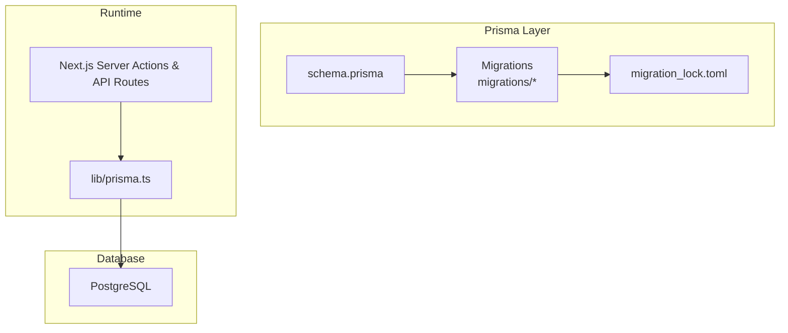
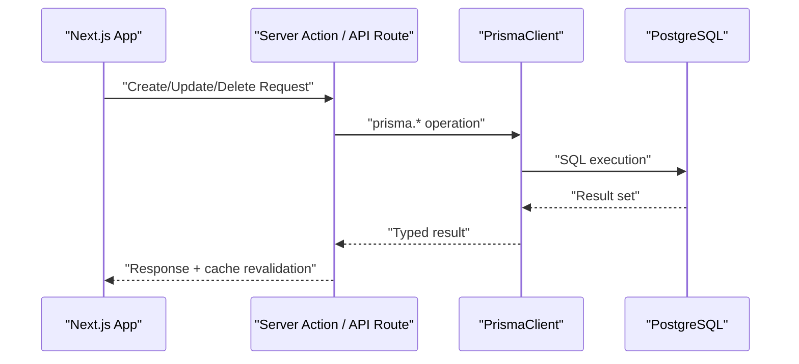
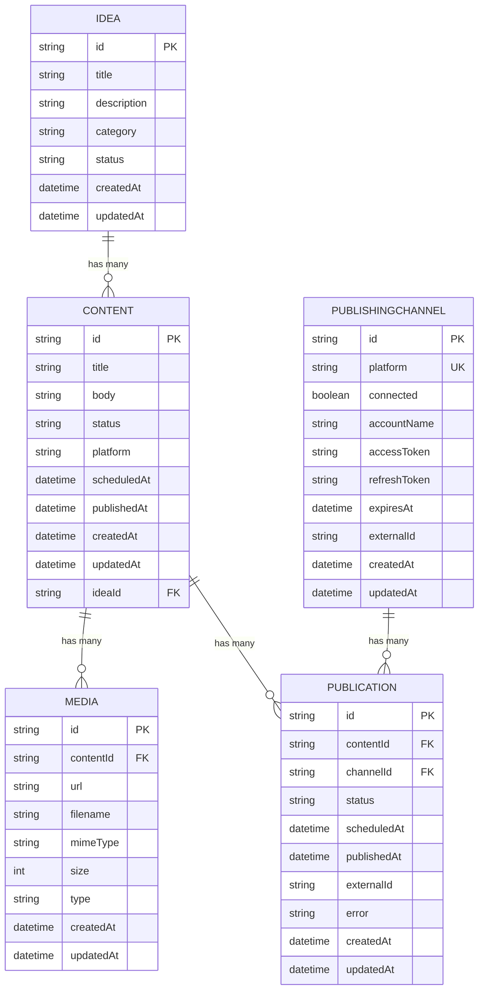
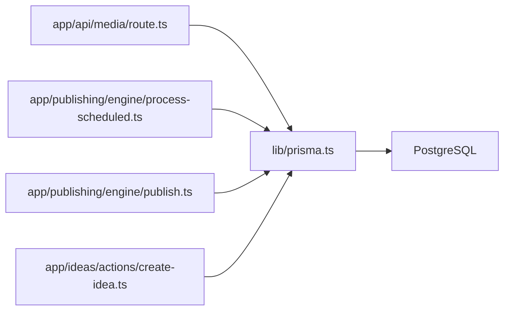

# Database Schema and Data Models

<cite>
**Referenced Files in This Document**
- [schema.prisma](file://prisma/schema.prisma)
- [20260811122549_add_idea/migration.sql](file://prisma/migrations/20260811122549_add_idea/migration.sql)
- [20260811141418_add_content/migration.sql](file://prisma/migrations/20260811141418_add_content/migration.sql)
- [20260811144400_add_scheduled_at/migration.sql](file://prisma/migrations/20260811144400_add_scheduled_at/migration.sql)
- [20260812050000_add_media/migration.sql](file://prisma/migrations/20260812050000_add_media/migration.sql)
- [20260812122000_add_publishing_channels/migration.sql](file://prisma/migrations/20260812122000_add_publishing_channels/migration.sql)
- [migration_lock.toml](file://prisma/migrations/migration_lock.toml)
- [prisma.ts](file://lib/prisma.ts)
- [route.ts (Media API)](file://app/api/media/route.ts)
- [process-scheduled.ts](file://app/publishing/engine/process-scheduled.ts)
- [publish.ts](file://app/publishing/engine/publish.ts)
- [create-idea.ts](file://app/ideas/actions/create-idea.ts)
</cite>

## Table of Contents
1. Introduction
2. Project Structure
3. Core Components
4. Architecture Overview
5. Detailed Component Analysis
6. Dependency Analysis
7. Performance Considerations
8. Troubleshooting Guide
9. Conclusion
10. Appendices

## Introduction
This document provides comprehensive data model documentation for the ContentOS database schema using Prisma and PostgreSQL. It details entity relationships among Idea, Content, Media, PublishingChannel, and Publication; defines fields, types, keys, indexes, and constraints; explains migration strategy and version management; includes schema diagrams; documents data access patterns, query optimization techniques, caching strategies, lifecycle rules, retention policies, archival procedures, security measures, and common query examples.

## Project Structure
The database is defined declaratively with Prisma and migrated to a PostgreSQL instance. The application uses a shared Prisma client configured via environment variables and integrates with Next.js server actions and API routes to perform reads and writes.

**Diagram sources**
- [schema.prisma:1-94](file://prisma/schema.prisma#L1-L94)
- [migration_lock.toml:1-4](file://prisma/migrations/migration_lock.toml#L1-L4)
- [prisma.ts:1-30](file://lib/prisma.ts#L1-L30)

**Section sources**
- [schema.prisma:1-94](file://prisma/schema.prisma#L1-L94)
- [prisma.ts:1-30](file://lib/prisma.ts#L1-L30)

## Core Components
This section outlines the primary entities, their fields, types, keys, indexes, and constraints.

- Idea
  - Fields: id (String, PK), title (String, not null), description (String, nullable), category (String, nullable), status (String, default INBOX), createdAt (DateTime, default now()), updatedAt (DateTime, auto-update).
  - Relationships: One-to-many with Content.
  - Constraints: Primary key on id.

- Content
  - Fields: id (String, PK), title (String, not null), body (String, nullable), status (String, default DRAFT), platform (String, nullable), scheduledAt (DateTime, nullable), publishedAt (DateTime, nullable), createdAt (DateTime, default now()), updatedAt (DateTime, auto-update).
  - Relationships: Optional many-to-one with Idea (onDelete SetNull); one-to-many with Publication; one-to-many with Media.
  - Constraints: Primary key on id; foreign key ideaId references Idea(id).

- Media
  - Fields: id (String, PK), contentId (String, not null), url (String, not null), filename (String, not null), mimeType (String, not null), size (Int, not null), type (String, not null), createdAt (DateTime, default now()), updatedAt (DateTime, auto-update).
  - Relationships: Many-to-one with Content (onDelete Cascade).
  - Indexes: contentId index for efficient lookups by content.
  - Constraints: Primary key on id; foreign key contentId references Content(id).

- PublishingChannel
  - Fields: id (String, PK), platform (String, unique), connected (Boolean, default false), accountName (String, nullable), accessToken (String, nullable), refreshToken (String, nullable), expiresAt (DateTime, nullable), externalId (String, nullable), createdAt (DateTime, default now()), updatedAt (DateTime, auto-update).
  - Relationships: One-to-many with Publication.
  - Constraints: Primary key on id; unique on platform.

- Publication
  - Fields: id (String, PK), contentId (String, not null), channelId (String, not null), status (String, default QUEUED), scheduledAt (DateTime, nullable), publishedAt (DateTime, nullable), externalId (String, nullable), error (String, nullable), createdAt (DateTime, default now()), updatedAt (DateTime, auto-update).
  - Relationships: Many-to-one with Content (onDelete Cascade); many-to-one with PublishingChannel (onDelete Cascade).
  - Constraints: Primary key on id; unique composite on (contentId, channelId) to prevent duplicate publications per channel.

**Section sources**
- [schema.prisma:10-93](file://prisma/schema.prisma#L10-L93)
- [20260811122549_add_idea/migration.sql:1-13](file://prisma/migrations/20260811122549_add_idea/migration.sql#L1-L13)
- [20260811141418_add_content/migration.sql:1-17](file://prisma/migrations/20260811141418_add_content/migration.sql#L1-L17)
- [20260811144400_add_scheduled_at/migration.sql:1-3](file://prisma/migrations/20260811144400_add_scheduled_at/migration.sql#L1-L3)
- [20260812050000_add_media/migration.sql:1-21](file://prisma/migrations/20260812050000_add_media/migration.sql#L1-L21)
- [20260812122000_add_publishing_channels/migration.sql:1-10](file://prisma/migrations/20260812122000_add_publishing_channels/migration.sql#L1-L10)

## Architecture Overview
The data architecture centers on Prisma as the ORM layer over PostgreSQL. Application code interacts with the database through a singleton Prisma client configured with a connection pool adapter. Migrations define the evolving schema, and the lock file pins the provider.

**Diagram sources**
- [prisma.ts:1-30](file://lib/prisma.ts#L1-L30)
- [route.ts (Media API):1-80](file://app/api/media/route.ts#L1-L80)

**Section sources**
- [prisma.ts:1-30](file://lib/prisma.ts#L1-L30)

## Detailed Component Analysis

### Entity Relationship Diagram

**Diagram sources**
- [schema.prisma:10-93](file://prisma/schema.prisma#L10-L93)

### Data Access Patterns and Query Optimization
- Media listing and creation
  - GET lists recent media with ordering and pagination via take.
  - POST validates inputs and creates media records.
  - Optimizations: Use indexes on contentId; limit results; project only needed fields.

- Scheduled publication processing
  - Queries publications with status SCHEDULED and scheduledAt <= now, ordered ascending, limited batch size.
  - Optimizations: Filtered index on (status, scheduledAt) would further improve performance; use selective projections.

- Publishing workflow
  - Loads publication with related content and media; validates state and channel connectivity; calls provider; updates status atomically within a transaction.
  - Optimizations: Transactional updates ensure consistency; avoid N+1 queries by including relations when needed.

- Idea creation
  - Server action validates input and inserts an idea; triggers path revalidation for UI freshness.

**Section sources**
- [route.ts (Media API):1-80](file://app/api/media/route.ts#L1-L80)
- [process-scheduled.ts:1-72](file://app/publishing/engine/process-scheduled.ts#L1-L72)
- [publish.ts:1-116](file://app/publishing/engine/publish.ts#L1-L116)
- [create-idea.ts:1-40](file://app/ideas/actions/create-idea.ts#L1-L40)

### Migration Strategy and Version Management
- Declarative schema in schema.prisma drives migrations.
- Each migration folder represents a versioned change applied to PostgreSQL.
- migration_lock.toml pins the provider to PostgreSQL to ensure consistent behavior across environments.
- Typical flow: modify schema.prisma -> generate migration -> apply migration in target environments.

**Section sources**
- [schema.prisma:1-94](file://prisma/schema.prisma#L1-L94)
- [20260811122549_add_idea/migration.sql:1-13](file://prisma/migrations/20260811122549_add_idea/migration.sql#L1-L13)
- [20260811141418_add_content/migration.sql:1-17](file://prisma/migrations/20260811141418_add_content/migration.sql#L1-L17)
- [20260811144400_add_scheduled_at/migration.sql:1-3](file://prisma/migrations/20260811144400_add_scheduled_at/migration.sql#L1-L3)
- [20260812050000_add_media/migration.sql:1-21](file://prisma/migrations/20260812050000_add_media/migration.sql#L1-L21)
- [20260812122000_add_publishing_channels/migration.sql:1-10](file://prisma/migrations/20260812122000_add_publishing_channels/migration.sql#L1-L10)
- [migration_lock.toml:1-4](file://prisma/migrations/migration_lock.toml#L1-L4)

### Data Lifecycle Rules, Retention Policies, Archival Procedures
- Lifecycle states
  - Idea: INBOX by default; can be converted into Content.
  - Content: DRAFT by default; transitions to READY before publishing; moves to PUBLISHED upon successful publish; supports scheduling via scheduledAt.
  - Publication: QUEUED by default; may be SCHEDULED if scheduledAt is set; transitions to PUBLISHED or FAILED based on outcome.
  - Media: Attached to Content; deleted when Content is deleted due to cascade.
  - PublishingChannel: Represents a connected platform; credentials stored for authentication.

- Retention and archival
  - No explicit retention or archival logic is implemented in the schema or referenced code.
  - Recommended approach: Add lifecycle flags or timestamps (e.g., archivedAt) and implement background jobs to archive or purge old records according to policy.

**Section sources**
- [schema.prisma:10-93](file://prisma/schema.prisma#L10-L93)
- [publish.ts:1-116](file://app/publishing/engine/publish.ts#L1-L116)

### Security Measures, Encryption Requirements, Access Control
- Secrets handling
  - DATABASE_URL must be provided at runtime; missing value throws an error during initialization.
  - Credentials such as accessToken and refreshToken are stored in PublishingChannel; consider encrypting sensitive fields at rest and limiting access via application-level authorization.

- Connection security
  - Use TLS for PostgreSQL connections via DATABASE_URL configuration.
  - Restrict database user permissions to least privilege.

- Input validation and sanitization
  - API routes validate required fields before writing to the database.
  - Enforce non-empty titles and bodies where applicable.

**Section sources**
- [prisma.ts:1-30](file://lib/prisma.ts#L1-L30)
- [route.ts (Media API):1-80](file://app/api/media/route.ts#L1-L80)
- [schema.prisma:57-73](file://prisma/schema.prisma#L57-L73)

## Dependency Analysis
High-level dependencies between modules that interact with the database:

**Diagram sources**
- [prisma.ts:1-30](file://lib/prisma.ts#L1-L30)
- [route.ts (Media API):1-80](file://app/api/media/route.ts#L1-L80)
- [process-scheduled.ts:1-72](file://app/publishing/engine/process-scheduled.ts#L1-L72)
- [publish.ts:1-116](file://app/publishing/engine/publish.ts#L1-L116)
- [create-idea.ts:1-40](file://app/ideas/actions/create-idea.ts#L1-L40)

**Section sources**
- [prisma.ts:1-30](file://lib/prisma.ts#L1-L30)
- [route.ts (Media API):1-80](file://app/api/media/route.ts#L1-L80)
- [process-scheduled.ts:1-72](file://app/publishing/engine/process-scheduled.ts#L1-L72)
- [publish.ts:1-116](file://app/publishing/engine/publish.ts#L1-L116)
- [create-idea.ts:1-40](file://app/ideas/actions/create-idea.ts#L1-L40)

## Performance Considerations
- Indexing
  - Media.contentId is indexed to speed up content-to-media joins.
  - Consider adding a composite index on Publication(status, scheduledAt) to optimize scheduled publication queries.

- Query efficiency
  - Use selective projections (select) to reduce payload size.
  - Limit result sets with take for list endpoints.

- Transactions
  - Use transactions for multi-table updates (e.g., updating Publication and Content together) to maintain consistency.

- Connection pooling
  - PrismaPg adapter configures max connections and timeouts; tune based on workload.

[No sources needed since this section provides general guidance]

## Troubleshooting Guide
- Missing database configuration
  - If DATABASE_URL is not set, Prisma client initialization throws an error. Ensure environment variables are correctly configured.

- Validation errors
  - Media creation requires contentId and url; other fields have defaults but must be valid types.
  - Publishing requires content to be READY and have a title and body; also requires at least one queued publication.

- State transitions
  - Only publications in QUEUED or SCHEDULED can be published; otherwise, an error is thrown.
  - After successful publish, both Publication and Content statuses are updated atomically.

- Scheduled processing
  - The scheduler fetches publications due for publishing; ensure scheduledAt values are correct and timezone-aware.

**Section sources**
- [prisma.ts:1-30](file://lib/prisma.ts#L1-L30)
- [route.ts (Media API):1-80](file://app/api/media/route.ts#L1-L80)
- [publish.ts:1-116](file://app/publishing/engine/publish.ts#L1-L116)
- [process-scheduled.ts:1-72](file://app/publishing/engine/process-scheduled.ts#L1-L72)

## Conclusion
ContentOS uses a clear, relational data model centered around Ideas, Content, Media, PublishingChannel, and Publication. Prisma migrations manage schema evolution, while application code enforces business rules and ensures data integrity through validations and transactions. Performance is supported by indexing and careful querying, and security relies on environment-based secrets and least-privilege database access. Extending lifecycle and archival features will require additional schema changes and background processes.

[No sources needed since this section summarizes without analyzing specific files]

## Appendices

### Common Query Examples
- Create an idea
  - Use server action to create an idea with title, optional description, and category.

- List recent media
  - Fetch media ordered by creation date descending, limited to a reasonable number.

- Publish a publication
  - Load publication with related content and media, validate state, call provider, update statuses in a transaction.

- Process scheduled publications
  - Find publications with status SCHEDULED and scheduledAt <= now, process in batches.

**Section sources**
- [create-idea.ts:1-40](file://app/ideas/actions/create-idea.ts#L1-L40)
- [route.ts (Media API):1-80](file://app/api/media/route.ts#L1-L80)
- [publish.ts:1-116](file://app/publishing/engine/publish.ts#L1-L116)
- [process-scheduled.ts:1-72](file://app/publishing/engine/process-scheduled.ts#L1-L72)