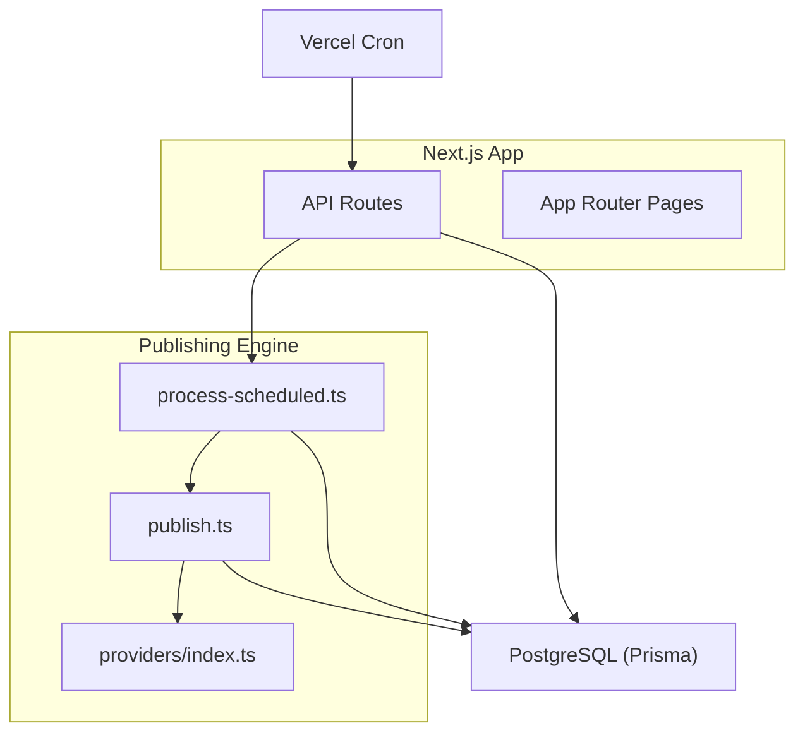
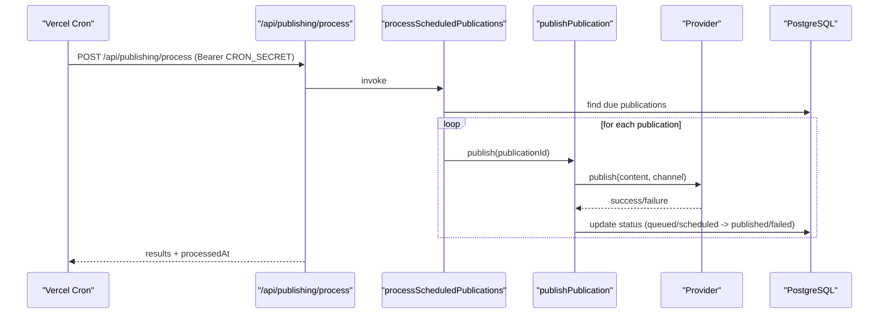
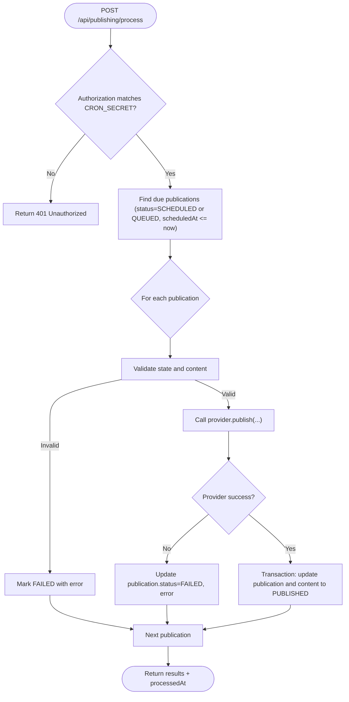
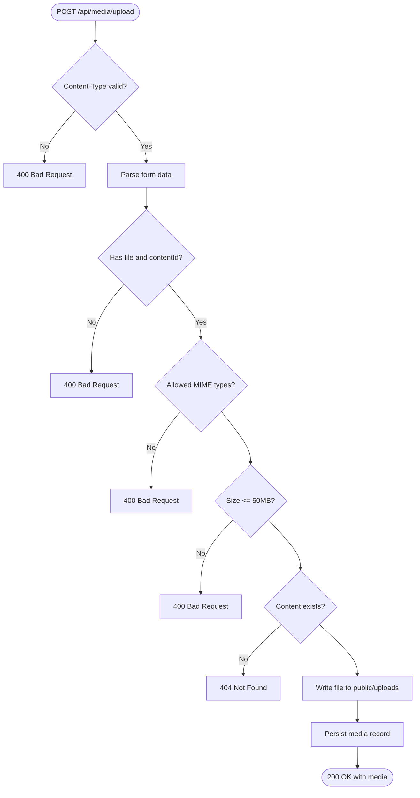
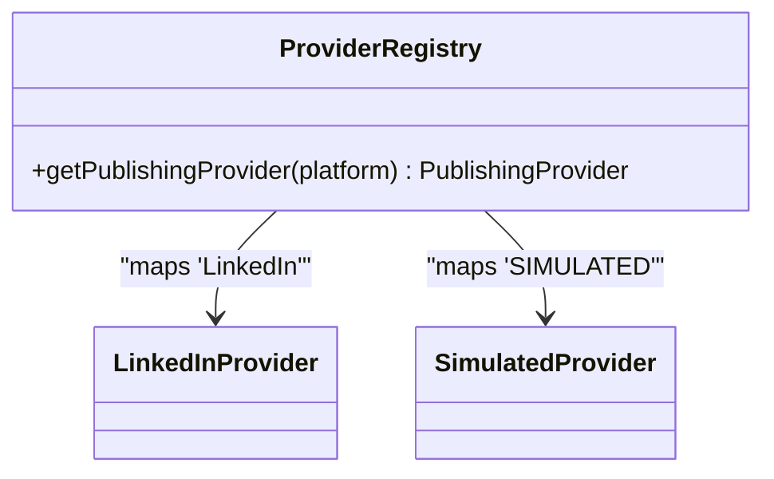
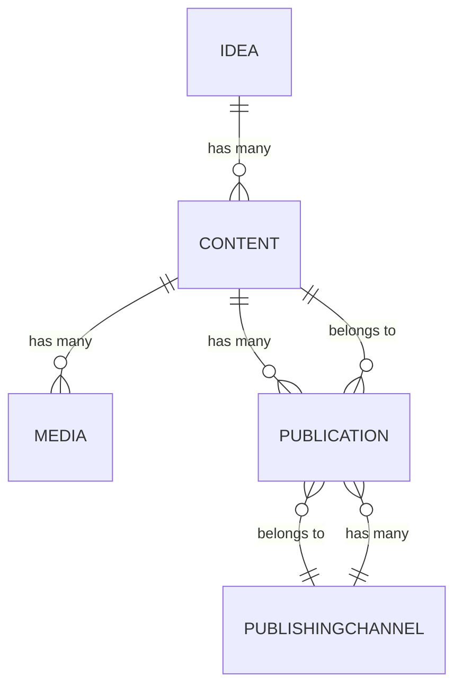
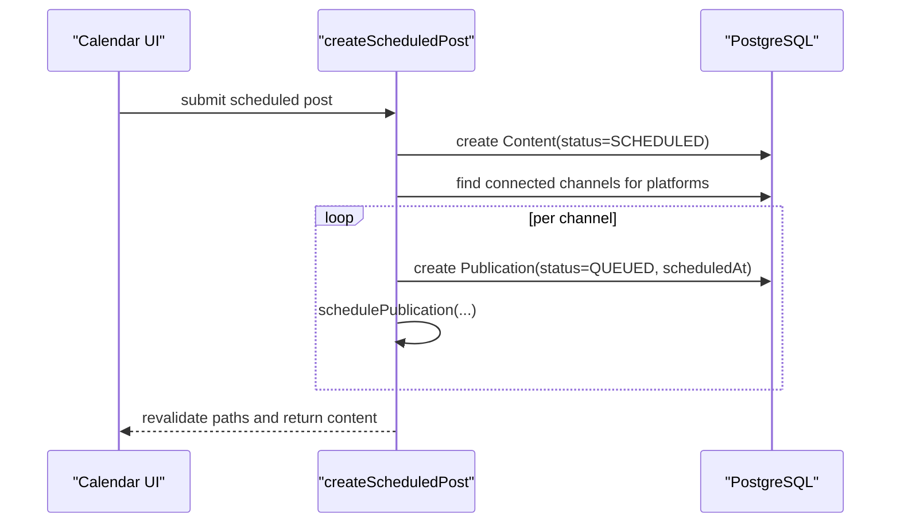
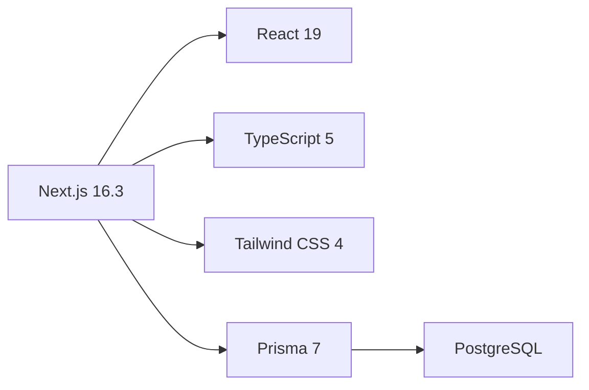

# Deployment and Configuration

<cite>
**Referenced Files in This Document**
- [package.json](file://package.json)
- [next.config.ts](file://next.config.ts)
- [vercel.json](file://vercel.json)
- [prisma/schema.prisma](file://prisma/schema.prisma)
- [lib/prisma.ts](file://lib/prisma.ts)
- [prisma.config.ts](file://prisma.config.ts)
- [app/api/publishing/process/route.ts](file://app/api/publishing/process/route.ts)
- [app/publishing/engine/process-scheduled.ts](file://app/publishing/engine/process-scheduled.ts)
- [app/publishing/engine/publish.ts](file://app/publishing/engine/publish.ts)
- [app/publishing/engine/providers/index.ts](file://app/publishing/engine/providers/index.ts)
- [app/calendar/actions/create-scheduled-post.ts](file://app/calendar/actions/create-scheduled-post.ts)
- [app/api/media/upload/route.ts](file://app/api/media/upload/route.ts)
- [README.md](file://README.md)
</cite>

## Table of Contents
1. Introduction
2. Project Structure
3. Core Components
4. Architecture Overview
5. Detailed Component Analysis
6. Dependency Analysis
7. Performance Considerations
8. Troubleshooting Guide
9. Conclusion
10. Appendices

## Introduction
This document provides comprehensive deployment and configuration guidance for ContentOS (octa-studio), focusing on production deployment on Vercel, environment variables, build configuration, scheduled publishing via cron, Next.js options, performance tuning, environment-specific configurations, database migrations, backups, disaster recovery, monitoring/logging, error tracking, security considerations, and troubleshooting.

## Project Structure
ContentOS is a Next.js 16 application using the App Router with TypeScript, Tailwind CSS, Prisma ORM, and PostgreSQL. It includes:
- API routes for AI generation, media upload, and publishing orchestration
- A publishing engine that processes scheduled publications
- Prisma schema defining core data models (Idea, Content, Media, PublishingChannel, Publication)
- Vercel cron configuration to trigger scheduled publishing
- Environment-driven configuration for database, OAuth, and cron security

**Diagram sources**
- [vercel.json:1-10](file://vercel.json#L1-L10)
- [app/api/publishing/process/route.ts:1-56](file://app/api/publishing/process/route.ts#L1-L56)
- [app/publishing/engine/process-scheduled.ts:1-72](file://app/publishing/engine/process-scheduled.ts#L1-L72)
- [app/publishing/engine/publish.ts:1-116](file://app/publishing/engine/publish.ts#L1-L116)
- [app/publishing/engine/providers/index.ts:1-21](file://app/publishing/engine/providers/index.ts#L1-L21)
- [lib/prisma.ts:1-30](file://lib/prisma.ts#L1-L30)

**Section sources**
- [package.json:1-35](file://package.json#L1-L35)
- [README.md:185-211](file://README.md#L185-L211)

## Core Components
- Database layer: Prisma client configured with PostgreSQL adapter and connection pooling settings.
- Scheduling: Vercel cron triggers an API endpoint that runs the scheduler to publish queued items.
- Publishing pipeline: Validates publication state, invokes platform providers, updates statuses atomically.
- Media handling: Uploads files to local public directory and persists metadata to the database.
- Environment configuration: Required env vars for database, cron secret, and optional integrations.

Key responsibilities:
- lib/prisma.ts: Initializes Prisma client with connection pool and validates DATABASE_URL.
- app/api/publishing/process/route.ts: Secures cron endpoint with Bearer token from CRON_SECRET.
- app/publishing/engine/process-scheduled.ts: Finds due publications and dispatches them.
- app/publishing/engine/publish.ts: Executes provider publish and updates records in a transaction.
- app/api/media/upload/route.ts: Validates and stores uploaded media.

**Section sources**
- [lib/prisma.ts:1-30](file://lib/prisma.ts#L1-L30)
- [app/api/publishing/process/route.ts:1-56](file://app/api/publishing/process/route.ts#L1-L56)
- [app/publishing/engine/process-scheduled.ts:1-72](file://app/publishing/engine/process-scheduled.ts#L1-L72)
- [app/publishing/engine/publish.ts:1-116](file://app/publishing/engine/publish.ts#L1-L116)
- [app/api/media/upload/route.ts:1-126](file://app/api/media/upload/route.ts#L1-L126)

## Architecture Overview
The system uses Vercel’s serverless functions for API routes and background jobs. The cron job calls the publishing process endpoint, which queries the database for due publications and publishes them via platform providers. All state changes are persisted through Prisma to PostgreSQL.

**Diagram sources**
- [vercel.json:1-10](file://vercel.json#L1-L10)
- [app/api/publishing/process/route.ts:1-56](file://app/api/publishing/process/route.ts#L1-L56)
- [app/publishing/engine/process-scheduled.ts:1-72](file://app/publishing/engine/process-scheduled.ts#L1-L72)
- [app/publishing/engine/publish.ts:1-116](file://app/publishing/engine/publish.ts#L1-L116)

## Detailed Component Analysis

### Scheduled Publishing Flow
- The cron job triggers the protected endpoint.
- The endpoint validates the Bearer token against CRON_SECRET.
- The scheduler queries due, scheduled publications and batches processing.
- Each publication is validated and sent to the appropriate provider.
- On success, content and publication records are updated atomically; on failure, errors are recorded.

**Diagram sources**
- [app/api/publishing/process/route.ts:1-56](file://app/api/publishing/process/route.ts#L1-L56)
- [app/publishing/engine/process-scheduled.ts:1-72](file://app/publishing/engine/process-scheduled.ts#L1-L72)
- [app/publishing/engine/publish.ts:1-116](file://app/publishing/engine/publish.ts#L1-L116)

**Section sources**
- [app/api/publishing/process/route.ts:1-56](file://app/api/publishing/process/route.ts#L1-L56)
- [app/publishing/engine/process-scheduled.ts:1-72](file://app/publishing/engine/process-scheduled.ts#L1-L72)
- [app/publishing/engine/publish.ts:1-116](file://app/publishing/engine/publish.ts#L1-L116)

### Media Upload Handling
- Accepts multipart/form-data with file and contentId.
- Validates content type and size limits.
- Writes file to public/uploads and records metadata in the database.

**Diagram sources**
- [app/api/media/upload/route.ts:1-126](file://app/api/media/upload/route.ts#L1-L126)

**Section sources**
- [app/api/media/upload/route.ts:1-126](file://app/api/media/upload/route.ts#L1-L126)

### Publishing Providers
- Provider registry maps platform names to implementations.
- If no provider is found, an error is thrown.

**Diagram sources**
- [app/publishing/engine/providers/index.ts:1-21](file://app/publishing/engine/providers/index.ts#L1-L21)

**Section sources**
- [app/publishing/engine/providers/index.ts:1-21](file://app/publishing/engine/providers/index.ts#L1-L21)

### Database Schema and Migrations
- Models include Idea, Content, Media, PublishingChannel, Publication.
- Migrations are stored under prisma/migrations and applied via Prisma CLI.
- Prisma config reads DATABASE_URL and optional SHADOW_DATABASE_URL.

**Diagram sources**
- [prisma/schema.prisma:1-94](file://prisma/schema.prisma#L1-L94)

**Section sources**
- [prisma/schema.prisma:1-94](file://prisma/schema.prisma#L1-L94)
- [prisma.config.ts:1-15](file://prisma.config.ts#L1-L15)

### Creating Scheduled Posts
- Server action creates content and corresponding publications for connected channels.
- Schedules each publication and revalidates relevant paths.

**Diagram sources**
- [app/calendar/actions/create-scheduled-post.ts:1-67](file://app/calendar/actions/create-scheduled-post.ts#L1-L67)

**Section sources**
- [app/calendar/actions/create-scheduled-post.ts:1-67](file://app/calendar/actions/create-scheduled-post.ts#L1-L67)

## Dependency Analysis
- Runtime dependencies include Next.js, Prisma client, PostgreSQL adapter, and pg driver.
- Dev dependencies include Prisma CLI, ESLint, Tailwind, and TypeScript tooling.
- Build scripts use Next.js commands; Prisma generates client and applies migrations.

**Diagram sources**
- [package.json:11-33](file://package.json#L11-L33)

**Section sources**
- [package.json:1-35](file://package.json#L1-L35)

## Performance Considerations
- Connection pooling: PrismaPg adapter sets max connections, timeouts, and idle timeout for efficient DB usage.
- Batched scheduling: Scheduler fetches up to a limited number of due publications per run to avoid overload.
- Transactional updates: Successful publishes update both publication and content within a single transaction to ensure consistency.
- File uploads: Enforce size limits and allowed MIME types to prevent abuse and reduce storage pressure.
- Next.js runtime: API route forces Node.js runtime and dynamic evaluation to support server-side operations.

Recommendations:
- Tune Prisma connection pool based on expected concurrency and database capacity.
- Adjust batch size in scheduler to balance throughput and latency.
- Offload large media to object storage (e.g., S3-compatible) instead of local disk for scalability.
- Use CDN for static assets and consider edge caching where applicable.

**Section sources**
- [lib/prisma.ts:14-19](file://lib/prisma.ts#L14-L19)
- [app/publishing/engine/process-scheduled.ts:11-27](file://app/publishing/engine/process-scheduled.ts#L11-L27)
- [app/publishing/engine/publish.ts:88-112](file://app/publishing/engine/publish.ts#L88-L112)
- [app/api/media/upload/route.ts:8-18](file://app/api/media/upload/route.ts#L8-L18)
- [app/api/publishing/process/route.ts:4-5](file://app/api/publishing/process/route.ts#L4-L5)

## Troubleshooting Guide
Common issues and resolutions:
- Missing DATABASE_URL: Application throws at startup if not set. Ensure it is configured in environment.
- Cron unauthorized: Endpoint returns 401 if Authorization header does not match Bearer CRON_SECRET. Verify CRON_SECRET and request headers.
- No connected channels: Scheduling fails if no connected channels exist for selected platforms. Connect required channels before scheduling.
- Unsupported file type or oversized file: Upload returns 400. Ensure file type is allowed and size is within limits.
- Provider not configured: Publishing fails if platform has no provider mapping. Add provider mapping or use supported platforms.

Operational checks:
- Verify Vercel cron path and schedule in vercel.json.
- Confirm NODE_ENV and environment variables are correctly set per environment.
- Inspect logs for scheduler start/end messages and any errors during publish attempts.

**Section sources**
- [lib/prisma.ts:8-12](file://lib/prisma.ts#L8-L12)
- [app/api/publishing/process/route.ts:8-25](file://app/api/publishing/process/route.ts#L8-L25)
- [app/calendar/actions/create-scheduled-post.ts:35-44](file://app/calendar/actions/create-scheduled-post.ts#L35-L44)
- [app/api/media/upload/route.ts:20-65](file://app/api/media/upload/route.ts#L20-L65)
- [app/publishing/engine/providers/index.ts:10-20](file://app/publishing/engine/providers/index.ts#L10-L20)
- [vercel.json:1-10](file://vercel.json#L1-L10)

## Conclusion
ContentOS leverages Next.js serverless functions and Vercel cron to provide robust scheduled publishing backed by PostgreSQL and Prisma. Proper environment configuration, secure cron access, and careful resource management are essential for reliable production operation. Follow the guidelines in this document to deploy, configure, monitor, and troubleshoot effectively.

## Appendices

### Production Deployment on Vercel
- Environment variables to set in Vercel project settings:
  - DATABASE_URL: PostgreSQL connection string
  - SHADOW_DATABASE_URL: Optional shadow database for migrations
  - CRON_SECRET: Secret used to protect the cron endpoint
  - Optional integrations: LINKEDIN_CLIENT_ID, LINKEDIN_CLIENT_SECRET, APP_URL, AI_* variables
- Build and run:
  - Build script: next build
  - Start script: next start
- Cron job:
  - Path: /api/publishing/process
  - Schedule: defined in vercel.json
  - Security: require Authorization: Bearer <CRON_SECRET>

**Section sources**
- [README.md:235-256](file://README.md#L235-L256)
- [vercel.json:1-10](file://vercel.json#L1-L10)
- [app/api/publishing/process/route.ts:8-25](file://app/api/publishing/process/route.ts#L8-L25)

### Next.js Configuration Options
- Allowed dev origins can be configured for local development scenarios.
- API routes use Node.js runtime and dynamic evaluation to support server-side logic.

**Section sources**
- [next.config.ts:1-10](file://next.config.ts#L1-L10)
- [app/api/publishing/process/route.ts:4-5](file://app/api/publishing/process/route.ts#L4-L5)

### Environment-Specific Configurations
- Development:
  - Local .env with DATABASE_URL, optional AI and OAuth settings, and CRON_SECRET.
  - Run npm run dev.
- Staging/Production:
  - Set environment variables in Vercel dashboard per environment.
  - Apply migrations with npx prisma migrate deploy.
  - Ensure CRON_SECRET differs across environments for isolation.

**Section sources**
- [README.md:131-149](file://README.md#L131-L149)
- [README.md:235-256](file://README.md#L235-L256)
- [prisma.config.ts:1-15](file://prisma.config.ts#L1-L15)

### Database Migration Strategies
- Generate client: npx prisma generate
- Create migration: npx prisma migrate dev --name <description>
- Apply to production: npx prisma migrate deploy
- Optional: use SHADOW_DATABASE_URL for safe migration testing

**Section sources**
- [README.md:153-167](file://README.md#L153-L167)
- [prisma.config.ts:1-15](file://prisma.config.ts#L1-L15)

### Backup Procedures and Disaster Recovery
- Backups:
  - Use your PostgreSQL provider’s backup mechanisms (snapshots, point-in-time recovery).
  - Periodically export schema and seed data if needed.
- Disaster recovery:
  - Restore from latest snapshot to a new instance.
  - Re-run npx prisma generate and npx prisma migrate deploy to align schema.
  - Verify cron secret and integrations are restored.

[No sources needed since this section provides general guidance]

### Monitoring and Logging
- Logs:
  - Console logs in API routes and scheduler indicate start/end times and errors.
  - Review Vercel function logs for cron invocations and failures.
- Error tracking:
  - Integrate an error reporting service (e.g., Sentry) to capture exceptions in API routes and server actions.
- Performance monitoring:
  - Use Vercel Analytics or APM tools to track latency and error rates.
  - Monitor database connection metrics and query performance.

**Section sources**
- [app/api/publishing/process/route.ts:27-43](file://app/api/publishing/process/route.ts#L27-L43)
- [app/publishing/engine/process-scheduled.ts:7-31](file://app/publishing/engine/process-scheduled.ts#L7-L31)

### Security Considerations
- Environment variable management:
  - Store secrets in Vercel environment variables; never commit .env files.
- Cron security:
  - Protect /api/publishing/process with Bearer token matching CRON_SECRET.
- SSL:
  - Use HTTPS provided by Vercel; ensure DATABASE_URL uses secure connection parameters as required by your provider.
- Access controls:
  - Restrict access to sensitive endpoints behind authentication in your application layer.
  - Limit media upload sizes and types to mitigate abuse.

**Section sources**
- [README.md:254-258](file://README.md#L254-L258)
- [app/api/publishing/process/route.ts:8-25](file://app/api/publishing/process/route.ts#L8-L25)
- [app/api/media/upload/route.ts:8-18](file://app/api/media/upload/route.ts#L8-L18)