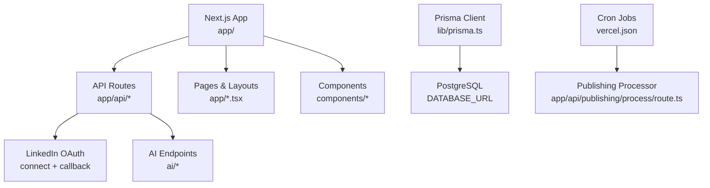
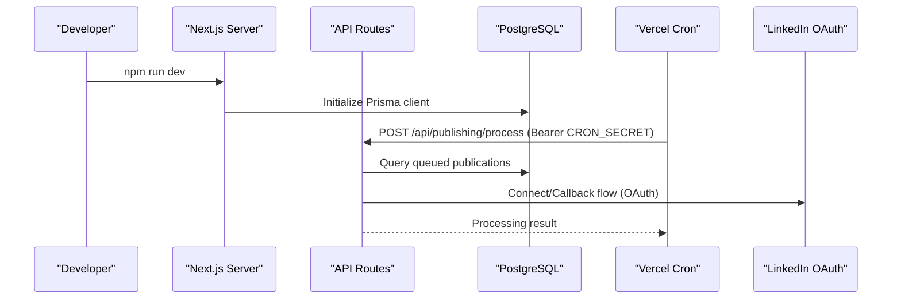
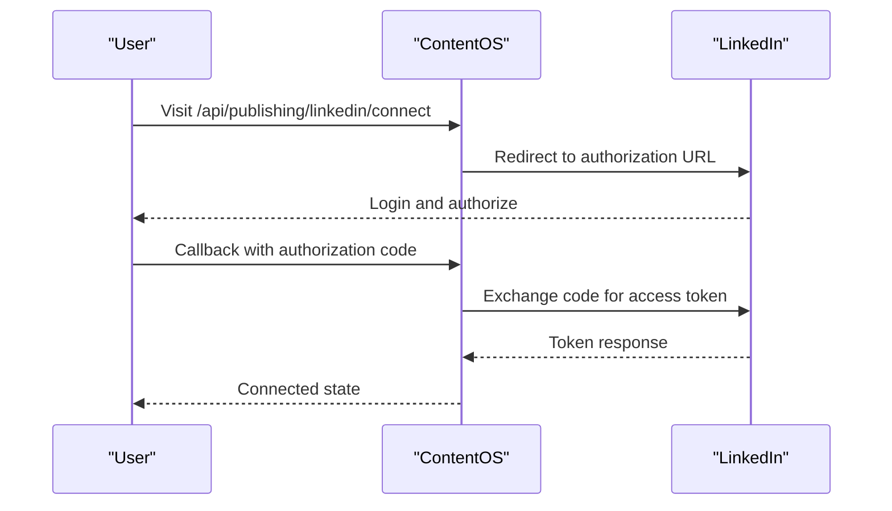
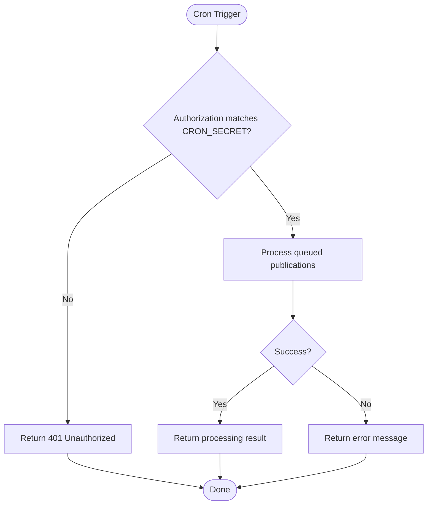
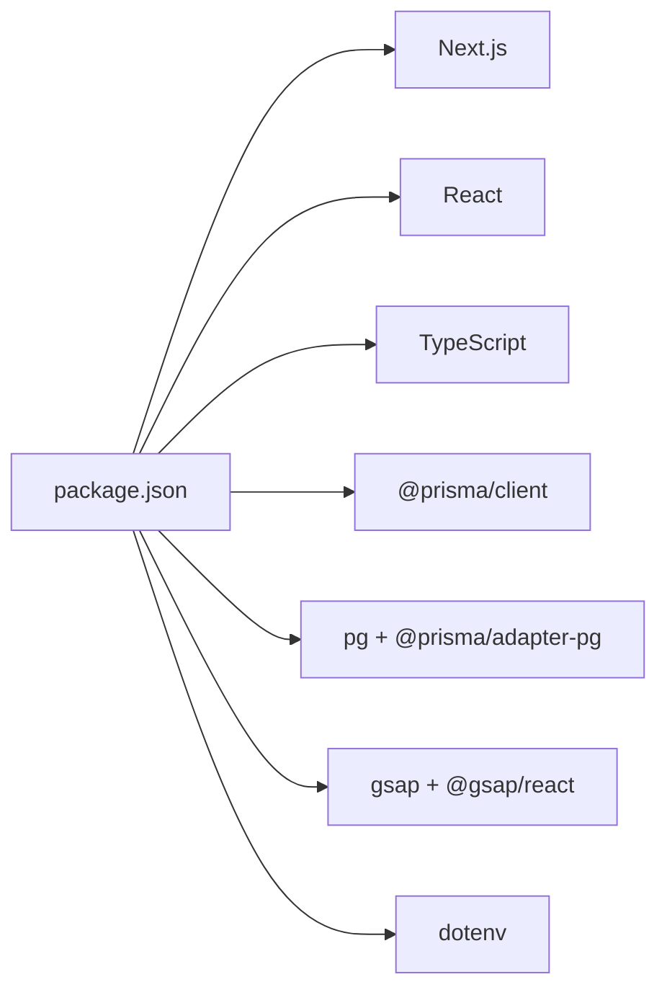

# Getting Started

<cite>
**Referenced Files in This Document**
- [README.md](file://README.md)
- [package.json](file://package.json)
- [next.config.ts](file://next.config.ts)
- [prisma.config.ts](file://prisma.config.ts)
- [lib/prisma.ts](file://lib/prisma.ts)
- [prisma/schema.prisma](file://prisma/schema.prisma)
- [app/api/publishing/linkedin/connect/route.ts](file://app/api/publishing/linkedin/connect/route.ts)
- [app/api/publishing/linkedin/callback/route.ts](file://app/api/publishing/linkedin/callback/route.ts)
- [app/api/publishing/process/route.ts](file://app/api/publishing/process/route.ts)
- [vercel.json](file://vercel.json)
</cite>

## Table of Contents
1. [Introduction](#introduction)
2. [Project Structure](#project-structure)
3. [Core Components](#core-components)
4. [Architecture Overview](#architecture-overview)
5. [Detailed Component Analysis](#detailed-component-analysis)
6. [Dependency Analysis](#dependency-analysis)
7. [Performance Considerations](#performance-considerations)
8. [Troubleshooting Guide](#troubleshooting-guide)
9. [Conclusion](#conclusion)
10. [Appendices](#appendices)

## Introduction
ContentOS (octa-studio) is an all-in-one content operating system for creators. It helps you plan, create, schedule, and publish content across multiple platforms from a single workspace. The project is built with Next.js 16, React 19, TypeScript, Tailwind CSS, Prisma, and PostgreSQL, with optional AI features via Ollama and LinkedIn OAuth for publishing.

Key capabilities include:
- Ideas capture and organization
- AI-assisted content generation (text, image, video)
- Full content editor and media library
- Calendar-based scheduling with timezone support
- Publishing to LinkedIn and other channels
- Analytics and link-in-bio pages

This guide walks you through prerequisites, installation, environment configuration, database setup, and starting the development server.

## Project Structure
At a high level, the application follows a feature-based layout under app/ with API routes, UI pages, and reusable components. Data access is handled by Prisma against PostgreSQL. Configuration lives in next.config.ts and prisma.config.ts. Cron jobs are configured for scheduled publishing.

**Diagram sources**
- [next.config.ts:1-10](file://next.config.ts#L1-L10)
- [prisma.config.ts:1-16](file://prisma.config.ts#L1-L16)
- [lib/prisma.ts:1-30](file://lib/prisma.ts#L1-L30)
- [vercel.json:1-10](file://vercel.json#L1-L10)
- [app/api/publishing/linkedin/connect/route.ts:1-34](file://app/api/publishing/linkedin/connect/route.ts#L1-L34)
- [app/api/publishing/linkedin/callback/route.ts:1-60](file://app/api/publishing/linkedin/callback/route.ts#L1-L60)
- [app/api/publishing/process/route.ts:1-55](file://app/api/publishing/process/route.ts#L1-L55)

**Section sources**
- [README.md:86-183](file://README.md#L86-L183)
- [package.json:1-35](file://package.json#L1-L35)

## Core Components
- Database layer: Prisma client configured with PostgreSQL adapter and connection pooling.
- API endpoints: AI generation, media management, LinkedIn OAuth, and scheduled publishing.
- Scheduling engine: Cron-triggered endpoint processes queued publications.
- Configuration: Next.js config and Prisma config manage runtime behavior and data source settings.

**Section sources**
- [lib/prisma.ts:1-30](file://lib/prisma.ts#L1-L30)
- [prisma/config:1-16](file://prisma.config.ts#L1-L16)
- [app/api/publishing/process/route.ts:1-55](file://app/api/publishing/process/route.ts#L1-L55)
- [next.config.ts:1-10](file://next.config.ts#L1-L10)

## Architecture Overview
The system uses Next.js as the full-stack framework. Frontend pages and components render via React and TypeScript. Backend logic resides in API routes. Data persistence is managed by Prisma over PostgreSQL. Optional AI services connect via environment variables. Scheduled publishing runs via cron on Vercel or locally.

**Diagram sources**
- [lib/prisma.ts:1-30](file://lib/prisma.ts#L1-L30)
- [app/api/publishing/process/route.ts:1-55](file://app/api/publishing/process/route.ts#L1-L55)
- [app/api/publishing/linkedin/connect/route.ts:1-34](file://app/api/publishing/linkedin/connect/route.ts#L1-L34)
- [app/api/publishing/linkedin/callback/route.ts:1-60](file://app/api/publishing/linkedin/callback/route.ts#L1-L60)
- [vercel.json:1-10](file://vercel.json#L1-L10)

## Detailed Component Analysis

### Environment Variables and Setup
- DATABASE_URL: Required for Prisma and runtime database access.
- SHADOW_DATABASE_URL: Used by Prisma migrations for safe schema changes.
- AI_PROVIDER, AI_BASE_URL, AI_MODEL: Configure local AI via Ollama (optional).
- LINKEDIN_CLIENT_ID, LINKEDIN_CLIENT_SECRET, APP_URL: Enable LinkedIn OAuth flows.
- CRON_SECRET: Secures the scheduled publishing endpoint; must be set for cron execution.

Environment usage examples:
- LinkedIn connect and callback read CLIENT_ID, CLIENT_SECRET, and APP_URL to build authorization URLs and exchange codes for tokens.
- Cron endpoint validates Authorization header against CRON_SECRET before processing queued publications.

**Section sources**
- [README.md:131-149](file://README.md#L131-L149)
- [README.md:235-258](file://README.md#L235-L258)
- [app/api/publishing/linkedin/connect/route.ts:1-34](file://app/api/publishing/linkedin/connect/route.ts#L1-L34)
- [app/api/publishing/linkedin/callback/route.ts:1-60](file://app/api/publishing/linkedin/callback/route.ts#L1-L60)
- [app/api/publishing/process/route.ts:1-55](file://app/api/publishing/process/route.ts#L1-L55)

### Database Setup with Prisma
- Generate Prisma client and apply migrations to initialize schema.
- Schema includes models for Idea, Content, Media, PublishingChannel, and Publication.
- Migrations are stored under prisma/migrations and applied via Prisma CLI.

Typical steps:
- Generate client: npx prisma generate
- Run migrations: npx prisma migrate dev --name init
- Apply migrations in production: npx prisma migrate deploy
- Inspect data: npx prisma studio

**Section sources**
- [README.md:153-167](file://README.md#L153-L167)
- [README.md:262-273](file://README.md#L262-L273)
- [prisma/schema.prisma:1-94](file://prisma/schema.prisma#L1-L94)
- [prisma.config.ts:1-16](file://prisma.config.ts#L1-L16)

### Development Server Startup
- Install dependencies with npm install.
- Start the development server with npm run dev.
- Open http://localhost:3000 in your browser.
- If using AI features, ensure Ollama is running locally.

**Section sources**
- [README.md:103-127](file://README.md#L103-L127)
- [README.md:171-183](file://README.md#L171-L183)
- [package.json:5-10](file://package.json#L5-L10)

### LinkedIn OAuth Integration
- Connect endpoint redirects users to LinkedIn’s authorization page with required scopes.
- Callback endpoint exchanges the authorization code for tokens and stores credentials.
- Requires LINKEDIN_CLIENT_ID, LINKEDIN_CLIENT_SECRET, and APP_URL to be set.

**Diagram sources**
- [app/api/publishing/linkedin/connect/route.ts:1-34](file://app/api/publishing/linkedin/connect/route.ts#L1-L34)
- [app/api/publishing/linkedin/callback/route.ts:1-60](file://app/api/publishing/linkedin/callback/route.ts#L1-L60)

**Section sources**
- [app/api/publishing/linkedin/connect/route.ts:1-34](file://app/api/publishing/linkedin/connect/route.ts#L1-L34)
- [app/api/publishing/linkedin/callback/route.ts:1-60](file://app/api/publishing/linkedin/callback/route.ts#L1-L60)

### Scheduled Publishing and Cron Security
- The cron endpoint at /api/publishing/process requires an Authorization header with Bearer CRON_SECRET.
- On success, it processes queued publications and returns results with timestamps.
- Vercel cron is configured to call this endpoint every minute.

**Diagram sources**
- [app/api/publishing/process/route.ts:1-55](file://app/api/publishing/process/route.ts#L1-L55)
- [vercel.json:1-10](file://vercel.json#L1-L10)

**Section sources**
- [app/api/publishing/process/route.ts:1-55](file://app/api/publishing/process/route.ts#L1-L55)
- [vercel.json:1-10](file://vercel.json#L1-L10)

## Dependency Analysis
- Runtime dependencies include Next.js, React, TypeScript, Prisma client, PostgreSQL adapter, GSAP animations, and dotenv.
- Dev dependencies include ESLint, Tailwind CSS, Prisma CLI, and type definitions.
- Scripts provide standard commands for development, building, linting, and database operations.

**Diagram sources**
- [package.json:11-33](file://package.json#L11-L33)

**Section sources**
- [package.json:1-35](file://package.json#L1-L35)

## Performance Considerations
- Connection pooling: Prisma Pg adapter sets max connections and timeouts for efficient database access.
- Dynamic rendering: Some API routes force dynamic execution to avoid caching issues during background processing.
- Cron frequency: The publishing processor runs frequently; ensure your database and external APIs can handle the load.

[No sources needed since this section provides general guidance]

## Troubleshooting Guide
Common setup issues and resolutions:

- Missing DATABASE_URL
  - Symptom: Application fails to start or Prisma throws an error indicating missing database configuration.
  - Resolution: Ensure DATABASE_URL is set in .env and points to a reachable PostgreSQL instance.

- Migration errors
  - Symptom: Prisma migration fails due to schema conflicts or connectivity issues.
  - Resolution: Verify SHADOW_DATABASE_URL is set if using Prisma’s shadow database feature. Re-run migrations after fixing schema changes.

- LinkedIn OAuth not working
  - Symptom: Connect or callback endpoints return errors about missing environment variables.
  - Resolution: Set LINKEDIN_CLIENT_ID, LINKEDIN_CLIENT_SECRET, and APP_URL correctly. Ensure redirect URI matches the callback path.

- Cron endpoint unauthorized
  - Symptom: Scheduled publishing returns 401 Unauthorized.
  - Resolution: Set CRON_SECRET and ensure the Authorization header is passed as Bearer <CRON_SECRET>.

- AI features not available
  - Symptom: AI endpoints fail to generate content.
  - Resolution: Install and run Ollama locally, set AI_PROVIDER=ollama, configure AI_BASE_URL and AI_MODEL accordingly.

- Development server does not start
  - Symptom: npm run dev fails or exits immediately.
  - Resolution: Confirm Node.js version is v18+, dependencies are installed, and environment variables are present.

**Section sources**
- [lib/prisma.ts:8-12](file://lib/prisma.ts#L8-L12)
- [app/api/publishing/linkedin/connect/route.ts:4-12](file://app/api/publishing/linkedin/connect/route.ts#L4-L12)
- [app/api/publishing/linkedin/callback/route.ts:27-38](file://app/api/publishing/linkedin/callback/route.ts#L27-L38)
- [app/api/publishing/process/route.ts:7-25](file://app/api/publishing/process/route.ts#L7-L25)
- [README.md:86-127](file://README.md#L86-L127)
- [README.md:171-183](file://README.md#L171-L183)

## Conclusion
You now have the essentials to set up and run ContentOS locally. Follow the prerequisites, configure environment variables, initialize the database with Prisma, and start the development server. Use LinkedIn OAuth to enable publishing and configure cron security for scheduled tasks. For AI features, run Ollama locally and set the appropriate environment variables. Refer to the troubleshooting section for common issues and solutions.

[No sources needed since this section summarizes without analyzing specific files]

## Appendices

### Quick Start Checklist
- System prerequisites: Node.js v18+, PostgreSQL running.
- Install dependencies: npm install.
- Configure environment: Set DATABASE_URL, SHADOW_DATABASE_URL, AI_* (optional), LinkedIn OAuth (optional), CRON_SECRET.
- Database setup: npx prisma generate, npx prisma migrate dev.
- Start server: npm run dev.
- Open browser: http://localhost:3000.

**Section sources**
- [README.md:86-183](file://README.md#L86-L183)
- [README.md:235-283](file://README.md#L235-L283)
- [package.json:5-10](file://package.json#L5-L10)