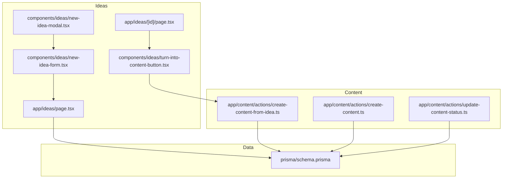
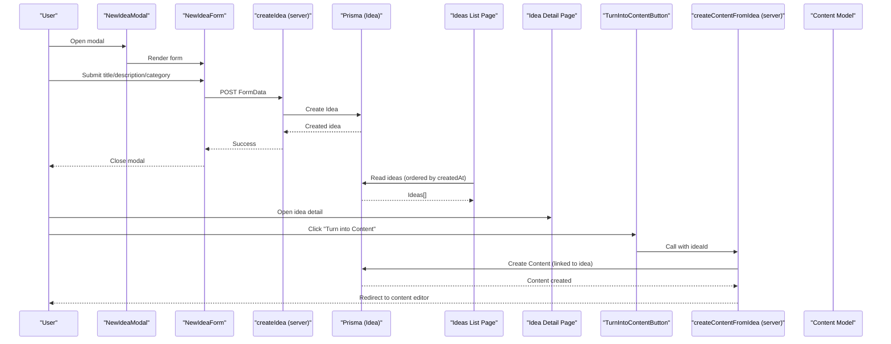
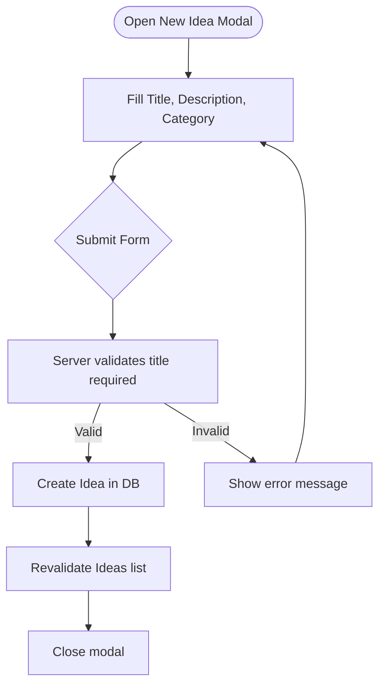
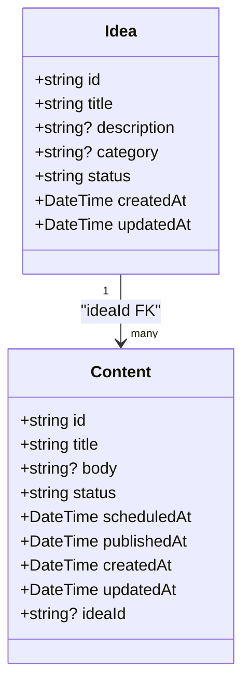
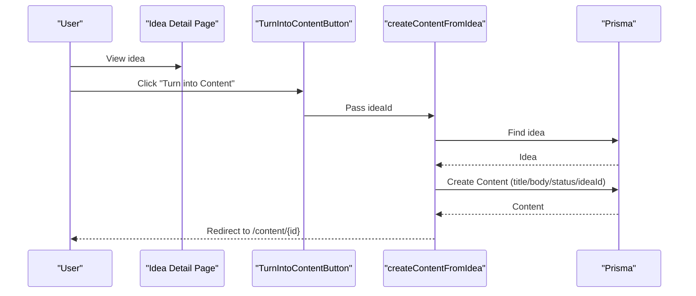
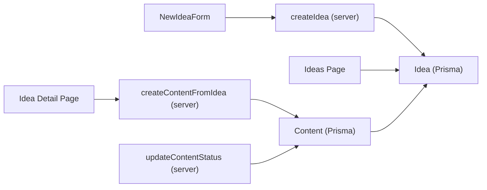
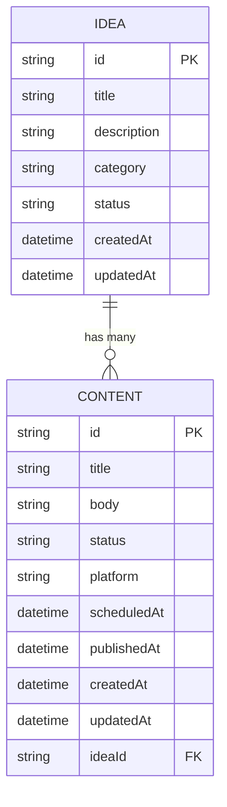

# Idea Management

<cite>
**Referenced Files in This Document**
- [app/ideas/page.tsx](file://app/ideas/page.tsx)
- [app/ideas/[id]/page.tsx](file://app/ideas/[id]/page.tsx)
- [app/ideas/actions/create-idea.ts](file://app/ideas/actions/create-idea.ts)
- [components/ideas/new-idea-modal.tsx](file://components/ideas/new-idea-modal.tsx)
- [components/ideas/new-idea-form.tsx](file://components/ideas/new-idea-form.tsx)
- [components/ideas/turn-into-content-button.tsx](file://components/ideas/turn-into-content-button.tsx)
- [app/content/actions/create-content-from-idea.ts](file://app/content/actions/create-content-from-idea.ts)
- [app/content/actions/create-content.ts](file://app/content/actions/create-content.ts)
- [app/content/actions/update-content-status.ts](file://app/content/actions/update-content-status.ts)
- [prisma/schema.prisma](file://prisma/schema.prisma)
</cite>

## Table of Contents
1. [Introduction](#introduction)
2. [Project Structure](#project-structure)
3. [Core Components](#core-components)
4. [Architecture Overview](#architecture-overview)
5. [Detailed Component Analysis](#detailed-component-analysis)
6. [Dependency Analysis](#dependency-analysis)
7. [Performance Considerations](#performance-considerations)
8. [Troubleshooting Guide](#troubleshooting-guide)
9. [Conclusion](#conclusion)
10. [Appendices](#appendices)

## Introduction
This document explains the Idea Management feature that enables creators to capture, organize, and manage content ideas before they become published content. It covers the idea creation workflow (including category tagging, description fields, and status tracking), the transformation from ideas to content items, UI components for forms and modals, database schema relationships, and how ideas integrate into the broader content pipeline.

## Project Structure
The Idea Management feature spans server actions, pages, and reusable UI components:
- Server-side logic for creating ideas and converting them to content
- Pages for listing ideas and viewing an idea detail with conversion action
- Modal and form components for capturing new ideas
- Database schema defining Idea and Content entities and their relationship

**Diagram sources**
- [app/ideas/page.tsx:1-90](file://app/ideas/page.tsx#L1-L90)
- [app/ideas/[id]/page.tsx:1-90](file://app/ideas/[id]/page.tsx#L1-L90)
- [components/ideas/new-idea-modal.tsx:1-50](file://components/ideas/new-idea-modal.tsx#L1-L50)
- [components/ideas/new-idea-form.tsx:1-102](file://components/ideas/new-idea-form.tsx#L1-L102)
- [components/ideas/turn-into-content-button.tsx:1-32](file://components/ideas/turn-into-content-button.tsx#L1-L32)
- [app/content/actions/create-content-from-idea.ts:1-28](file://app/content/actions/create-content-from-idea.ts#L1-L28)
- [app/content/actions/create-content.ts:1-26](file://app/content/actions/create-content.ts#L1-L26)
- [app/content/actions/update-content-status.ts:1-58](file://app/content/actions/update-content-status.ts#L1-L58)
- [prisma/schema.prisma:10-37](file://prisma/schema.prisma#L10-L37)

**Section sources**
- [app/ideas/page.tsx:1-90](file://app/ideas/page.tsx#L1-L90)
- [app/ideas/[id]/page.tsx:1-90](file://app/ideas/[id]/page.tsx#L1-L90)
- [components/ideas/new-idea-modal.tsx:1-50](file://components/ideas/new-idea-modal.tsx#L1-L50)
- [components/ideas/new-idea-form.tsx:1-102](file://components/ideas/new-idea-form.tsx#L1-L102)
- [components/ideas/turn-into-content-button.tsx:1-32](file://components/ideas/turn-into-content-button.tsx#L1-L32)
- [app/content/actions/create-content-from-idea.ts:1-28](file://app/content/actions/create-content-from-idea.ts#L1-L28)
- [app/content/actions/create-content.ts:1-26](file://app/content/actions/create-content.ts#L1-L26)
- [app/content/actions/update-content-status.ts:1-58](file://app/content/actions/update-content-status.ts#L1-L58)
- [prisma/schema.prisma:10-37](file://prisma/schema.prisma#L10-L37)

## Core Components
- Ideas list page: Loads all ideas ordered by creation date and renders a simple inbox view with category tags and status badges.
- Idea detail page: Displays full idea details and provides a “Turn into Content” action.
- New idea modal and form: Captures title, description, and category; validates on the server and persists via Prisma.
- Conversion action: Creates a new content item from an idea and redirects to the content editor.
- Database models: Define Idea and Content entities and their one-to-many relationship.

Key responsibilities:
- Capture: Modal + form collect idea metadata.
- Organize: Category tag and status field provide basic organization.
- Convert: Button triggers server action to create content linked to the original idea.

**Section sources**
- [app/ideas/page.tsx:5-82](file://app/ideas/page.tsx#L5-L82)
- [app/ideas/[id]/page.tsx:13-83](file://app/ideas/[id]/page.tsx#L13-L83)
- [components/ideas/new-idea-modal.tsx:6-47](file://components/ideas/new-idea-modal.tsx#L6-L47)
- [components/ideas/new-idea-form.tsx:10-99](file://components/ideas/new-idea-form.tsx#L10-L99)
- [components/ideas/turn-into-content-button.tsx:10-29](file://components/ideas/turn-into-content-button.tsx#L10-L29)
- [app/content/actions/create-content-from-idea.ts:6-26](file://app/content/actions/create-content-from-idea.ts#L6-L26)
- [prisma/schema.prisma:10-37](file://prisma/schema.prisma#L10-L37)

## Architecture Overview
The idea lifecycle flows through UI components, server actions, and the database:

**Diagram sources**
- [components/ideas/new-idea-modal.tsx:6-47](file://components/ideas/new-idea-modal.tsx#L6-L47)
- [components/ideas/new-idea-form.tsx:14-32](file://components/ideas/new-idea-form.tsx#L14-L32)
- [app/ideas/actions/create-idea.ts:6-38](file://app/ideas/actions/create-idea.ts#L6-L38)
- [app/ideas/page.tsx:5-10](file://app/ideas/page.tsx#L5-L10)
- [app/ideas/[id]/page.tsx:13-26](file://app/ideas/[id]/page.tsx#L13-L26)
- [components/ideas/turn-into-content-button.tsx:15-18](file://components/ideas/turn-into-content-button.tsx#L15-L18)
- [app/content/actions/create-content-from-idea.ts:6-26](file://app/content/actions/create-content-from-idea.ts#L6-L26)
- [prisma/schema.prisma:10-37](file://prisma/schema.prisma#L10-L37)

## Detailed Component Analysis

### Idea Creation Workflow
- User opens the “+ New Idea” modal from the Ideas list page.
- The modal renders a form with fields for title (required), description (optional), and category (optional).
- On submit, the client calls a server action that validates inputs and creates an Idea record.
- After success, the modal closes and the list revalidates to show the new idea.

**Diagram sources**
- [components/ideas/new-idea-modal.tsx:6-47](file://components/ideas/new-idea-modal.tsx#L6-L47)
- [components/ideas/new-idea-form.tsx:14-32](file://components/ideas/new-idea-form.tsx#L14-L32)
- [app/ideas/actions/create-idea.ts:6-38](file://app/ideas/actions/create-idea.ts#L6-L38)

**Section sources**
- [components/ideas/new-idea-modal.tsx:6-47](file://components/ideas/new-idea-modal.tsx#L6-L47)
- [components/ideas/new-idea-form.tsx:14-32](file://components/ideas/new-idea-form.tsx#L14-L32)
- [app/ideas/actions/create-idea.ts:6-38](file://app/ideas/actions/create-idea.ts#L6-L38)

### Idea Detail and Status Tracking
- The idea detail page loads a single idea and displays its category, status, title, description, and creation date.
- Status is stored on the Idea model and defaults to INBOX.
- The page exposes a “Turn into Content” button to initiate conversion.

**Diagram sources**
- [prisma/schema.prisma:10-37](file://prisma/schema.prisma#L10-L37)

**Section sources**
- [app/ideas/[id]/page.tsx:13-83](file://app/ideas/[id]/page.tsx#L13-L83)
- [prisma/schema.prisma:10-19](file://prisma/schema.prisma#L10-L19)

### Idea-to-Content Transformation
- Clicking “Turn into Content” invokes a server action that:
  - Fetches the idea by ID
  - Creates a new Content item with title and body copied from the idea
  - Sets initial content status to DRAFT
  - Links the content back to the idea via ideaId
  - Redirects to the content editor for further editing

**Diagram sources**
- [components/ideas/turn-into-content-button.tsx:15-18](file://components/ideas/turn-into-content-button.tsx#L15-L18)
- [app/content/actions/create-content-from-idea.ts:6-26](file://app/content/actions/create-content-from-idea.ts#L6-L26)

**Section sources**
- [components/ideas/turn-into-content-button.tsx:10-29](file://components/ideas/turn-into-content-button.tsx#L10-L29)
- [app/content/actions/create-content-from-idea.ts:6-26](file://app/content/actions/create-content-from-idea.ts#L6-L26)

### UI Components Summary
- NewIdeaModal: Opens/closes a modal overlay and renders the form.
- NewIdeaForm: Handles form submission, pending state, and error display.
- TurnIntoContentButton: Provides a transition-aware button to trigger conversion.
- Ideas list and detail pages: Present ideas and enable navigation and conversion.

**Section sources**
- [components/ideas/new-idea-modal.tsx:6-47](file://components/ideas/new-idea-modal.tsx#L6-L47)
- [components/ideas/new-idea-form.tsx:10-99](file://components/ideas/new-idea-form.tsx#L10-L99)
- [components/ideas/turn-into-content-button.tsx:10-29](file://components/ideas/turn-into-content-button.tsx#L10-L29)
- [app/ideas/page.tsx:5-82](file://app/ideas/page.tsx#L5-L82)
- [app/ideas/[id]/page.tsx:13-83](file://app/ideas/[id]/page.tsx#L13-L83)

## Dependency Analysis
- Client components depend on server actions for persistence and transformation.
- Server actions depend on Prisma client to read/write database models.
- The Idea model has a one-to-many relationship with Content via ideaId.
- Content status updates are enforced by a dedicated server action with validation.

**Diagram sources**
- [components/ideas/new-idea-form.tsx:14-32](file://components/ideas/new-idea-form.tsx#L14-L32)
- [app/ideas/actions/create-idea.ts:6-38](file://app/ideas/actions/create-idea.ts#L6-L38)
- [app/ideas/page.tsx:5-10](file://app/ideas/page.tsx#L5-L10)
- [app/ideas/[id]/page.tsx:13-26](file://app/ideas/[id]/page.tsx#L13-L26)
- [app/content/actions/create-content-from-idea.ts:6-26](file://app/content/actions/create-content-from-idea.ts#L6-L26)
- [app/content/actions/update-content-status.ts:14-56](file://app/content/actions/update-content-status.ts#L14-L56)
- [prisma/schema.prisma:10-37](file://prisma/schema.prisma#L10-L37)

**Section sources**
- [prisma/schema.prisma:10-37](file://prisma/schema.prisma#L10-L37)
- [app/content/actions/update-content-status.ts:14-56](file://app/content/actions/update-content-status.ts#L14-L56)

## Performance Considerations
- The ideas list fetches all ideas ordered by creation time. For large inventories, consider pagination or filtering to reduce payload size.
- Server actions use minimal data transfer and rely on Prisma queries; ensure indexes exist on frequently filtered fields if you add search/filter features later.
- Revalidation occurs after creating ideas to refresh lists without full page reloads.

[No sources needed since this section provides general guidance]

## Troubleshooting Guide
- Validation errors: If the idea title is missing, the server returns a validation error which is surfaced in the form’s error state.
- Not found handling: The idea detail page uses a not-found response when an idea does not exist.
- Content status constraints: Updating content status enforces allowed values and prevents changes to published content; scheduling requires a scheduled date/time.

Common issues and resolutions:
- Missing title: Ensure the title field is filled before submitting.
- Idea not found: Verify the idea ID exists and the route parameters are correct.
- Invalid content status: Use only supported statuses when updating content.

**Section sources**
- [app/ideas/actions/create-idea.ts:6-38](file://app/ideas/actions/create-idea.ts#L6-L38)
- [app/ideas/[id]/page.tsx:18-26](file://app/ideas/[id]/page.tsx#L18-L26)
- [app/content/actions/update-content-status.ts:6-56](file://app/content/actions/update-content-status.ts#L6-L56)

## Conclusion
The Idea Management feature provides a streamlined path from capturing raw ideas to producing publishable content. Users can quickly log ideas with optional categories and descriptions, view them in an inbox, and convert promising ideas into content items that link back to their source idea. The design leverages server actions for reliable persistence and clear separation between UI and data operations. Future enhancements could include advanced filtering, search, and richer status workflows for ideas.

[No sources needed since this section summarizes without analyzing specific files]

## Appendices

### Database Schema: Idea and Content Relationship
- Idea stores core idea metadata including title, optional description, optional category, and status.
- Content stores the resulting content with title, optional body, platform, scheduling/publishing timestamps, and status.
- Content links back to its originating idea via ideaId, enabling traceability from content to idea.

**Diagram sources**
- [prisma/schema.prisma:10-37](file://prisma/schema.prisma#L10-L37)

**Section sources**
- [prisma/schema.prisma:10-37](file://prisma/schema.prisma#L10-L37)