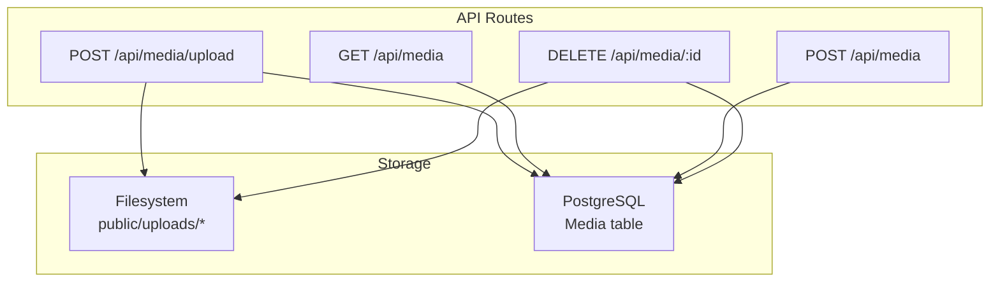
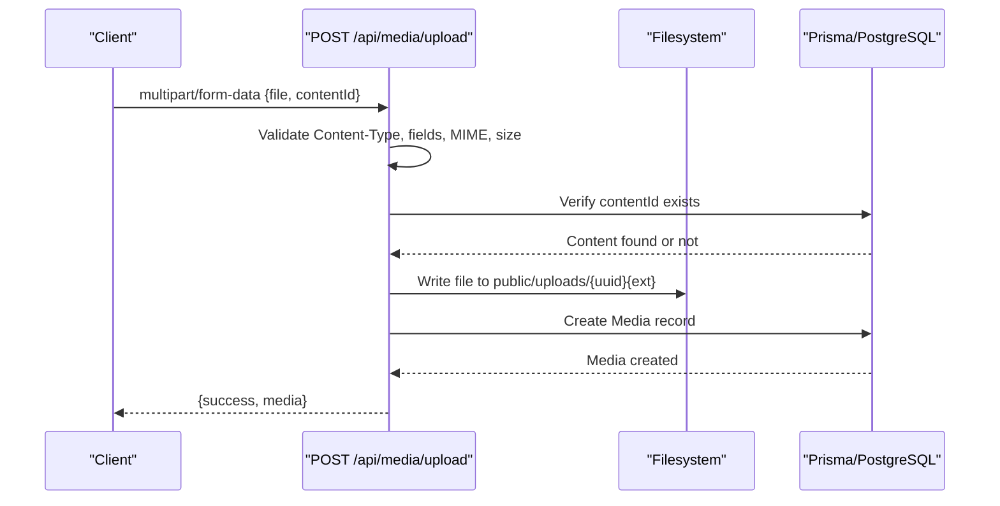
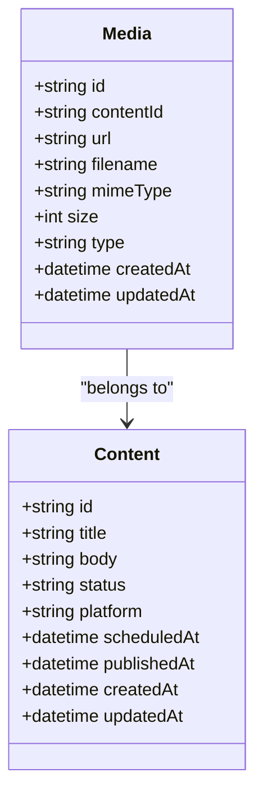
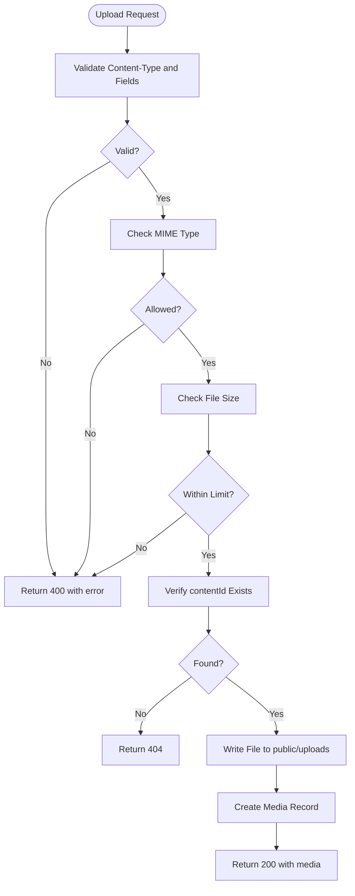

# Media API Endpoints

<cite>
**Referenced Files in This Document**
- [route.ts](file://app/api/media/upload/route.ts)
- [route.ts](file://app/api/media/[id]/route.ts)
- [route.ts](file://app/api/media/route.ts)
- [schema.prisma](file://prisma/schema.prisma)
- [content-editor.tsx](file://components/content/content-editor.tsx)
- [media-picker-modal.tsx](file://components/calendar/media-picker-modal.tsx)
- [calendar-workspace.tsx](file://components/calendar/calendar-workspace.tsx)
</cite>

## Table of Contents
1. [Introduction](#introduction)
2. [Project Structure](#project-structure)
3. [Core Components](#core-components)
4. [Architecture Overview](#architecture-overview)
5. [Detailed Component Analysis](#detailed-component-analysis)
6. [Dependency Analysis](#dependency-analysis)
7. [Performance Considerations](#performance-considerations)
8. [Troubleshooting Guide](#troubleshooting-guide)
9. [Conclusion](#conclusion)
10. [Appendices](#appendices)

## Introduction
This document provides detailed API documentation for media management endpoints used to upload, list, retrieve, and delete media assets associated with content items. It covers request/response formats, validation rules, error handling, and the end-to-end lifecycle from file upload to database persistence and file system storage. Client implementation examples are included based on actual usage within the application.

## Project Structure
The media APIs are implemented as Next.js App Router route handlers under app/api/media:
- POST /api/media/upload: Uploads a media file (multipart/form-data) and persists metadata to the database.
- GET /api/media: Lists recent media entries.
- POST /api/media: Creates a media record without uploading a file (for external references).
- DELETE /api/media/[id]: Deletes a media record and its underlying file.

**Diagram sources**
- [route.ts:20-125](file://app/api/media/upload/route.ts#L20-L125)
- [route.ts:4-23](file://app/api/media/route.ts#L4-L23)
- [route.ts:25-79](file://app/api/media/route.ts#L25-L79)
- [route.ts:13-73](file://app/api/media/[id]/route.ts#L13-L73)
- [schema.prisma:39-55](file://prisma/schema.prisma#L39-L55)

**Section sources**
- [route.ts:20-125](file://app/api/media/upload/route.ts#L20-L125)
- [route.ts:4-23](file://app/api/media/route.ts#L4-L23)
- [route.ts:25-79](file://app/api/media/route.ts#L25-L79)
- [route.ts:13-73](file://app/api/media/[id]/route.ts#L13-L73)
- [schema.prisma:39-55](file://prisma/schema.prisma#L39-L55)

## Core Components
- Upload handler validates Content-Type, required fields, allowed MIME types, and file size; writes files to public/uploads; creates a Media record.
- List handler returns recent media records with selected fields.
- Create handler inserts a Media record for externally hosted media.
- Delete handler removes the physical file and deletes the Media record.

Key constraints and behaviors:
- Allowed MIME types: image/jpeg, image/png, image/webp, image/gif, video/mp4, video/webm, video/quicktime.
- Maximum file size: 50 MB.
- Uploaded files are stored under public/uploads with a UUID-based filename preserving original extension.
- Media type is inferred from MIME type (VIDEO if starts with video/, otherwise IMAGE).
- Database schema includes Media with contentId, url, filename, mimeType, size, type, timestamps, and a relation to Content.

**Section sources**
- [route.ts:8-18](file://app/api/media/upload/route.ts#L8-L18)
- [route.ts:20-125](file://app/api/media/upload/route.ts#L20-L125)
- [route.ts:4-23](file://app/api/media/route.ts#L4-L23)
- [route.ts:25-79](file://app/api/media/route.ts#L25-L79)
- [route.ts:13-73](file://app/api/media/[id]/route.ts#L13-L73)
- [schema.prisma:39-55](file://prisma/schema.prisma#L39-L55)

## Architecture Overview
The media subsystem integrates three layers:
- API layer: Route handlers validate inputs, enforce business rules, and orchestrate operations.
- Storage layer: Filesystem stores binary assets; PostgreSQL stores metadata via Prisma ORM.
- Client layer: React components use FormData to upload files and fetch lists or perform deletions.

**Diagram sources**
- [route.ts:20-125](file://app/api/media/upload/route.ts#L20-L125)
- [schema.prisma:39-55](file://prisma/schema.prisma#L39-L55)

## Detailed Component Analysis

### POST /api/media/upload
Purpose:
- Accepts a media file and associates it with a content item by creating a Media record and storing the file on disk.

Request:
- Method: POST
- URL: /api/media/upload
- Headers:
  - Content-Type: multipart/form-data
- Form fields:
  - file: File object (required)
  - contentId: string (required)

Validation and rules:
- Content-Type must be multipart/form-data or application/x-www-form-urlencoded.
- file must be present and be a File instance.
- contentId must be a non-empty string.
- Only allowed MIME types are accepted.
- File size must not exceed 50 MB.
- contentId must correspond to an existing Content record.

Processing flow:
- Validates headers and form data.
- Checks MIME type against allowlist.
- Verifies file size limit.
- Ensures contentId refers to an existing Content.
- Generates a UUID filename preserving original extension.
- Writes file to public/uploads.
- Infers type (IMAGE or VIDEO) from MIME type.
- Persists Media record with url, filename, mimeType, size, type, and contentId.

Response:
- Success (200):
  - { success: true, media: { id, url, filename, mimeType, size, type, createdAt } }
- Errors:
  - 400: Invalid Content-Type, missing file, missing contentId, unsupported MIME type, file too large.
  - 404: Content not found.
  - 500: Server error during upload or database operation.

Example requests/responses:
- Request:
  - Method: POST
  - Endpoint: /api/media/upload
  - Body: multipart/form-data with fields file and contentId
- Response (success):
  - { success: true, media: { id: "...", url: "/uploads/...jpg", filename: "...", mimeType: "image/jpeg", size: 12345, type: "IMAGE", createdAt: "..." } }

Error codes and messages:
- 400: "Content-Type must be multipart/form-data."
- 400: "File is required."
- 400: "contentId is required."
- 400: "Unsupported file type: <mime>"
- 400: "File must be smaller than 50 MB."
- 404: "Content not found."
- 500: Error message from server-side failure.

Security considerations:
- MIME type allowlist restricts accepted file types.
- File size limit prevents abuse.
- UUID filenames reduce predictability.
- No authentication middleware is applied to this endpoint in the current codebase.

Rate limiting:
- Not implemented in the current codebase.

Database operations:
- Reads Content by id to validate association.
- Creates Media record with metadata.

File system operations:
- Creates directory public/uploads if needed.
- Writes file buffer to disk.

Client implementation example:
- See usage in content editor and calendar components that build FormData with file and contentId and call /api/media/upload.

**Section sources**
- [route.ts:20-125](file://app/api/media/upload/route.ts#L20-L125)
- [content-editor.tsx:197-229](file://components/content/content-editor.tsx#L197-L229)
- [media-picker-modal.tsx:86-127](file://components/calendar/media-picker-modal.tsx#L86-L127)
- [calendar-workspace.tsx:185-230](file://components/calendar/calendar-workspace.tsx#L185-L230)
- [schema.prisma:39-55](file://prisma/schema.prisma#L39-L55)

### GET /api/media
Purpose:
- Returns a paginated list of recent media entries.

Request:
- Method: GET
- URL: /api/media
- Query parameters: none defined in the route.

Response:
- 200:
  - { media: [ { id, url, filename, mimeType, size, type, createdAt } ] }
- Notes:
  - Limited to last 50 entries ordered by creation date descending.

**Section sources**
- [route.ts:4-23](file://app/api/media/route.ts#L4-L23)

### POST /api/media
Purpose:
- Creates a Media record without uploading a file (useful for linking to external media).

Request:
- Method: POST
- URL: /api/media
- Headers:
  - Content-Type: application/json
- Body fields:
  - contentId: string (required)
  - url: string (required)
  - filename: string (optional)
  - mimeType: string (optional, defaults to image/jpeg)
  - size: number (optional, defaults to 0)
  - type: string (optional, defaults to IMAGE)

Response:
- 200:
  - { success: true, media: { id, url, filename, mimeType, size, type, createdAt } }
- 400:
  - { error: "contentId and url are required." }
- 500:
  - { error: "Media creation failed." }

**Section sources**
- [route.ts:25-79](file://app/api/media/route.ts#L25-L79)

### DELETE /api/media/[id]
Purpose:
- Deletes a specific media asset by removing its file and database record.

Request:
- Method: DELETE
- URL: /api/media/{id}

Processing:
- Retrieves Media by id.
- Attempts to delete the file at public/uploads/<url path>.
- Ignores ENOENT errors for missing files.
- Deletes the Media record from the database.

Response:
- 200:
  - { success: true, id: "<mediaId>" }
- 404:
  - { error: "Media not found." }
- 500:
  - { error: "Media delete failed." }

Error handling:
- If file deletion fails with a non-ENOENT error, the error is rethrown and results in a 500 response.

**Section sources**
- [route.ts:13-73](file://app/api/media/[id]/route.ts#L13-L73)

## Dependency Analysis
- Route handlers depend on:
  - Prisma client for database access.
  - Node filesystem APIs for reading/writing files.
  - Path utilities for constructing file paths.
- Data model:
  - Media has a many-to-one relationship with Content via contentId.
  - Index on contentId improves lookup performance.

**Diagram sources**
- [schema.prisma:21-37](file://prisma/schema.prisma#L21-L37)
- [schema.prisma:39-55](file://prisma/schema.prisma#L39-L55)

**Section sources**
- [schema.prisma:21-37](file://prisma/schema.prisma#L21-L37)
- [schema.prisma:39-55](file://prisma/schema.prisma#L39-L55)

## Performance Considerations
- File uploads are synchronous per file; consider streaming or chunked uploads for very large files.
- Directory creation uses recursive mkdir to avoid repeated checks.
- Listing media is limited to 50 rows; implement pagination for larger datasets.
- Database queries select minimal fields where possible to reduce payload size.
- Avoid unnecessary reads by validating contentId existence before writing files.

[No sources needed since this section provides general guidance]

## Troubleshooting Guide
Common issues and resolutions:
- 400 Content-Type error: Ensure the request uses multipart/form-data when uploading files.
- 400 Missing file or contentId: Include both file and contentId in the form data.
- 400 Unsupported file type: Use one of the allowed MIME types.
- 400 File too large: Reduce file size below 50 MB.
- 404 Content not found: Provide a valid contentId that exists in the database.
- 404 Media not found: The specified media id does not exist.
- 500 Server errors: Check logs for stack traces; verify filesystem permissions and database connectivity.

Operational tips:
- Confirm public/uploads directory exists and is writable.
- Validate that the Content entity exists before attempting uploads.
- When deleting, handle cases where the file may already be missing but the record remains.

**Section sources**
- [route.ts:20-125](file://app/api/media/upload/route.ts#L20-L125)
- [route.ts:13-73](file://app/api/media/[id]/route.ts#L13-L73)

## Conclusion
The media API provides robust endpoints for uploading, listing, creating, and deleting media assets tied to content items. Validation, allowlists, and size limits protect the system, while Prisma and filesystem operations ensure consistent state. Clients can integrate using FormData for uploads and standard fetch calls for other operations. For production deployments, consider adding authentication, rate limiting, and CDN integration for serving uploaded assets.

[No sources needed since this section summarizes without analyzing specific files]

## Appendices

### Authentication, Rate Limiting, and Security
- Authentication:
  - No authentication middleware is currently applied to media endpoints.
- Rate limiting:
  - Not implemented in the current codebase.
- Security considerations:
  - MIME type allowlist restricts accepted file types.
  - File size limit mitigates resource exhaustion.
  - UUID-based filenames reduce predictability.
  - Consider adding CORS configuration and input sanitization for production.

[No sources needed since this section provides general guidance]

### Media Lifecycle Diagram

**Diagram sources**
- [route.ts:20-125](file://app/api/media/upload/route.ts#L20-L125)

### Client Implementation Examples
- Uploading images/videos to a content item:
  - Build FormData with fields file and contentId.
  - POST to /api/media/upload.
  - Handle success response containing media metadata.
- Listing media:
  - GET /api/media to retrieve recent media.
- Deleting media:
  - DELETE /api/media/{id} to remove both file and record.

References to client usage:
- Content editor component demonstrates multi-file upload and deletion flows.
- Calendar workspace and media picker modal show practical upload patterns.

**Section sources**
- [content-editor.tsx:197-229](file://components/content/content-editor.tsx#L197-L229)
- [content-editor.tsx:273-314](file://components/content/content-editor.tsx#L273-L314)
- [media-picker-modal.tsx:86-127](file://components/calendar/media-picker-modal.tsx#L86-L127)
- [calendar-workspace.tsx:185-230](file://components/calendar/calendar-workspace.tsx#L185-L230)