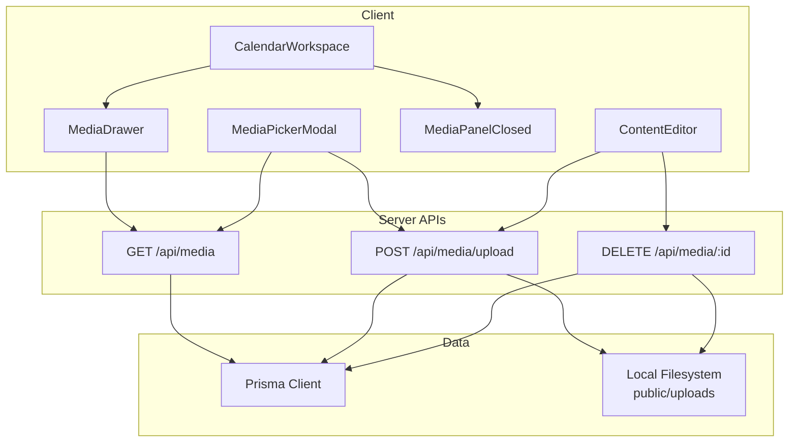
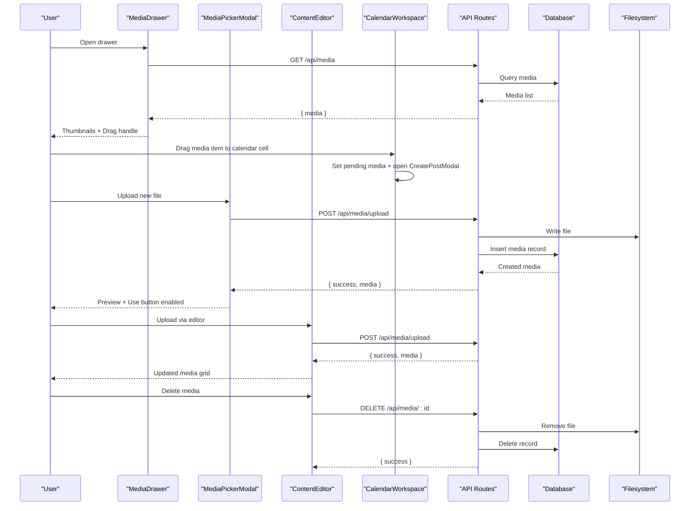
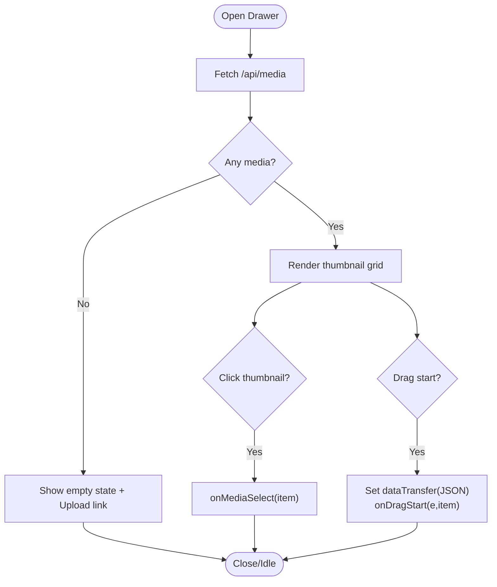
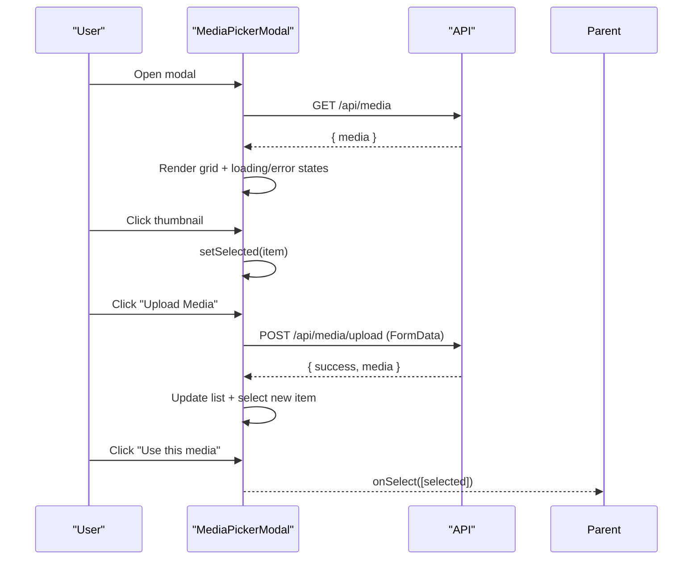
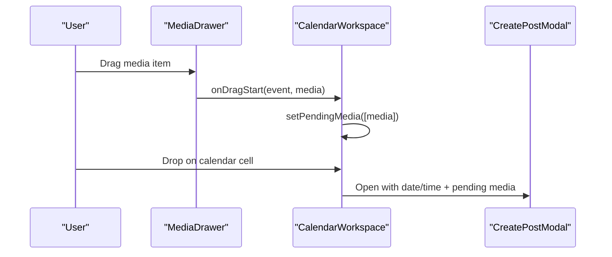
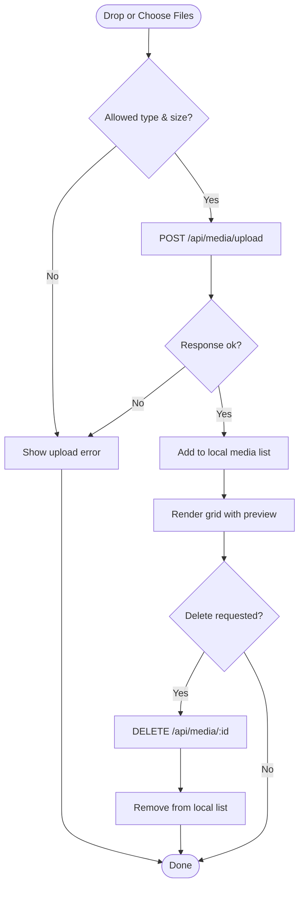
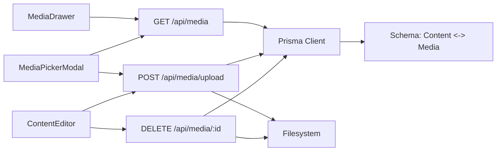
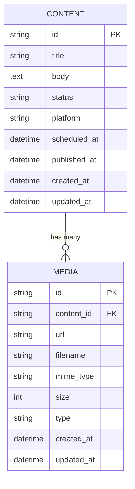

# Media Library Interface

<cite>
**Referenced Files in This Document**
- [media-drawer.tsx](file://components/calendar/media-drawer.tsx)
- [media-picker-modal.tsx](file://components/calendar/media-picker-modal.tsx)
- [media-panel-closed.tsx](file://components/calendar/media-panel-closed.tsx)
- [calendar-workspace.tsx](file://components/calendar/calendar-workspace.tsx)
- [content-editor.tsx](file://components/content/content-editor.tsx)
- [route.ts](file://app/api/media/route.ts)
- [upload route.ts](file://app/api/media/upload/route.ts)
- [media id route.ts](file://app/api/media/[id]/route.ts)
- [schema.prisma](file://prisma/schema.prisma)
</cite>

## Table of Contents
1. [Introduction](#introduction)
2. [Project Structure](#project-structure)
3. [Core Components](#core-components)
4. [Architecture Overview](#architecture-overview)
5. [Detailed Component Analysis](#detailed-component-analysis)
6. [Dependency Analysis](#dependency-analysis)
7. [Performance Considerations](#performance-considerations)
8. [Troubleshooting Guide](#troubleshooting-guide)
9. [Conclusion](#conclusion)
10. [Appendices](#appendices)

## Introduction
This document explains the media library user interface components that enable browsing, previewing, uploading, selecting, and scheduling media assets within a content calendar and content editor. It covers:
- The media drawer for quick browsing and drag-and-drop selection into scheduled posts
- The media picker modal for richer search, filtering, upload, and selection workflows
- Responsive design patterns and interaction flows
- UI states, loading indicators, and error handling
- Accessibility considerations and keyboard navigation support
- Integration examples with content creation and scheduling

## Project Structure
The media library spans client-side React components and Next.js API routes backed by Prisma and local file storage.

**Diagram sources**
- [media-drawer.tsx:31-38](file://components/calendar/media-drawer.tsx#L31-L38)
- [media-picker-modal.tsx:43-80](file://components/calendar/media-picker-modal.tsx#L43-L80)
- [media-picker-modal.tsx:86-127](file://components/calendar/media-picker-modal.tsx#L86-L127)
- [content-editor.tsx:165-230](file://components/content/content-editor.tsx#L165-L230)
- [content-editor.tsx:273-314](file://components/content/content-editor.tsx#L273-L314)
- [route.ts:4-23](file://app/api/media/route.ts#L4-L23)
- [upload route.ts:20-126](file://app/api/media/upload/route.ts#L20-L126)
- [media id route.ts:13-74](file://app/api/media/[id]/route.ts#L13-L74)

**Section sources**
- [media-drawer.tsx:1-167](file://components/calendar/media-drawer.tsx#L1-L167)
- [media-picker-modal.tsx:1-329](file://components/calendar/media-picker-modal.tsx#L1-L329)
- [media-panel-closed.tsx:1-88](file://components/calendar/media-panel-closed.tsx#L1-L88)
- [calendar-workspace.tsx:1-329](file://components/calendar/calendar-workspace.tsx#L1-L329)
- [content-editor.tsx:1-596](file://components/content/content-editor.tsx#L1-L596)
- [route.ts:1-80](file://app/api/media/route.ts#L1-L80)
- [upload route.ts:1-126](file://app/api/media/upload/route.ts#L1-L126)
- [media id route.ts:1-74](file://app/api/media/[id]/route.ts#L1-L74)
- [schema.prisma:21-55](file://prisma/schema.prisma#L21-L55)

## Core Components
- Media Drawer: A slide-in panel that lists recent media, supports click-to-select and drag-and-drop to the calendar, and provides quick links to manage media and UGC tools.
- Media Picker Modal: A full-screen modal with tabs (Photos active), grid previews, upload area, selection state, and confirmation to use selected media.
- Media Panel (Closed): A compact side panel when the drawer is closed, supporting drag-and-drop uploads and quick actions.
- Calendar Workspace: Orchestrates media drawer visibility, handles drag-and-drop from drawer to calendar cells, and opens the create-post modal with pending media.
- Content Editor: Provides media upload via file picker or drag-and-drop, displays thumbnails/videos, and supports deletion.

Key responsibilities:
- Fetching media list
- Uploading files to server
- Managing selection and preview states
- Handling errors and loading states
- Enabling drag-and-drop integration with scheduling

**Section sources**
- [media-drawer.tsx:6-20](file://components/calendar/media-drawer.tsx#L6-L20)
- [media-picker-modal.tsx:5-18](file://components/calendar/media-picker-modal.tsx#L5-L18)
- [media-panel-closed.tsx:5-15](file://components/calendar/media-panel-closed.tsx#L5-L15)
- [calendar-workspace.tsx:23-39](file://components/calendar/calendar-workspace.tsx#L23-L39)
- [content-editor.tsx:6-22](file://components/content/content-editor.tsx#L6-L22)

## Architecture Overview
The media flow connects UI components to API endpoints and data persistence.

**Diagram sources**
- [media-drawer.tsx:31-38](file://components/calendar/media-drawer.tsx#L31-L38)
- [calendar-workspace.tsx:157-171](file://components/calendar/calendar-workspace.tsx#L157-L171)
- [media-picker-modal.tsx:86-127](file://components/calendar/media-picker-modal.tsx#L86-L127)
- [content-editor.tsx:165-230](file://components/content/content-editor.tsx#L165-L230)
- [content-editor.tsx:273-314](file://components/content/content-editor.tsx#L273-L314)
- [route.ts:4-23](file://app/api/media/route.ts#L4-L23)
- [upload route.ts:20-126](file://app/api/media/upload/route.ts#L20-L126)
- [media id route.ts:13-74](file://app/api/media/[id]/route.ts#L13-L74)

## Detailed Component Analysis

### Media Drawer
- Purpose: Quick access to media library with thumbnail grid, selection via click, and drag-and-drop to calendar.
- Data fetching: Loads media on open; fetches from GET /api/media.
- Interaction:
  - Click thumbnail triggers selection callback.
  - Drag starts sets JSON payload with media details.
  - Escape key closes drawer.
- UI states: Empty state shows “No media yet” with upload prompt; otherwise grid of thumbnails.
- Accessibility: Keyboard support via Escape to close; images include alt text.

**Diagram sources**
- [media-drawer.tsx:31-38](file://components/calendar/media-drawer.tsx#L31-L38)
- [media-drawer.tsx:82-102](file://components/calendar/media-drawer.tsx#L82-L102)
- [media-drawer.tsx:40-48](file://components/calendar/media-drawer.tsx#L40-L48)

**Section sources**
- [media-drawer.tsx:1-167](file://components/calendar/media-drawer.tsx#L1-L167)

### Media Picker Modal
- Purpose: Rich media selection with tabs, upload, preview, and confirmation.
- Tabs: Photos (active), Text, Elements, Background, AI Image (placeholders).
- Data fetching: On tab change to Photos, fetches GET /api/media with loading/error states.
- Upload: Uses POST /api/media/upload with FormData; updates local list and selects newly uploaded item.
- Selection: Single selection with visual ring/border; footer shows selected filename and enables “Use this media”.
- Accessibility: Escape closes modal; focus management via modal container; buttons are keyboard accessible.

**Diagram sources**
- [media-picker-modal.tsx:43-80](file://components/calendar/media-picker-modal.tsx#L43-L80)
- [media-picker-modal.tsx:86-127](file://components/calendar/media-picker-modal.tsx#L86-L127)
- [media-picker-modal.tsx:129-132](file://components/calendar/media-picker-modal.tsx#L129-L132)
- [media-picker-modal.tsx:135-148](file://components/calendar/media-picker-modal.tsx#L135-L148)

**Section sources**
- [media-picker-modal.tsx:1-329](file://components/calendar/media-picker-modal.tsx#L1-L329)

### Media Panel (Closed)
- Purpose: Compact panel when drawer is closed; supports drag-and-drop upload and quick actions.
- Interactions:
  - Drag over/drop triggers upload handler passing files to parent.
  - Placeholder area guides users to drop media.
- Integration: Parent component handles actual upload calls and refreshes.

**Section sources**
- [media-panel-closed.tsx:1-88](file://components/calendar/media-panel-closed.tsx#L1-L88)

### Calendar Workspace Integration
- Manages media drawer visibility and sidebar width context.
- Handles drag-and-drop from drawer to calendar cells to prefill create-post modal with pending media.
- Provides global upload entry points and toast notifications for feedback.

**Diagram sources**
- [media-drawer.tsx:82-102](file://components/calendar/media-drawer.tsx#L82-L102)
- [calendar-workspace.tsx:157-171](file://components/calendar/calendar-workspace.tsx#L157-L171)
- [calendar-workspace.tsx:296-317](file://components/calendar/calendar-workspace.tsx#L296-L317)

**Section sources**
- [calendar-workspace.tsx:1-329](file://components/calendar/calendar-workspace.tsx#L1-L329)

### Content Editor Integration
- Supports multiple file upload via hidden input and drag-and-drop zone.
- Validates allowed types and size limits before upload.
- Displays thumbnails or video previews; allows deletion per item.
- Integrates with API routes for upload and delete operations.

**Diagram sources**
- [content-editor.tsx:165-230](file://components/content/content-editor.tsx#L165-L230)
- [content-editor.tsx:273-314](file://components/content/content-editor.tsx#L273-L314)
- [upload route.ts:20-126](file://app/api/media/upload/route.ts#L20-L126)
- [media id route.ts:13-74](file://app/api/media/[id]/route.ts#L13-L74)

**Section sources**
- [content-editor.tsx:1-596](file://components/content/content-editor.tsx#L1-L596)

## Dependency Analysis
- Client components depend on API routes for CRUD operations on media.
- API routes depend on Prisma client and filesystem for storage.
- Schema defines relationships between Content and Media, ensuring referential integrity and cascade deletes.

**Diagram sources**
- [route.ts:4-23](file://app/api/media/route.ts#L4-L23)
- [upload route.ts:20-126](file://app/api/media/upload/route.ts#L20-L126)
- [media id route.ts:13-74](file://app/api/media/[id]/route.ts#L13-L74)
- [schema.prisma:21-55](file://prisma/schema.prisma#L21-L55)

**Section sources**
- [route.ts:1-80](file://app/api/media/route.ts#L1-L80)
- [upload route.ts:1-126](file://app/api/media/upload/route.ts#L1-L126)
- [media id route.ts:1-74](file://app/api/media/[id]/route.ts#L1-L74)
- [schema.prisma:1-94](file://prisma/schema.prisma#L1-L94)

## Performance Considerations
- Limit fetched records: API returns up to 50 items to avoid large payloads.
- Lazy loading: Media drawer loads only when opened; modal loads per tab activation.
- Efficient previews: Use aspect-ratio containers and object-fit for fast rendering.
- Avoid redundant requests: Reuse media list state within components; consider debouncing rapid tab switches if needed.
- File size validation: Enforce 50 MB limit on client and server to prevent heavy uploads.

[No sources needed since this section provides general guidance]

## Troubleshooting Guide
Common issues and resolutions:
- Failed to load media: Check network response and ensure GET /api/media returns valid JSON. Handle error state in modal and drawer.
- Upload failed: Verify content-type is multipart/form-data, file type is allowed, and size under 50 MB. Inspect server logs for detailed messages.
- Unsupported file type: Ensure MIME types match allowed set; update client accept attributes accordingly.
- Delete not working: Confirm media exists and file path resolves correctly; ENOENT is ignored gracefully.
- Empty media list: Ensure uploads succeed and database entries are created; refresh after successful uploads.

**Section sources**
- [media-picker-modal.tsx:43-80](file://components/calendar/media-picker-modal.tsx#L43-L80)
- [media-picker-modal.tsx:86-127](file://components/calendar/media-picker-modal.tsx#L86-L127)
- [upload route.ts:20-126](file://app/api/media/upload/route.ts#L20-L126)
- [media id route.ts:13-74](file://app/api/media/[id]/route.ts#L13-L74)

## Conclusion
The media library interface provides a cohesive experience for browsing, uploading, selecting, and scheduling media across the calendar and content editor. It balances simplicity with powerful features like drag-and-drop, previews, and robust error handling. With clear UI states and accessible interactions, it supports efficient content creation workflows.

[No sources needed since this section summarizes without analyzing specific files]

## Appendices

### API Definitions
- GET /api/media
  - Response: { media: Array<{ id, url, filename, mimeType, size, type, createdAt }> }
- POST /api/media/upload
  - Body: multipart/form-data with fields file, contentId
  - Response: { success, media }
- DELETE /api/media/:id
  - Response: { success, id }

**Section sources**
- [route.ts:4-23](file://app/api/media/route.ts#L4-L23)
- [upload route.ts:20-126](file://app/api/media/upload/route.ts#L20-L126)
- [media id route.ts:13-74](file://app/api/media/[id]/route.ts#L13-L74)

### Data Model

**Diagram sources**
- [schema.prisma:21-55](file://prisma/schema.prisma#L21-L55)