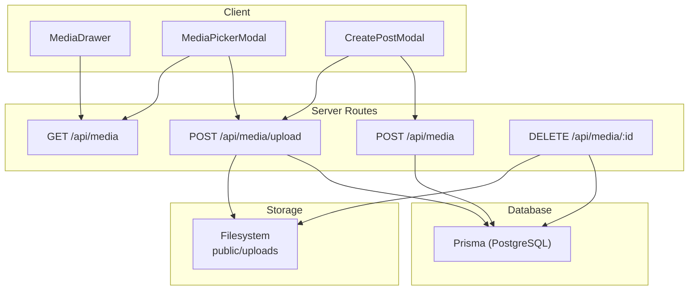
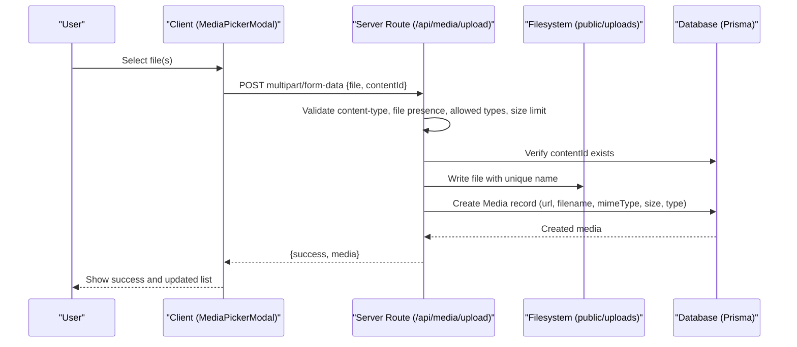
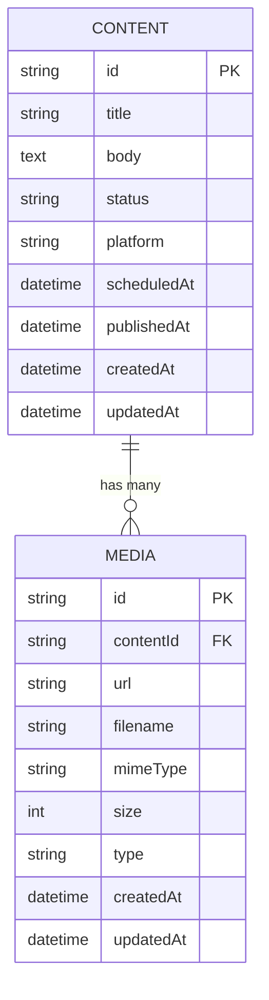
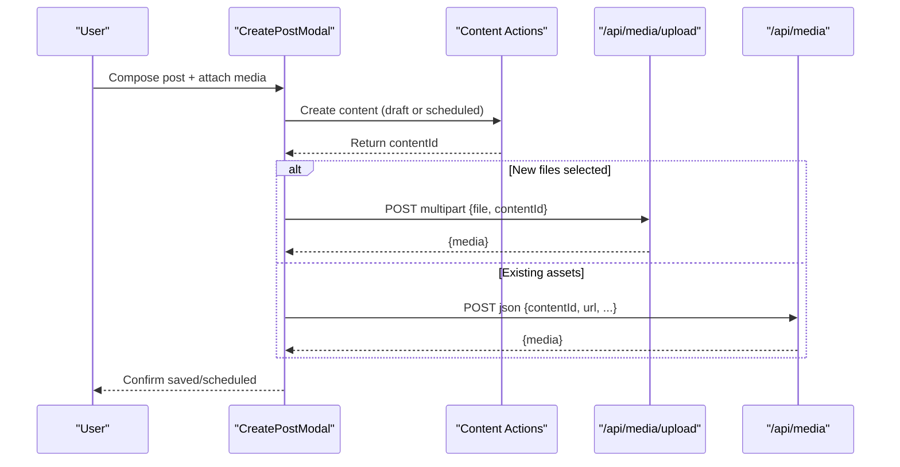
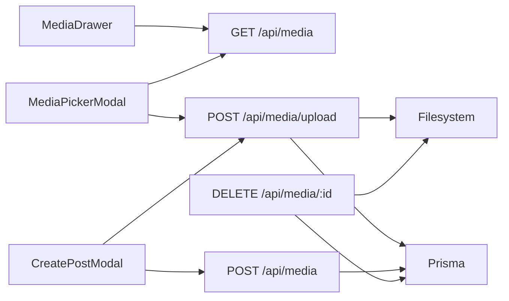

# Media Library

<cite>
**Referenced Files in This Document**
- [app/api/media/route.ts](file://app/api/media/route.ts)
- [app/api/media/upload/route.ts](file://app/api/media/upload/route.ts)
- [app/api/media/[id]/route.ts](file://app/api/media/[id]/route.ts)
- [components/calendar/media-drawer.tsx](file://components/calendar/media-drawer.tsx)
- [components/calendar/media-picker-modal.tsx](file://components/calendar/media-picker-modal.tsx)
- [components/calendar/create-post-modal.tsx](file://components/calendar/create-post-modal.tsx)
- [prisma/schema.prisma](file://prisma/schema.prisma)
</cite>

## Table of Contents
1. [Introduction](#introduction)
2. [Project Structure](#project-structure)
3. [Core Components](#core-components)
4. [Architecture Overview](#architecture-overview)
5. [Detailed Component Analysis](#detailed-component-analysis)
6. [Dependency Analysis](#dependency-analysis)
7. [Performance Considerations](#performance-considerations)
8. [Troubleshooting Guide](#troubleshooting-guide)
9. [Conclusion](#conclusion)
10. [Appendices](#appendices)

## Introduction
This document explains the Media Management system, covering how media is uploaded, validated, stored, and consumed across the application. It details the API endpoints for upload, retrieval, and deletion; the UI components that present the media library, drawer, and picker modal; and how media integrates with content creation and scheduling workflows. It also outlines storage configuration, file size limits, security considerations, and the database relationships between media assets and content entities.

## Project Structure
The media subsystem spans server routes (API), Prisma data models, and client-side components:
- API routes handle listing, creating, uploading, and deleting media records and files.
- The Prisma schema defines the Media model and its relationship to Content.
- Client components provide a media drawer, a design-time picker modal, and integration into post creation/scheduling.

**Diagram sources**
- [app/api/media/route.ts:4-23](file://app/api/media/route.ts#L4-L23)
- [app/api/media/route.ts:25-79](file://app/api/media/route.ts#L25-L79)
- [app/api/media/upload/route.ts:20-125](file://app/api/media/upload/route.ts#L20-L125)
- [app/api/media/[id]/route.ts:13-73](file://app/api/media/[id]/route.ts#L13-L73)
- [components/calendar/media-drawer.tsx:31-38](file://components/calendar/media-drawer.tsx#L31-L38)
- [components/calendar/media-picker-modal.tsx:43-80](file://components/calendar/media-picker-modal.tsx#L43-L80)
- [components/calendar/create-post-modal.tsx:132-169](file://components/calendar/create-post-modal.tsx#L132-L169)
- [prisma/schema.prisma:21-55](file://prisma/schema.prisma#L21-L55)

**Section sources**
- [app/api/media/route.ts:4-79](file://app/api/media/route.ts#L4-L79)
- [app/api/media/upload/route.ts:20-125](file://app/api/media/upload/route.ts#L20-L125)
- [app/api/media/[id]/route.ts:13-73](file://app/api/media/[id]/route.ts#L13-L73)
- [components/calendar/media-drawer.tsx:31-38](file://components/calendar/media-drawer.tsx#L31-L38)
- [components/calendar/media-picker-modal.tsx:43-80](file://components/calendar/media-picker-modal.tsx#L43-L80)
- [components/calendar/create-post-modal.tsx:132-169](file://components/calendar/create-post-modal.tsx#L132-L169)
- [prisma/schema.prisma:21-55](file://prisma/schema.prisma#L21-L55)

## Core Components
- Media API
  - GET /api/media: Lists recent media records from the database.
  - POST /api/media: Creates a media record when an asset already exists elsewhere (e.g., external URL).
  - POST /api/media/upload: Accepts multipart uploads, validates type and size, persists to filesystem under public/uploads, and creates a media record.
  - DELETE /api/media/:id: Deletes the physical file and removes the media record.
- UI Components
  - MediaDrawer: Displays thumbnails of media and supports drag-and-drop selection.
  - MediaPickerModal: Provides a tabbed interface to browse existing media, upload new files, and select assets for use.
  - CreatePostModal: Integrates media into content creation and scheduling flows, uploading pending files and linking existing assets.

**Section sources**
- [app/api/media/route.ts:4-79](file://app/api/media/route.ts#L4-L79)
- [app/api/media/upload/route.ts:20-125](file://app/api/media/upload/route.ts#L20-L125)
- [app/api/media/[id]/route.ts:13-73](file://app/api/media/[id]/route.ts#L13-L73)
- [components/calendar/media-drawer.tsx:22-116](file://components/calendar/media-drawer.tsx#L22-L116)
- [components/calendar/media-picker-modal.tsx:30-132](file://components/calendar/media-picker-modal.tsx#L30-L132)
- [components/calendar/create-post-modal.tsx:132-169](file://components/calendar/create-post-modal.tsx#L132-L169)

## Architecture Overview
The system follows a clear separation of concerns:
- Client components fetch or upload media via Next.js API routes.
- Server routes enforce validation and persist metadata to the database while storing files on disk.
- The database maintains relationships between Content and Media, enabling retrieval by content context.

**Diagram sources**
- [components/calendar/media-picker-modal.tsx:86-127](file://components/calendar/media-picker-modal.tsx#L86-L127)
- [app/api/media/upload/route.ts:20-125](file://app/api/media/upload/route.ts#L20-L125)
- [prisma/schema.prisma:21-55](file://prisma/schema.prisma#L21-L55)

## Detailed Component Analysis

### Media API Endpoints
- GET /api/media
  - Purpose: Retrieve a paginated list of media records ordered by newest first.
  - Response: Array of media items with id, url, filename, mimeType, size, type, createdAt.
  - Notes: Limits results to a fixed number to avoid large payloads.

- POST /api/media
  - Purpose: Register an existing media asset (with a known URL) against a content item.
  - Input: JSON body with contentId, url, filename, mimeType, size, type.
  - Validation: Requires contentId and url; defaults applied for missing fields.
  - Response: Created media object.

- POST /api/media/upload
  - Purpose: Accept file uploads, validate them, store on disk, and create a media record.
  - Validation:
    - Content-Type must be multipart/form-data or form-urlencoded.
    - File field required and must be a File instance.
    - contentId required and must exist in the database.
    - Allowed MIME types enforced (images and videos).
    - Max file size enforced (50 MB).
  - Storage: Writes to public/uploads with a unique filename derived from UUID + original extension.
  - Metadata: Stores url as /uploads/{filename}, filename, mimeType, size, and type (IMAGE vs VIDEO).
  - Response: Success payload with created media.

- DELETE /api/media/:id
  - Purpose: Remove a media asset both from disk and database.
  - Behavior: Attempts to delete the file; ignores ENOENT if already missing. Then deletes the database record.
  - Response: Success with id.

**Section sources**
- [app/api/media/route.ts:4-79](file://app/api/media/route.ts#L4-L79)
- [app/api/media/upload/route.ts:20-125](file://app/api/media/upload/route.ts#L20-L125)
- [app/api/media/[id]/route.ts:13-73](file://app/api/media/[id]/route.ts#L13-L73)

### Media Library Interface
- MediaDrawer
  - Loads media via GET /api/media when opened.
  - Renders a thumbnail grid with click-to-select and drag-start handlers.
  - Provides keyboard support (Escape to close) and a link to manage media.

- MediaPickerModal
  - Tabs include Photos (active), Text, Elements, Background, AI Image (placeholders).
  - Fetches media on tab change and displays images/videos with previews.
  - Supports inline upload via hidden file input and calls POST /api/media/upload.
  - Allows selecting one or more items and returning them to the caller.

- Integration with Post Creation
  - CreatePostModal opens the MediaPickerModal to insert media.
  - On save or schedule, it uploads any pending local files and registers existing assets against the newly created content.

**Section sources**
- [components/calendar/media-drawer.tsx:31-116](file://components/calendar/media-drawer.tsx#L31-L116)
- [components/calendar/media-picker-modal.tsx:43-132](file://components/calendar/media-picker-modal.tsx#L43-L132)
- [components/calendar/create-post-modal.tsx:132-169](file://components/calendar/create-post-modal.tsx#L132-L169)

### File Processing Pipelines, Thumbnails, and Optimization
- Current pipeline
  - Upload validation and persistence are handled directly in the upload route.
  - No server-side thumbnail generation or image/video optimization is implemented at this time.
  - Type detection sets MEDIA.type to IMAGE or VIDEO based on MIME prefix.

- Recommendations for future enhancements
  - Generate thumbnails for images and video frames during upload using a processing library.
  - Optimize images (resize, compress) and transcode videos to web-friendly formats.
  - Store generated variants alongside originals and reference appropriate versions in the UI.

[No sources needed since this section provides general guidance]

### Database Relationships
- Media Model
  - Fields: id, contentId, url, filename, mimeType, size, type, timestamps.
  - Relationship: Belongs to Content via contentId with cascade delete.
  - Index: contentId indexed for efficient queries.

- Content Model
  - One-to-many relationship with Media; each content can have multiple media assets.

**Diagram sources**
- [prisma/schema.prisma:21-55](file://prisma/schema.prisma#L21-L55)

**Section sources**
- [prisma/schema.prisma:21-55](file://prisma/schema.prisma#L21-L55)

### Media Integration with Content Creation and Scheduling
- Draft creation flow
  - User composes content and optionally attaches media.
  - On save, the system creates the content record and then associates media:
    - For newly uploaded files, POST /api/media/upload is called with contentId.
    - For existing assets, POST /api/media is called to register them against the content.

- Scheduling flow
  - When scheduling a post, the same association logic applies after the content is created.
  - Media remains linked to the content regardless of publish state.

**Diagram sources**
- [components/calendar/create-post-modal.tsx:132-169](file://components/calendar/create-post-modal.tsx#L132-L169)
- [app/api/media/upload/route.ts:20-125](file://app/api/media/upload/route.ts#L20-L125)
- [app/api/media/route.ts:25-79](file://app/api/media/route.ts#L25-L79)

**Section sources**
- [components/calendar/create-post-modal.tsx:132-169](file://components/calendar/create-post-modal.tsx#L132-L169)

## Dependency Analysis
- Client dependencies
  - MediaDrawer depends on GET /api/media to populate thumbnails.
  - MediaPickerModal depends on GET /api/media and POST /api/media/upload.
  - CreatePostModal orchestrates uploads and registrations during save/schedule.

- Server dependencies
  - All routes depend on Prisma client for database operations.
  - Upload and Delete routes depend on Node filesystem APIs to manage files under public/uploads.

- Data dependencies
  - Media records require a valid contentId referencing an existing Content row.
  - Deletion cascades remove associated media when content is deleted.

**Diagram sources**
- [components/calendar/media-drawer.tsx:31-38](file://components/calendar/media-drawer.tsx#L31-L38)
- [components/calendar/media-picker-modal.tsx:43-127](file://components/calendar/media-picker-modal.tsx#L43-L127)
- [components/calendar/create-post-modal.tsx:132-169](file://components/calendar/create-post-modal.tsx#L132-L169)
- [app/api/media/route.ts:4-79](file://app/api/media/route.ts#L4-L79)
- [app/api/media/upload/route.ts:20-125](file://app/api/media/upload/route.ts#L20-L125)
- [app/api/media/[id]/route.ts:13-73](file://app/api/media/[id]/route.ts#L13-L73)

**Section sources**
- [components/calendar/media-drawer.tsx:31-38](file://components/calendar/media-drawer.tsx#L31-L38)
- [components/calendar/media-picker-modal.tsx:43-127](file://components/calendar/media-picker-modal.tsx#L43-L127)
- [components/calendar/create-post-modal.tsx:132-169](file://components/calendar/create-post-modal.tsx#L132-L169)
- [app/api/media/route.ts:4-79](file://app/api/media/route.ts#L4-L79)
- [app/api/media/upload/route.ts:20-125](file://app/api/media/upload/route.ts#L20-L125)
- [app/api/media/[id]/route.ts:13-73](file://app/api/media/[id]/route.ts#L13-L73)

## Performance Considerations
- Pagination and limits
  - The list endpoint returns a capped set of recent media to reduce payload size.
- File handling
  - Uploading large files consumes memory for buffering; consider streaming for very large assets.
- Storage layout
  - All files are stored under a single directory; consider partitioning by date or contentId as volume grows.
- Rendering
  - Thumbnails are not generated; consider lazy-loading images and adding responsive sizes to improve perceived performance.

[No sources needed since this section provides general guidance]

## Troubleshooting Guide
Common issues and resolutions:
- Unsupported file type
  - Cause: MIME type not in the allowed list.
  - Resolution: Convert to a supported format (JPEG, PNG, WebP, GIF, MP4, WebM, QuickTime).

- File too large
  - Cause: Exceeds 50 MB limit.
  - Resolution: Compress or trim media before upload.

- Missing contentId
  - Cause: Required parameter not provided or invalid.
  - Resolution: Ensure a valid contentId is attached to the upload request.

- Content not found
  - Cause: contentId does not correspond to an existing Content record.
  - Resolution: Create or verify the content before uploading media.

- File not found on delete
  - Cause: Physical file was previously removed.
  - Resolution: The route tolerates missing files; ensure the database record is cleaned up.

- Network errors
  - Cause: API failures or timeouts.
  - Resolution: Retry with backoff and surface user-friendly error messages.

**Section sources**
- [app/api/media/upload/route.ts:20-125](file://app/api/media/upload/route.ts#L20-L125)
- [app/api/media/[id]/route.ts:13-73](file://app/api/media/[id]/route.ts#L13-L73)

## Conclusion
The Media Management system provides a straightforward workflow for uploading, organizing, and associating media with content. While it currently stores raw files without server-side optimization, it offers robust validation, secure storage practices, and clear database relationships. Future enhancements such as thumbnail generation, image/video optimization, and advanced search/filtering will further improve usability and performance.

[No sources needed since this section summarizes without analyzing specific files]

## Appendices

### API Reference Summary
- GET /api/media
  - Returns a list of media records with basic metadata.
- POST /api/media
  - Registers an existing media asset against a content item.
- POST /api/media/upload
  - Accepts multipart uploads, validates, stores files, and creates media records.
- DELETE /api/media/:id
  - Removes a media asset from disk and database.

**Section sources**
- [app/api/media/route.ts:4-79](file://app/api/media/route.ts#L4-L79)
- [app/api/media/upload/route.ts:20-125](file://app/api/media/upload/route.ts#L20-L125)
- [app/api/media/[id]/route.ts:13-73](file://app/api/media/[id]/route.ts#L13-L73)

### Security Considerations
- Content-Type enforcement ensures only multipart/form-data uploads are accepted.
- Allowed MIME types restrict uploads to safe and expected formats.
- Size limits protect server resources.
- Unique filenames prevent overwrites and collisions.
- File deletion gracefully handles missing files to avoid crashes.

**Section sources**
- [app/api/media/upload/route.ts:20-125](file://app/api/media/upload/route.ts#L20-L125)
- [app/api/media/[id]/route.ts:13-73](file://app/api/media/[id]/route.ts#L13-L73)