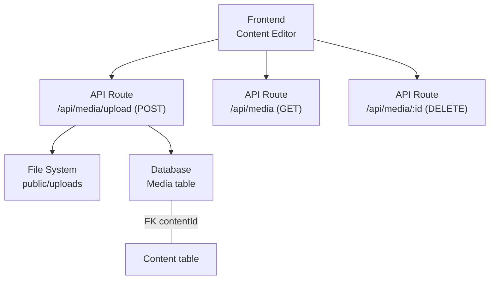
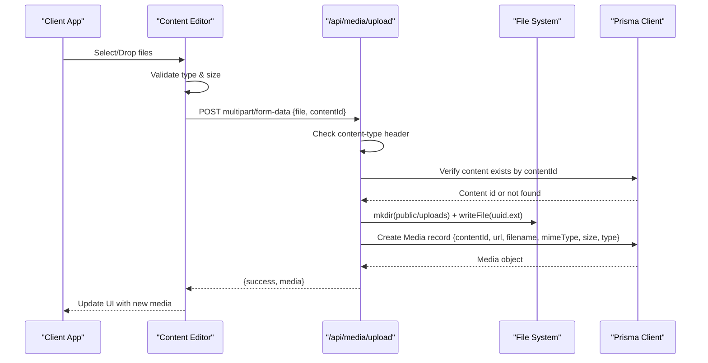
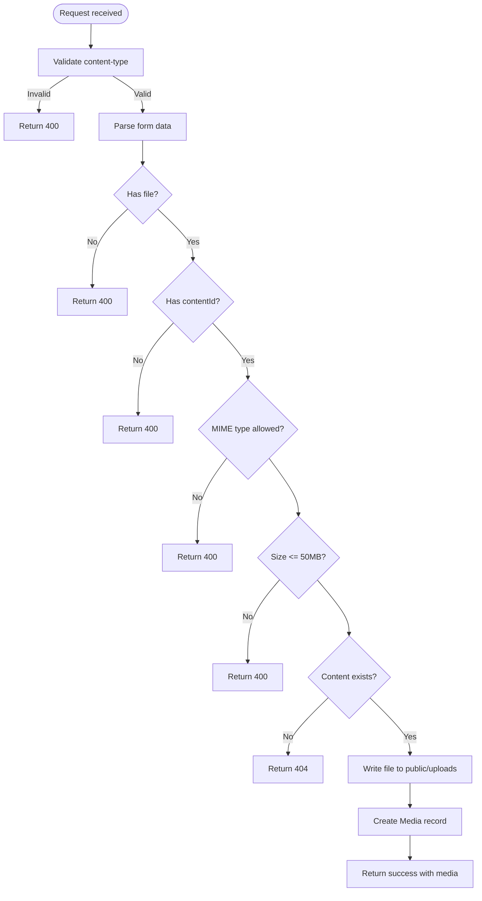
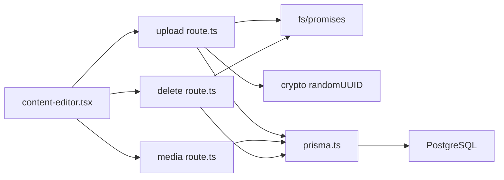

# Media Upload Processing

<cite>
**Referenced Files in This Document**
- [route.ts](file://app/api/media/upload/route.ts)
- [route.ts](file://app/api/media/route.ts)
- [route.ts](file://app/api/media/[id]/route.ts)
- [content-editor.tsx](file://components/content/content-editor.tsx)
- [schema.prisma](file://prisma/schema.prisma)
- [prisma.ts](file://lib/prisma.ts)
</cite>

## Table of Contents
1. [Introduction](#introduction)
2. [Project Structure](#project-structure)
3. [Core Components](#core-components)
4. [Architecture Overview](#architecture-overview)
5. [Detailed Component Analysis](#detailed-component-analysis)
6. [Dependency Analysis](#dependency-analysis)
7. [Performance Considerations](#performance-considerations)
8. [Troubleshooting Guide](#troubleshooting-guide)
9. [Conclusion](#conclusion)

## Introduction
This document explains the media upload processing system for content entities. It covers the end-to-end workflow from form data handling and file validation to storage management, database integration, and error handling. The system supports images and videos with strict security checks and associates uploaded media with a specific content entity via contentId.

## Project Structure
The media upload feature spans frontend components and backend API routes:
- Frontend: Content editor component handles user interactions, validates files client-side, and sends uploads to the server.
- Backend: Next.js API routes handle multipart uploads, validate inputs, persist files to disk, and record metadata in the database.
- Database: Prisma schema defines the Media model and its relationship to Content.

**Diagram sources**
- [route.ts:20-125](file://app/api/media/upload/route.ts#L20-L125)
- [route.ts:4-23](file://app/api/media/route.ts#L4-L23)
- [route.ts:13-73](file://app/api/media/[id]/route.ts#L13-L73)
- [schema.prisma:21-55](file://prisma/schema.prisma#L21-L55)

**Section sources**
- [content-editor.tsx:165-230](file://components/content/content-editor.tsx#L165-L230)
- [route.ts:20-125](file://app/api/media/upload/route.ts#L20-L125)
- [route.ts:4-23](file://app/api/media/route.ts#L4-L23)
- [route.ts:13-73](file://app/api/media/[id]/route.ts#L13-L73)
- [schema.prisma:21-55](file://prisma/schema.prisma#L21-L55)

## Core Components
- File upload handler: Validates request type, extracts file and contentId, enforces allowed MIME types and size limits, verifies content existence, writes file to disk under public/uploads, determines media type, and persists metadata to the database.
- Media listing: Returns recent media entries with essential fields.
- Media deletion: Removes the physical file and deletes the database record.
- Frontend uploader: Validates files on the client side, constructs FormData with file and contentId, posts to the upload endpoint, updates UI state, and handles errors.

Key constraints and supported formats:
- Allowed MIME types: image/jpeg, image/png, image/webp, image/gif, video/mp4, video/webm, video/quicktime
- Maximum file size: 50 MB
- Storage path: public/uploads (created automatically if missing)
- Metadata stored: filename, mimeType, size, type (IMAGE or VIDEO), url (/uploads/<uuid>.ext), contentId

Security measures:
- Strict content-type check for multipart/form-data
- Whitelist-based MIME type validation
- Enforced file size limit
- Content existence verification before association
- Safe filename generation using UUIDs to avoid collisions and path traversal risks

Database integration:
- Media model stores all required metadata and links to Content via contentId
- Relationship is enforced by foreign key with cascade delete

**Section sources**
- [route.ts:8-18](file://app/api/media/upload/route.ts#L8-L18)
- [route.ts:20-125](file://app/api/media/upload/route.ts#L20-L125)
- [route.ts:4-23](file://app/api/media/route.ts#L4-L23)
- [route.ts:13-73](file://app/api/media/[id]/route.ts#L13-L73)
- [content-editor.tsx:24-34](file://components/content/content-editor.tsx#L24-L34)
- [content-editor.tsx:165-230](file://components/content/content-editor.tsx#L165-L230)
- [schema.prisma:39-55](file://prisma/schema.prisma#L39-L55)

## Architecture Overview
The upload flow ensures secure, validated, and traceable media attachment to content items.

**Diagram sources**
- [content-editor.tsx:165-230](file://components/content/content-editor.tsx#L165-L230)
- [route.ts:20-125](file://app/api/media/upload/route.ts#L20-L125)
- [schema.prisma:39-55](file://prisma/schema.prisma#L39-L55)

## Detailed Component Analysis

### Upload Endpoint: /api/media/upload (POST)
Responsibilities:
- Validate request content-type
- Parse multipart form data to extract file and contentId
- Validate file presence, MIME type whitelist, and size limit
- Verify that the referenced content exists
- Generate a safe filename using UUID and original extension
- Ensure upload directory exists and write file to disk
- Determine media type (IMAGE vs VIDEO) based on MIME prefix
- Persist media metadata to the database and return it

Error handling:
- 400 for invalid content-type, missing file, missing contentId, unsupported MIME type, or oversized file
- 404 when contentId does not exist
- 500 for unexpected server errors

**Diagram sources**
- [route.ts:20-125](file://app/api/media/upload/route.ts#L20-L125)

**Section sources**
- [route.ts:20-125](file://app/api/media/upload/route.ts#L20-L125)

### Media Listing: /api/media (GET)
- Retrieves up to 50 most recent media records ordered by creation time
- Returns id, url, filename, mimeType, size, type, createdAt

Use cases:
- Populate media galleries or lists in the editor
- Provide quick access to recently uploaded assets

**Section sources**
- [route.ts:4-23](file://app/api/media/route.ts#L4-L23)

### Media Deletion: /api/media/:id (DELETE)
- Finds media by id
- Deletes the corresponding file from public/uploads (ignores ENOENT)
- Deletes the database record
- Returns success or appropriate error

**Section sources**
- [route.ts:13-73](file://app/api/media/[id]/route.ts#L13-L73)

### Frontend Uploader: Content Editor
Responsibilities:
- Client-side validation of MIME type and file size
- Construct FormData with file and contentId
- Send sequential uploads to /api/media/upload
- Update local media list on success
- Display errors to the user
- Support drag-and-drop and file picker

Validation rules mirror the server:
- Allowed MIME types: JPEG, PNG, WebP, GIF, MP4, WebM, QuickTime
- Max size: 50 MB

User experience:
- Shows uploading state
- Displays per-file errors
- Allows deleting media with confirmation

**Section sources**
- [content-editor.tsx:24-34](file://components/content/content-editor.tsx#L24-L34)
- [content-editor.tsx:165-230](file://components/content/content-editor.tsx#L165-L230)
- [content-editor.tsx:273-314](file://components/content/content-editor.tsx#L273-L314)

### Database Schema and Relationships
- Media model includes: id, contentId, url, filename, mimeType, size, type, timestamps
- Foreign key contentId references Content with cascade delete
- Index on contentId for efficient queries

Relationships:
- One Content can have many Media items
- Deleting a Content cascades to related Media

**Section sources**
- [schema.prisma:21-55](file://prisma/schema.prisma#L21-L55)

## Dependency Analysis
- Frontend depends on Next.js fetch API and React state management
- Upload route depends on Node fs/promises for file operations and crypto for UUID generation
- All routes depend on Prisma client configured via lib/prisma.ts
- Database provider is PostgreSQL via Prisma adapter

**Diagram sources**
- [content-editor.tsx:165-230](file://components/content/content-editor.tsx#L165-L230)
- [route.ts:20-125](file://app/api/media/upload/route.ts#L20-L125)
- [route.ts:4-23](file://app/api/media/route.ts#L4-L23)
- [route.ts:13-73](file://app/api/media/[id]/route.ts#L13-L73)
- [prisma.ts:1-30](file://lib/prisma.ts#L1-L30)

**Section sources**
- [prisma.ts:1-30](file://lib/prisma.ts#L1-L30)

## Performance Considerations
- Sequential uploads: The frontend uploads files one by one; consider batching or parallel uploads for large batches to reduce total latency.
- Memory usage: Converting files to Buffer occurs server-side; ensure adequate memory for large files near the 50 MB limit.
- Disk I/O: Writing files synchronously in a single process may block; consider streaming writes for very large files.
- Database writes: Each upload triggers a create operation; ensure indexes on frequently queried fields (contentId already indexed).
- Static serving: Files are served from public/uploads; configure your hosting environment to serve this directory efficiently.

[No sources needed since this section provides general guidance]

## Troubleshooting Guide
Common issues and resolutions:
- Invalid content-type: Ensure requests use multipart/form-data when uploading files.
- Missing file or contentId: Both must be present in the form payload.
- Unsupported file type: Only JPEG, PNG, WebP, GIF, MP4, WebM, QuickTime are accepted.
- File too large: Limit is 50 MB per file.
- Content not found: Verify the contentId corresponds to an existing content record.
- Delete failures: If the file is missing on disk, deletion still proceeds; otherwise, check permissions and paths.

Operational notes:
- Directory creation: The upload directory is created automatically if missing.
- Error responses: Use HTTP status codes 400, 404, and 500 consistently with descriptive messages.

**Section sources**
- [route.ts:20-125](file://app/api/media/upload/route.ts#L20-L125)
- [route.ts:13-73](file://app/api/media/[id]/route.ts#L13-L73)

## Conclusion
The media upload system provides a secure, validated, and well-integrated pipeline for attaching images and videos to content. It enforces strict MIME type and size constraints, safely stores files, and maintains accurate metadata in the database linked to content via contentId. The frontend offers a smooth user experience with client-side validation and clear error feedback. For scaling, consider parallel uploads, streaming writes, and external storage backends.