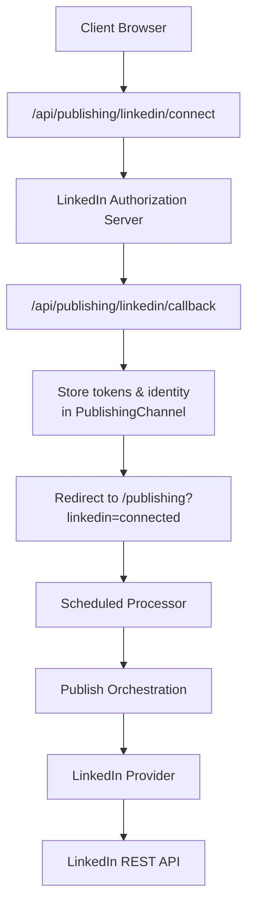
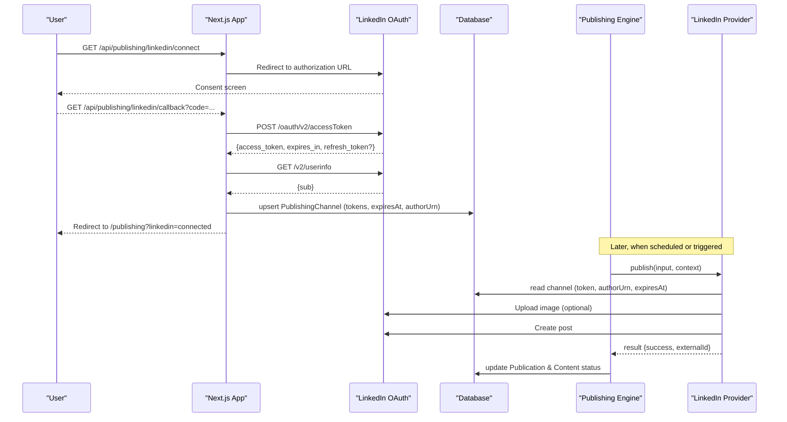
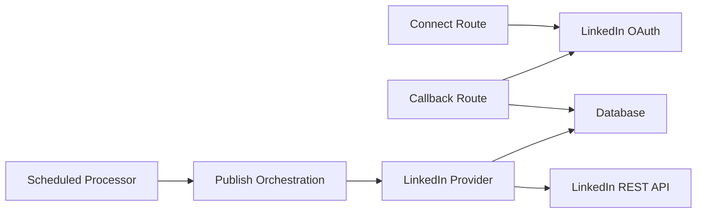

# LinkedIn OAuth Integration

<cite>
**Referenced Files in This Document**
- [connect route](file://app/api/publishing/linkedin/connect/route.ts)
- [callback route](file://app/api/publishing/linkedin/callback/route.ts)
- [LinkedIn provider](file://app/publishing/engine/providers/linkedin.ts)
- [provider registry](file://app/publishing/engine/providers/index.ts)
- [publish orchestration](file://app/publishing/engine/publish.ts)
- [scheduled processor](file://app/publishing/engine/process-scheduled.ts)
- [types](file://app/publishing/engine/types.ts)
- [Prisma schema](file://prisma/schema.prisma)
</cite>

## Table of Contents
1. Introduction
2. Project Structure
3. Core Components
4. Architecture Overview
5. Detailed Component Analysis
6. Dependency Analysis
7. Performance Considerations
8. Troubleshooting Guide
9. Conclusion

## Introduction
This document explains the LinkedIn OAuth integration for publishing content to LinkedIn from the application. It covers the complete authentication flow from the initial connection request to token storage and usage, documents the OAuth endpoints (/connect and /callback), details token management and session handling, explains the LinkedIn API client implementation within the provider system, outlines configuration requirements (credentials, redirect URLs, permissions), and provides error handling guidance and troubleshooting techniques for common issues such as authentication failures, token expiration, and API rate limits.

## Project Structure
The LinkedIn integration spans several modules:
- OAuth routes under app/api/publishing/linkedin for initiating authorization and handling callbacks
- A provider implementation under app/publishing/engine/providers that integrates with LinkedIn’s REST APIs
- Publishing engine components that orchestrate scheduled publications and invoke providers
- Data model definitions in Prisma schema for storing channel credentials and publication state

**Diagram sources**
- [connect route:1-34](file://app/api/publishing/linkedin/connect/route.ts#L1-L34)
- [callback route:1-169](file://app/api/publishing/linkedin/callback/route.ts#L1-L169)
- [LinkedIn provider:1-284](file://app/publishing/engine/providers/linkedin.ts#L1-L284)
- [publish orchestration:1-116](file://app/publishing/engine/publish.ts#L1-L116)
- [scheduled processor:1-72](file://app/publishing/engine/process-scheduled.ts#L1-L72)

**Section sources**
- [connect route:1-34](file://app/api/publishing/linkedin/connect/route.ts#L1-L34)
- [callback route:1-169](file://app/api/publishing/linkedin/callback/route.ts#L1-L169)
- [LinkedIn provider:1-284](file://app/publishing/engine/providers/linkedin.ts#L1-L284)
- [publish orchestration:1-116](file://app/publishing/engine/publish.ts#L1-L116)
- [scheduled processor:1-72](file://app/publishing/engine/process-scheduled.ts#L1-L72)
- [Prisma schema:57-73](file://prisma/schema.prisma#L57-L73)

## Core Components
- OAuth connect endpoint: Builds the LinkedIn authorization URL using configured client ID and app URL, sets required scopes, and redirects the user to LinkedIn.
- OAuth callback endpoint: Exchanges the authorization code for an access token, retrieves user info to derive the author URN, and persists credentials and identity into the database.
- LinkedIn provider: Implements publishing by validating stored credentials, optionally uploading images via LinkedIn’s image upload flow, and creating posts on LinkedIn.
- Publishing engine: Orchestrates publication execution, selects the appropriate provider based on platform, and updates publication status accordingly.
- Scheduled processor: Periodically finds due publications and triggers publishing.

Key responsibilities:
- Authentication flow: connect -> authorize -> callback -> store tokens
- Token usage: Bearer token in headers for API calls; expiry checks before publish
- Session handling: No server-side sessions are used; persistence is via the database record for the channel

**Section sources**
- [connect route:1-34](file://app/api/publishing/linkedin/connect/route.ts#L1-L34)
- [callback route:1-169](file://app/api/publishing/linkedin/callback/route.ts#L1-L169)
- [LinkedIn provider:141-284](file://app/publishing/engine/providers/linkedin.ts#L141-L284)
- [publish orchestration:1-116](file://app/publishing/engine/publish.ts#L1-L116)
- [scheduled processor:1-72](file://app/publishing/engine/process-scheduled.ts#L1-L72)

## Architecture Overview
The system uses a standard OAuth 2.0 authorization code flow with LinkedIn, followed by REST API calls to publish content. The provider pattern abstracts platform-specific logic, allowing the publishing engine to remain decoupled from provider details.

**Diagram sources**
- [connect route:1-34](file://app/api/publishing/linkedin/connect/route.ts#L1-L34)
- [callback route:1-169](file://app/api/publishing/linkedin/callback/route.ts#L1-L169)
- [LinkedIn provider:141-284](file://app/publishing/engine/providers/linkedin.ts#L141-L284)
- [publish orchestration:1-116](file://app/publishing/engine/publish.ts#L1-L116)

## Detailed Component Analysis

### OAuth Connect Endpoint (/connect)
- Purpose: Initiate LinkedIn OAuth by redirecting users to the authorization endpoint with required parameters.
- Request: GET /api/publishing/linkedin/connect
- Response: HTTP 302 redirect to LinkedIn authorization URL
- Behavior:
  - Reads environment variables for client ID and app URL
  - Constructs redirect URI pointing to the callback route
  - Sets scope to openid profile w_member_social
  - Redirects to LinkedIn authorization endpoint

Error handling:
- Missing environment variables return a 500 JSON error indicating misconfiguration

Configuration requirements:
- LINKEDIN_CLIENT_ID must be set
- APP_URL must be set and match the registered redirect URI in LinkedIn app settings

**Section sources**
- [connect route:1-34](file://app/api/publishing/linkedin/connect/route.ts#L1-L34)

### OAuth Callback Endpoint (/callback)
- Purpose: Exchange the authorization code for tokens, retrieve user identity, and persist credentials.
- Request: GET /api/publishing/linkedin/callback?code=...&error=...
- Response: JSON error or redirect to /publishing?linkedin=connected
- Behavior:
  - Validates presence of code or handles error parameter
  - Exchanges code for access token via LinkedIn’s token endpoint
  - Retrieves user info to derive author URN
  - Persists access token, optional refresh token, expiry time, and author URN to the database
  - Redirects back to the application

Error handling:
- Missing code returns a 400 error
- Token exchange failures return a 400 error with details
- Missing access token returns a 400 error
- User info retrieval failures return a 400 error with details
- Missing member identifier returns a 400 error

Token storage:
- Stored in the PublishingChannel table with fields for access token, refresh token, expiry timestamp, and author URN

Session handling:
- No server-side session is maintained; the database record serves as the persistent connection state

**Section sources**
- [callback route:1-169](file://app/api/publishing/linkedin/callback/route.ts#L1-L169)
- [Prisma schema:57-73](file://prisma/schema.prisma#L57-L73)

### LinkedIn Provider Implementation
- Purpose: Publish content to LinkedIn using stored credentials and the LinkedIn REST API.
- Responsibilities:
  - Validate channel credentials and expiry
  - Optionally upload images via LinkedIn’s image upload flow
  - Create posts with commentary and optional media
  - Return success/failure results with external IDs where available

Processing logic:
- Reads channel data from the database
- Checks for missing access token, expired token, and missing author URN
- If media includes an image, downloads it from the application’s storage and uploads to LinkedIn
- Creates a post with visibility and distribution settings
- Captures external ID from response headers

Error handling:
- Returns structured errors for missing credentials, expired tokens, missing author URN, and API failures
- Logs detailed error information for debugging

Performance considerations:
- Downloads images once per post
- Uses direct PUT upload to LinkedIn-provided upload URL
- Avoids unnecessary network calls by checking token validity first

**Section sources**
- [LinkedIn provider:141-284](file://app/publishing/engine/providers/linkedin.ts#L141-L284)

### Publishing Engine and Provider Registry
- Purpose: Orchestrate publishing by selecting the correct provider and updating publication status.
- Behavior:
  - Loads publication details including associated content and media
  - Validates publication state and content body
  - Ensures the channel is connected
  - Invokes the provider’s publish method with input and context
  - Updates publication and content records upon success or failure

Provider registry:
- Maps platform names to provider implementations
- Throws an error if no provider is configured for a given platform

**Section sources**
- [publish orchestration:1-116](file://app/publishing/engine/publish.ts#L1-L116)
- [provider registry:1-21](file://app/publishing/engine/providers/index.ts#L1-L21)

### Scheduled Processing
- Purpose: Find due publications and trigger publishing.
- Behavior:
  - Queries publications with status SCHEDULED and scheduledAt in the past
  - Processes up to a batch size per run
  - Calls the publish orchestration function and aggregates results

**Section sources**
- [scheduled processor:1-72](file://app/publishing/engine/process-scheduled.ts#L1-L72)

### Data Model
- PublishingChannel stores platform-specific connection details:
  - Platform name, connection status, account name
  - Access token, refresh token, expiry timestamp
  - External identifiers and author URN
- Publication tracks per-content-per-channel publishing lifecycle:
  - Status transitions (QUEUED, SCHEDULED, PUBLISHED, FAILED)
  - Scheduled and published timestamps
  - External IDs and error messages

**Section sources**
- [Prisma schema:57-73](file://prisma/schema.prisma#L57-L73)
- [Prisma schema:75-93](file://prisma/schema.prisma#L75-L93)

## Dependency Analysis
The integration has clear dependencies between components:
- OAuth routes depend on environment configuration and LinkedIn endpoints
- Callback route depends on database persistence and LinkedIn userinfo endpoint
- Provider depends on database for credential retrieval and LinkedIn REST APIs
- Publishing engine depends on provider registry and database for state updates
- Scheduled processor depends on database queries and publishing orchestration

**Diagram sources**
- [connect route:1-34](file://app/api/publishing/linkedin/connect/route.ts#L1-L34)
- [callback route:1-169](file://app/api/publishing/linkedin/callback/route.ts#L1-L169)
- [LinkedIn provider:141-284](file://app/publishing/engine/providers/linkedin.ts#L141-L284)
- [publish orchestration:1-116](file://app/publishing/engine/publish.ts#L1-L116)
- [scheduled processor:1-72](file://app/publishing/engine/process-scheduled.ts#L1-L72)

**Section sources**
- [connect route:1-34](file://app/api/publishing/linkedin/connect/route.ts#L1-L34)
- [callback route:1-169](file://app/api/publishing/linkedin/callback/route.ts#L1-L169)
- [LinkedIn provider:141-284](file://app/publishing/engine/providers/linkedin.ts#L141-L284)
- [publish orchestration:1-116](file://app/publishing/engine/publish.ts#L1-L116)
- [scheduled processor:1-72](file://app/publishing/engine/process-scheduled.ts#L1-L72)

## Performance Considerations
- Image uploads: The provider downloads images from application storage and uploads them directly to LinkedIn using a provided upload URL. Ensure storage endpoints are fast and reliable to avoid delays.
- Token validation: Checking token expiry before API calls prevents unnecessary network requests and reduces error rates.
- Batch processing: The scheduled processor limits the number of publications processed per run to avoid overwhelming resources.
- Logging: Detailed logs are emitted at key points to aid performance monitoring and debugging.

[No sources needed since this section provides general guidance]

## Troubleshooting Guide
Common issues and resolutions:

- Environment misconfiguration:
  - Symptoms: Errors indicating missing LinkedIn OAuth environment variables during connect or callback
  - Resolution: Ensure LINKEDIN_CLIENT_ID, LINKEDIN_CLIENT_SECRET, and APP_URL are correctly set and that APP_URL matches the redirect URI configured in LinkedIn app settings

- Authorization code missing:
  - Symptoms: Callback returns a 400 error stating missing authorization code
  - Resolution: Verify that the user completed the consent flow and that the redirect URI is correct

- Token exchange failure:
  - Symptoms: Callback returns a 400 error with details about token exchange failure
  - Resolution: Check LinkedIn app permissions, client secret correctness, and redirect URI matching; review logged details for specific error codes

- User info retrieval failure:
  - Symptoms: Callback returns a 400 error unable to retrieve LinkedIn member identity
  - Resolution: Ensure the openid and profile scopes are granted; verify network connectivity to LinkedIn userinfo endpoint

- Missing member identifier:
  - Symptoms: Callback returns a 400 error stating LinkedIn did not return a member identifier
  - Resolution: Reconnect LinkedIn after enabling required profile permissions

- Missing access token or expired token:
  - Symptoms: Publishing fails with errors indicating missing or expired access token
  - Resolution: Reconnect LinkedIn to obtain a new token; ensure expiresAt is updated on successful callback

- Missing author URN:
  - Symptoms: Publishing fails with error indicating missing author URN
  - Resolution: Reconnect LinkedIn after enabling required profile permission to obtain the member identifier

- API rate limits or transient errors:
  - Symptoms: Publishing returns errors with LinkedIn API status codes
  - Resolution: Implement retry logic with exponential backoff; monitor rate limit headers; reduce batch sizes if necessary

Debugging techniques:
- Review console logs for OAuth authorization, token exchange, user info retrieval, and publishing steps
- Inspect database records for PublishingChannel to verify stored tokens, expiry times, and author URN
- Validate environment variables and LinkedIn app configuration (redirect URI, scopes, permissions)
- Test OAuth flow manually by accessing /connect and following the callback to confirm end-to-end behavior

**Section sources**
- [connect route:1-34](file://app/api/publishing/linkedin/connect/route.ts#L1-L34)
- [callback route:1-169](file://app/api/publishing/linkedin/callback/route.ts#L1-L169)
- [LinkedIn provider:141-284](file://app/publishing/engine/providers/linkedin.ts#L141-L284)
- [publish orchestration:1-116](file://app/publishing/engine/publish.ts#L1-L116)

## Conclusion
The LinkedIn OAuth integration implements a robust authorization code flow with secure token storage and a provider-based publishing pipeline. The system validates credentials, manages token expiry, and integrates with LinkedIn’s REST APIs to publish posts with optional media. Proper configuration of environment variables and LinkedIn app settings is essential. Error handling is comprehensive, and logging supports effective troubleshooting. For production deployments, consider adding token refresh mechanisms and retry strategies for resilience against rate limits and transient failures.

[No sources needed since this section summarizes without analyzing specific files]