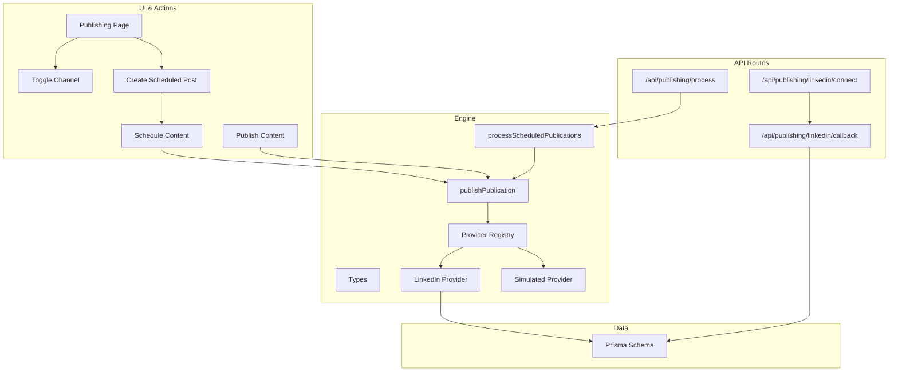
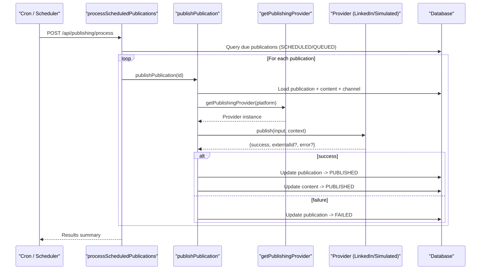
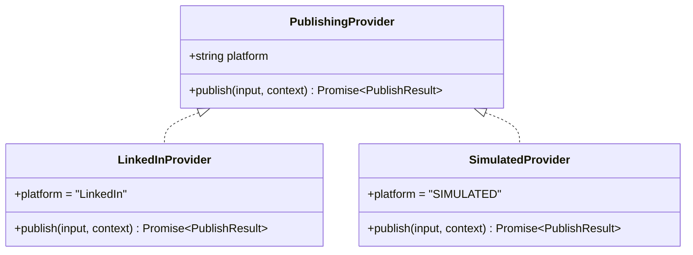
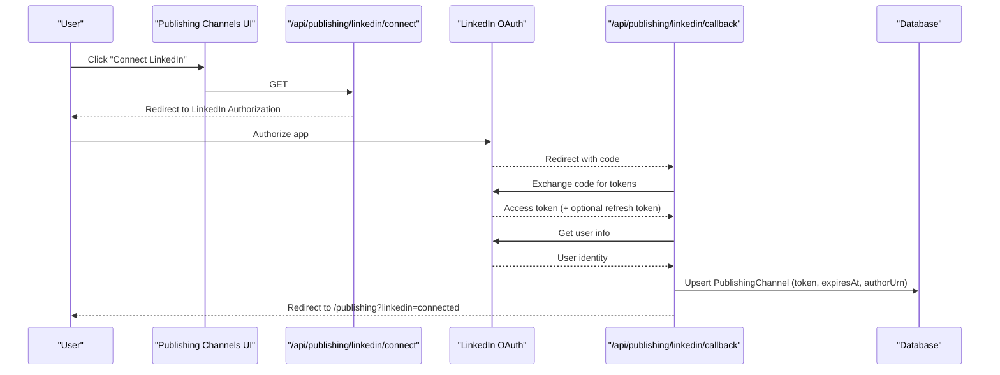
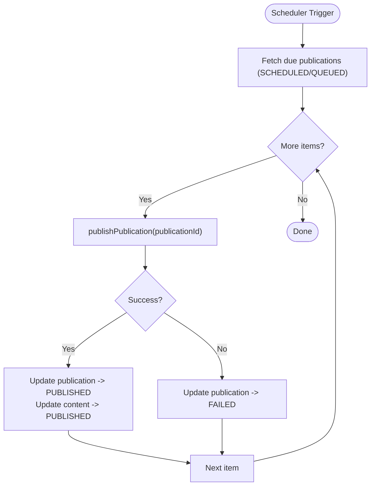
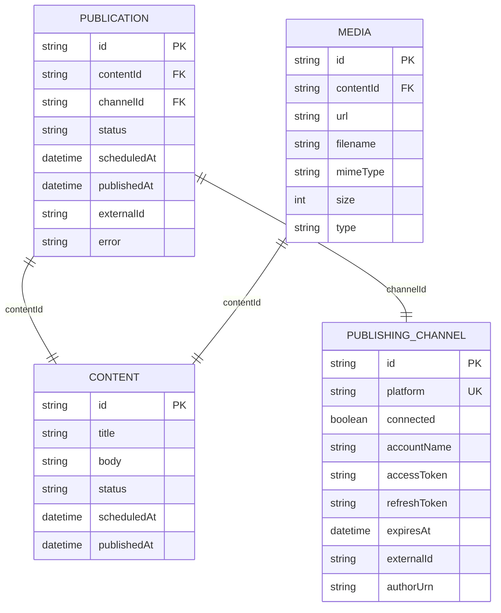
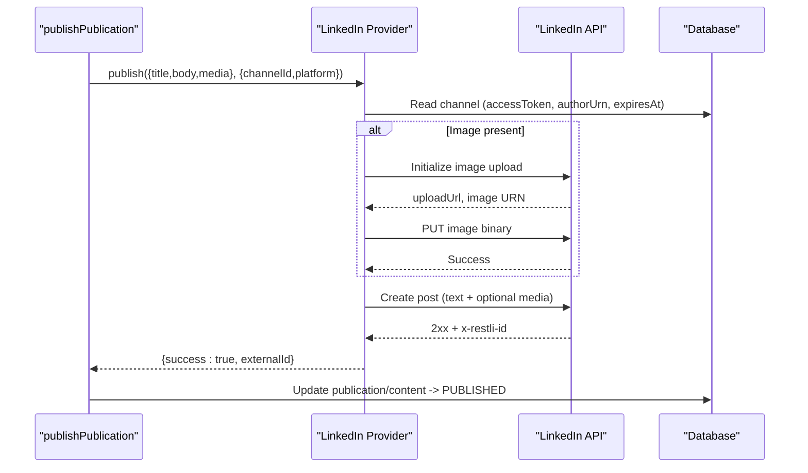
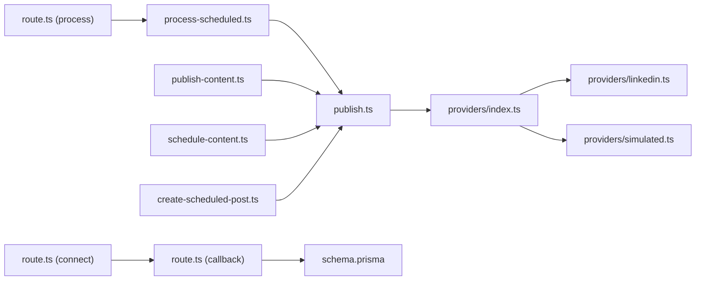

# Multi-Platform Publishing

<cite>
**Referenced Files in This Document**
- [types.ts](file://app/publishing/engine/types.ts)
- [index.ts](file://app/publishing/engine/providers/index.ts)
- [linkedin.ts](file://app/publishing/engine/providers/linkedin.ts)
- [simulated.ts](file://app/publishing/engine/providers/simulated.ts)
- [publish.ts](file://app/publishing/engine/publish.ts)
- [process-scheduled.ts](file://app/publishing/engine/process-scheduled.ts)
- [route.ts (connect)](file://app/api/publishing/linkedin/connect/route.ts)
- [route.ts (callback)](file://app/api/publishing/linkedin/callback/route.ts)
- [route.ts (process)](file://app/api/publishing/process/route.ts)
- [schema.prisma](file://prisma/schema.prisma)
- [page.tsx (Publishing page)](file://app/publishing/page.tsx)
- [publishing-channels.tsx](file://components/publishing/publishing-channels.tsx)
- [toggle-channel.ts](file://app/publishing/actions/toggle-channel.ts)
- [create-scheduled-post.ts](file://app/calendar/actions/create-scheduled-post.ts)
- [schedule-content.ts](file://app/content/actions/schedule-content.ts)
- [publish-content.ts](file://app/content/actions/publish-content.ts)
</cite>

## Table of Contents
1. [Introduction](#introduction)
2. [Project Structure](#project-structure)
3. [Core Components](#core-components)
4. [Architecture Overview](#architecture-overview)
5. [Detailed Component Analysis](#detailed-component-analysis)
6. [Dependency Analysis](#dependency-analysis)
7. [Performance Considerations](#performance-considerations)
8. [Troubleshooting Guide](#troubleshooting-guide)
9. [Conclusion](#conclusion)
10. [Appendices](#appendices)

## Introduction
This document explains the Multi-Platform Publishing system, focusing on the publishing engine architecture built around a provider pattern that supports multiple social media platforms. It details LinkedIn OAuth integration (connection setup, token management, and callback handling), the scheduled publishing workflow with queue processing and status tracking, the provider abstraction layer for implementing new platform integrations, channels management and credential storage, examples of provider implementations, webhook-like endpoints, error recovery mechanisms, authentication flows, rate limiting considerations, platform-specific limitations, and integration points with the content management system and scheduling engine.

## Project Structure
The publishing system is organized into:
- Engine core: types, provider registry, publish orchestration, and scheduled processing
- Provider implementations: LinkedIn and simulated providers
- API routes: LinkedIn OAuth connect and callback, cron-triggered process endpoint
- Data model: Prisma schema for Content, Media, PublishingChannel, and Publication
- UI and actions: Publishing page, channel toggling, scheduling from calendar/content actions

**Diagram sources**
- [types.ts:1-37](file://app/publishing/engine/types.ts#L1-L37)
- [index.ts:1-21](file://app/publishing/engine/providers/index.ts#L1-L21)
- [linkedin.ts:1-284](file://app/publishing/engine/providers/linkedin.ts#L1-L284)
- [simulated.ts:1-33](file://app/publishing/engine/providers/simulated.ts#L1-L33)
- [publish.ts:1-116](file://app/publishing/engine/publish.ts#L1-L116)
- [process-scheduled.ts:1-72](file://app/publishing/engine/process-scheduled.ts#L1-L72)
- [route.ts (connect):1-34](file://app/api/publishing/linkedin/connect/route.ts#L1-L34)
- [route.ts (callback):1-169](file://app/api/publishing/linkedin/callback/route.ts#L1-L169)
- [route.ts (process):1-56](file://app/api/publishing/process/route.ts#L1-L56)
- [schema.prisma:1-94](file://prisma/schema.prisma#L1-L94)
- [page.tsx (Publishing page):1-186](file://app/publishing/page.tsx#L1-L186)
- [publishing-channels.tsx:1-147](file://components/publishing/publishing-channels.tsx#L1-L147)
- [toggle-channel.ts:1-39](file://app/publishing/actions/toggle-channel.ts#L1-L39)
- [create-scheduled-post.ts:1-67](file://app/calendar/actions/create-scheduled-post.ts#L1-L67)
- [schedule-content.ts:1-66](file://app/content/actions/schedule-content.ts#L1-L66)
- [publish-content.ts:1-70](file://app/content/actions/publish-content.ts#L1-L70)

**Section sources**
- [types.ts:1-37](file://app/publishing/engine/types.ts#L1-L37)
- [index.ts:1-21](file://app/publishing/engine/providers/index.ts#L1-L21)
- [publish.ts:1-116](file://app/publishing/engine/publish.ts#L1-L116)
- [process-scheduled.ts:1-72](file://app/publishing/engine/process-scheduled.ts#L1-L72)
- [route.ts (connect):1-34](file://app/api/publishing/linkedin/connect/route.ts#L1-L34)
- [route.ts (callback):1-169](file://app/api/publishing/linkedin/callback/route.ts#L1-L169)
- [route.ts (process):1-56](file://app/api/publishing/process/route.ts#L1-L56)
- [schema.prisma:1-94](file://prisma/schema.prisma#L1-L94)
- [page.tsx (Publishing page):1-186](file://app/publishing/page.tsx#L1-L186)
- [publishing-channels.tsx:1-147](file://components/publishing/publishing-channels.tsx#L1-L147)
- [toggle-channel.ts:1-39](file://app/publishing/actions/toggle-channel.ts#L1-L39)
- [create-scheduled-post.ts:1-67](file://app/calendar/actions/create-scheduled-post.ts#L1-L67)
- [schedule-content.ts:1-66](file://app/content/actions/schedule-content.ts#L1-L66)
- [publish-content.ts:1-70](file://app/content/actions/publish-content.ts#L1-L70)

## Core Components
- Publishing provider interface and data contracts define a uniform contract for all platforms via PublishInput, ProviderContext, PublishResult, and PublishingProvider.
- Provider registry maps platform names to concrete providers and enforces configuration presence.
- LinkedIn provider implements OAuth-aware publishing with image upload flow and post creation.
- Simulated provider provides a safe development path without external calls.
- Orchestration functions coordinate database reads/writes, provider invocation, and state transitions.
- Scheduled processor batches due publications and delegates to the publisher.
- API routes handle LinkedIn OAuth flow and cron-triggered processing.

**Section sources**
- [types.ts:1-37](file://app/publishing/engine/types.ts#L1-L37)
- [index.ts:1-21](file://app/publishing/engine/providers/index.ts#L1-L21)
- [linkedin.ts:1-284](file://app/publishing/engine/providers/linkedin.ts#L1-L284)
- [simulated.ts:1-33](file://app/publishing/engine/providers/simulated.ts#L1-L33)
- [publish.ts:1-116](file://app/publishing/engine/publish.ts#L1-L116)
- [process-scheduled.ts:1-72](file://app/publishing/engine/process-scheduled.ts#L1-L72)
- [route.ts (connect):1-34](file://app/api/publishing/linkedin/connect/route.ts#L1-L34)
- [route.ts (callback):1-169](file://app/api/publishing/linkedin/callback/route.ts#L1-L169)
- [route.ts (process):1-56](file://app/api/publishing/process/route.ts#L1-L56)

## Architecture Overview
The system uses a provider pattern to decouple platform-specific logic from the core publishing pipeline. The scheduler queries due publications, invokes the publisher, which resolves the correct provider by platform, executes platform-specific operations, and updates statuses atomically.

**Diagram sources**
- [process-scheduled.ts:1-72](file://app/publishing/engine/process-scheduled.ts#L1-L72)
- [publish.ts:1-116](file://app/publishing/engine/publish.ts#L1-L116)
- [index.ts:1-21](file://app/publishing/engine/providers/index.ts#L1-L21)
- [linkedin.ts:1-284](file://app/publishing/engine/providers/linkedin.ts#L1-L284)
- [simulated.ts:1-33](file://app/publishing/engine/providers/simulated.ts#L1-L33)
- [route.ts (process):1-56](file://app/api/publishing/process/route.ts#L1-L56)

## Detailed Component Analysis

### Provider Abstraction Layer
- Types define a consistent contract for input, context, and result across platforms.
- Registry centralizes provider mapping and throws when a platform is not configured.
- New platform integration requires:
  - Implementing PublishingProvider with publish(input, context).
  - Registering it in the provider registry under a stable platform key.
  - Ensuring credentials are stored in PublishingChannel and accessible by the provider.

**Diagram sources**
- [types.ts:1-37](file://app/publishing/engine/types.ts#L1-L37)
- [linkedin.ts:141-283](file://app/publishing/engine/providers/linkedin.ts#L141-L283)
- [simulated.ts:8-32](file://app/publishing/engine/providers/simulated.ts#L8-L32)
- [index.ts:1-21](file://app/publishing/engine/providers/index.ts#L1-L21)

**Section sources**
- [types.ts:1-37](file://app/publishing/engine/types.ts#L1-L37)
- [index.ts:1-21](file://app/publishing/engine/providers/index.ts#L1-L21)

### LinkedIn OAuth Integration
- Connect route builds an authorization URL with required scopes and redirects users to LinkedIn.
- Callback route exchanges the authorization code for tokens, retrieves user info, computes author URN, and persists connection details (access token, refresh token, expiry, author URN).
- Provider validates token presence and expiration before publishing and returns clear errors if missing or expired.

**Diagram sources**
- [route.ts (connect):1-34](file://app/api/publishing/linkedin/connect/route.ts#L1-L34)
- [route.ts (callback):1-169](file://app/api/publishing/linkedin/callback/route.ts#L1-L169)
- [schema.prisma:57-73](file://prisma/schema.prisma#L57-L73)

**Section sources**
- [route.ts (connect):1-34](file://app/api/publishing/linkedin/connect/route.ts#L1-L34)
- [route.ts (callback):1-169](file://app/api/publishing/linkedin/callback/route.ts#L1-L169)
- [linkedin.ts:141-283](file://app/publishing/engine/providers/linkedin.ts#L141-L283)
- [schema.prisma:57-73](file://prisma/schema.prisma#L57-L73)

### Scheduled Publishing Workflow
- Calendar and content actions create or update publications with scheduled times and statuses.
- The process endpoint is secured with a bearer token and triggers batch processing of due publications.
- Each publication is published through the appropriate provider; results update both publication and content records atomically.

**Diagram sources**
- [process-scheduled.ts:1-72](file://app/publishing/engine/process-scheduled.ts#L1-L72)
- [publish.ts:1-116](file://app/publishing/engine/publish.ts#L1-L116)
- [route.ts (process):1-56](file://app/api/publishing/process/route.ts#L1-L56)

**Section sources**
- [create-scheduled-post.ts:1-67](file://app/calendar/actions/create-scheduled-post.ts#L1-L67)
- [schedule-content.ts:1-66](file://app/content/actions/schedule-content.ts#L1-L66)
- [publish-content.ts:1-70](file://app/content/actions/publish-content.ts#L1-L70)
- [process-scheduled.ts:1-72](file://app/publishing/engine/process-scheduled.ts#L1-L72)
- [publish.ts:1-116](file://app/publishing/engine/publish.ts#L1-L116)
- [route.ts (process):1-56](file://app/api/publishing/process/route.ts#L1-L56)

### Publishing Channels Management and Credential Storage
- Channels are represented by PublishingChannel with fields for platform, connected flag, account name, access/refresh tokens, expiry, and author URN.
- UI lists connected platforms and exposes connect/disconnect actions.
- Toggle action creates or updates channel records and clears sensitive fields on disconnect.

**Diagram sources**
- [schema.prisma:21-94](file://prisma/schema.prisma#L21-L94)

**Section sources**
- [schema.prisma:57-73](file://prisma/schema.prisma#L57-L73)
- [publishing-channels.tsx:1-147](file://components/publishing/publishing-channels.tsx#L1-L147)
- [toggle-channel.ts:1-39](file://app/publishing/actions/toggle-channel.ts#L1-L39)
- [page.tsx (Publishing page):1-186](file://app/publishing/page.tsx#L1-L186)

### Provider Implementations Examples
- LinkedIn provider:
  - Validates channel credentials and author URN.
  - Uploads images using LinkedIn’s two-step upload flow and posts text/media content.
  - Returns external IDs and structured errors.
- Simulated provider:
  - Logs inputs and returns a synthetic external ID for testing.

**Diagram sources**
- [publish.ts:1-116](file://app/publishing/engine/publish.ts#L1-L116)
- [linkedin.ts:141-283](file://app/publishing/engine/providers/linkedin.ts#L141-L284)

**Section sources**
- [linkedin.ts:1-284](file://app/publishing/engine/providers/linkedin.ts#L1-L284)
- [simulated.ts:1-33](file://app/publishing/engine/providers/simulated.ts#L1-L33)

### Webhook Handling and Error Recovery
- The process endpoint acts as a webhook/cron target, secured by a bearer token, to trigger scheduled publishing.
- Errors during scheduling or publishing are captured and returned with descriptive messages; failed publications are marked FAILED with error details.
- Provider-level try/catch ensures exceptions are normalized to structured results.

**Section sources**
- [route.ts (process):1-56](file://app/api/publishing/process/route.ts#L1-L56)
- [process-scheduled.ts:1-72](file://app/publishing/engine/process-scheduled.ts#L1-L72)
- [publish.ts:1-116](file://app/publishing/engine/publish.ts#L1-L116)
- [linkedin.ts:271-283](file://app/publishing/engine/providers/linkedin.ts#L271-L283)

### Authentication Flows, Rate Limiting, and Platform-Specific Limitations
- Authentication:
  - LinkedIn OAuth flow handled by connect and callback routes; tokens and expiry stored in PublishingChannel.
  - Provider checks token presence and expiration prior to API calls.
- Rate limiting:
  - No explicit client-side rate limiting is implemented; consider adding retries with exponential backoff and throttling per platform quotas.
- Platform-specific limitations:
  - LinkedIn image posts currently use a single media object; multi-image support can be added by extending the provider.
  - Ensure required permissions (e.g., profile and social posting) are granted during OAuth scope configuration.

**Section sources**
- [route.ts (connect):1-34](file://app/api/publishing/linkedin/connect/route.ts#L1-L34)
- [route.ts (callback):1-169](file://app/api/publishing/linkedin/callback/route.ts#L1-L169)
- [linkedin.ts:182-204](file://app/publishing/engine/providers/linkedin.ts#L182-L204)
- [linkedin.ts:148-180](file://app/publishing/engine/providers/linkedin.ts#L148-L180)

### Integration with Content Management System and Scheduling Engine
- Content actions validate readiness and enforce preconditions before publishing or scheduling.
- Scheduling sets content and related publications to SCHEDULED with a future time.
- Publishing orchestrates provider execution and updates both content and publication states atomically.

**Section sources**
- [publish-content.ts:1-70](file://app/content/actions/publish-content.ts#L1-L70)
- [schedule-content.ts:1-66](file://app/content/actions/schedule-content.ts#L1-L66)
- [create-scheduled-post.ts:1-67](file://app/calendar/actions/create-scheduled-post.ts#L1-L67)
- [publish.ts:1-116](file://app/publishing/engine/publish.ts#L1-L116)

## Dependency Analysis
- Engine depends on Prisma for persistence and on providers for platform-specific behavior.
- Providers depend on environment variables (e.g., APP_URL, LinkedIn endpoints) and on PublishingChannel credentials.
- API routes depend on environment configuration (OAuth secrets, CRON_SECRET) and on engine functions.

**Diagram sources**
- [publish.ts:1-116](file://app/publishing/engine/publish.ts#L1-L116)
- [index.ts:1-21](file://app/publishing/engine/providers/index.ts#L1-L21)
- [linkedin.ts:1-284](file://app/publishing/engine/providers/linkedin.ts#L1-L284)
- [simulated.ts:1-33](file://app/publishing/engine/providers/simulated.ts#L1-L33)
- [process-scheduled.ts:1-72](file://app/publishing/engine/process-scheduled.ts#L1-L72)
- [route.ts (process):1-56](file://app/api/publishing/process/route.ts#L1-L56)
- [route.ts (callback):1-169](file://app/api/publishing/linkedin/callback/route.ts#L1-L169)
- [route.ts (connect):1-34](file://app/api/publishing/linkedin/connect/route.ts#L1-L34)
- [schema.prisma:1-94](file://prisma/schema.prisma#L1-L94)
- [publish-content.ts:1-70](file://app/content/actions/publish-content.ts#L1-L70)
- [schedule-content.ts:1-66](file://app/content/actions/schedule-content.ts#L1-L66)
- [create-scheduled-post.ts:1-67](file://app/calendar/actions/create-scheduled-post.ts#L1-L67)

**Section sources**
- [publish.ts:1-116](file://app/publishing/engine/publish.ts#L1-L116)
- [index.ts:1-21](file://app/publishing/engine/providers/index.ts#L1-L21)
- [route.ts (process):1-56](file://app/api/publishing/process/route.ts#L1-L56)

## Performance Considerations
- Batch processing: The scheduler fetches up to a fixed number of due publications per run to avoid long-running tasks.
- Atomic updates: Successful publishes update publication and content within a transaction to ensure consistency.
- External calls: LinkedIn image upload involves two network requests; consider caching or optimizing where possible.
- Concurrency: If scaling beyond a single server, add job queues and idempotency keys to prevent duplicate publishes.

[No sources needed since this section provides general guidance]

## Troubleshooting Guide
- Missing or invalid environment variables:
  - LinkedIn OAuth requires CLIENT_ID, CLIENT_SECRET, and APP_URL.
  - Process endpoint requires CRON_SECRET for authorization.
- Token issues:
  - Provider rejects publishing if access token is missing or expired; reconnect LinkedIn to refresh.
- Validation failures:
  - Content must have a title and body; only READY content can be published immediately.
  - Publications require a connected channel and valid status transitions.
- API errors:
  - LinkedIn responses include status and body; logs capture detailed error information for diagnosis.

**Section sources**
- [route.ts (connect):1-34](file://app/api/publishing/linkedin/connect/route.ts#L1-L34)
- [route.ts (callback):1-169](file://app/api/publishing/linkedin/callback/route.ts#L1-L169)
- [route.ts (process):1-56](file://app/api/publishing/process/route.ts#L1-L56)
- [publish.ts:23-44](file://app/publishing/engine/publish.ts#L23-L44)
- [publish-content.ts:19-41](file://app/content/actions/publish-content.ts#L19-L41)
- [linkedin.ts:246-255](file://app/publishing/engine/providers/linkedin.ts#L246-L255)

## Conclusion
The Multi-Platform Publishing system provides a robust, extensible foundation for distributing content across social platforms. The provider pattern cleanly isolates platform logic, while the engine coordinates scheduling, publishing, and state management. LinkedIn OAuth integration is fully implemented for connection setup, token management, and publishing. The scheduled workflow processes due publications reliably, with clear error reporting and atomic state updates. Extending to additional platforms follows a straightforward pattern of implementing the provider interface and registering it in the registry.

[No sources needed since this section summarizes without analyzing specific files]

## Appendices

### How to Add a New Platform Integration
- Define a provider implementing PublishingProvider with publish(input, context).
- Store credentials in PublishingChannel and ensure they are accessible by the provider.
- Register the provider in the provider registry under a unique platform key.
- Test via the simulated flow or real API calls, ensuring error handling and status updates work correctly.

**Section sources**
- [types.ts:1-37](file://app/publishing/engine/types.ts#L1-L37)
- [index.ts:1-21](file://app/publishing/engine/providers/index.ts#L1-L21)
- [schema.prisma:57-73](file://prisma/schema.prisma#L57-L73)