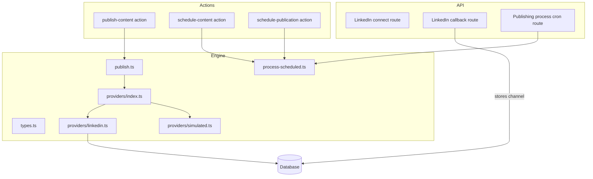
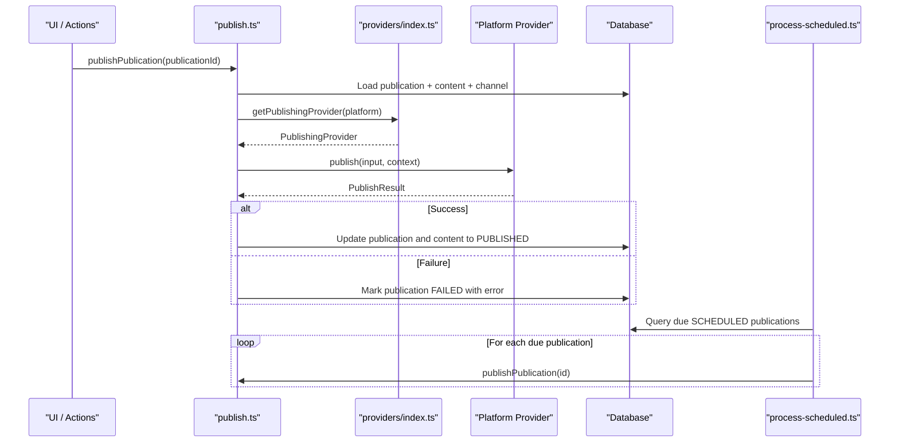
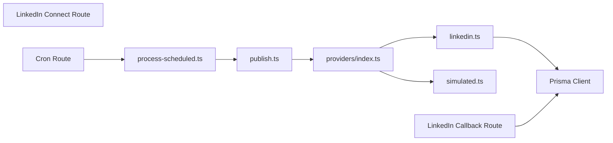

# Provider Architecture

<cite>
**Referenced Files in This Document**
- [types.ts](file://app/publishing/engine/types.ts)
- [providers/index.ts](file://app/publishing/engine/providers/index.ts)
- [linkedin.ts](file://app/publishing/engine/providers/linkedin.ts)
- [simulated.ts](file://app/publishing/engine/providers/simulated.ts)
- [publish.ts](file://app/publishing/engine/publish.ts)
- [process-scheduled.ts](file://app/publishing/engine/process-scheduled.ts)
- [route.ts (LinkedIn connect)](file://app/api/publishing/linkedin/connect/route.ts)
- [route.ts (LinkedIn callback)](file://app/api/publishing/linkedin/callback/route.ts)
- [route.ts (publishing process cron)](file://app/api/publishing/process/route.ts)
- [publish-content.ts](file://app/content/actions/publish-content.ts)
- [schedule-content.ts](file://app/content/actions/schedule-content.ts)
- [schedule-publication.ts](file://app/publishing/actions/schedule-publication.ts)
</cite>

## Table of Contents
1. Introduction
2. Project Structure
3. Core Components
4. Architecture Overview
5. Detailed Component Analysis
6. Dependency Analysis
7. Performance Considerations
8. Troubleshooting Guide
9. Conclusion
10. Appendices

## Introduction
This document explains the publishing provider architecture that enables pluggable platform integrations for content publishing. It focuses on the provider pattern implementation, the PublishingProvider interface, provider registration and retrieval, and how different platforms are supported uniformly through an abstraction layer. It includes examples of LinkedIn and simulated providers, error handling patterns, rate limiting considerations, platform-specific configurations, and guidance for implementing new platform providers.

## Project Structure
The publishing engine is organized under app/publishing/engine with a clear separation of concerns:
- types.ts defines shared contracts for inputs, contexts, results, and the provider interface.
- providers/ contains platform-specific implementations and a registry to retrieve them by platform name.
- publish.ts orchestrates publication execution using the selected provider.
- process-scheduled.ts implements scheduled publishing via a cron-like endpoint.
- API routes handle LinkedIn OAuth flows and trigger scheduled processing.
- Server actions coordinate UI-driven publishing and scheduling workflows.

**Diagram sources**
- [types.ts:1-37](file://app/publishing/engine/types.ts#L1-L37)
- [providers/index.ts:1-21](file://app/publishing/engine/providers/index.ts#L1-L21)
- [linkedin.ts:1-284](file://app/publishing/engine/providers/linkedin.ts#L1-L284)
- [simulated.ts:1-33](file://app/publishing/engine/providers/simulated.ts#L1-L33)
- [publish.ts:1-116](file://app/publishing/engine/publish.ts#L1-L116)
- [process-scheduled.ts:1-72](file://app/publishing/engine/process-scheduled.ts#L1-L72)
- [route.ts (LinkedIn connect):1-34](file://app/api/publishing/linkedin/connect/route.ts#L1-L34)
- [route.ts (LinkedIn callback):1-169](file://app/api/publishing/linkedin/callback/route.ts#L1-L169)
- [route.ts (publishing process cron):1-56](file://app/api/publishing/process/route.ts#L1-L56)
- [publish-content.ts:1-70](file://app/content/actions/publish-content.ts#L1-L70)
- [schedule-content.ts:1-66](file://app/content/actions/schedule-content.ts#L1-L66)
- [schedule-publication.ts:1-52](file://app/publishing/actions/schedule-publication.ts#L1-L52)

**Section sources**
- [types.ts:1-37](file://app/publishing/engine/types.ts#L1-L37)
- [providers/index.ts:1-21](file://app/publishing/engine/providers/index.ts#L1-L21)
- [publish.ts:1-116](file://app/publishing/engine/publish.ts#L1-L116)
- [process-scheduled.ts:1-72](file://app/publishing/engine/process-scheduled.ts#L1-L72)
- [route.ts (LinkedIn connect):1-34](file://app/api/publishing/linkedin/connect/route.ts#L1-L34)
- [route.ts (LinkedIn callback):1-169](file://app/api/publishing/linkedin/callback/route.ts#L1-L169)
- [route.ts (publishing process cron):1-56](file://app/api/publishing/process/route.ts#L1-L56)
- [publish-content.ts:1-70](file://app/content/actions/publish-content.ts#L1-L70)
- [schedule-content.ts:1-66](file://app/content/actions/schedule-content.ts#L1-L66)
- [schedule-publication.ts:1-52](file://app/publishing/actions/schedule-publication.ts#L1-L52)

## Core Components
- PublishingProvider interface: Defines the contract for all platform providers, including a platform identifier and a publish method that accepts input and context and returns a result.
- PublishInput: Describes title, body, target platform, optional account name, and media attachments.
- ProviderContext: Carries channel identity, platform, and optional account name into the provider.
- PublishResult: Indicates success or failure and may include an externalId from the platform and an error message.
- Provider registry: A simple map keyed by platform string that exposes getPublishingProvider to retrieve a concrete provider or throw if not configured.

Key responsibilities:
- Abstraction: Providers implement a uniform interface so callers do not need to know platform specifics.
- Registration: New platforms are added by exporting a provider instance and registering it in the registry.
- Retrieval: The registry centralizes provider lookup, ensuring consistent error behavior when a platform is unknown.

**Section sources**
- [types.ts:1-37](file://app/publishing/engine/types.ts#L1-L37)
- [providers/index.ts:1-21](file://app/publishing/engine/providers/index.ts#L1-L21)

## Architecture Overview
The system uses a provider pattern to decouple orchestration logic from platform-specific details. Orchestration layers validate state, assemble inputs, and update database records. Platform providers encapsulate authentication, API calls, and platform-specific behaviors.

**Diagram sources**
- [publish.ts:1-116](file://app/publishing/engine/publish.ts#L1-L116)
- [providers/index.ts:1-21](file://app/publishing/engine/providers/index.ts#L1-L21)
- [process-scheduled.ts:1-72](file://app/publishing/engine/process-scheduled.ts#L1-L72)

## Detailed Component Analysis

### PublishingProvider Interface and Types
- PublishingProvider.platform: A stable identifier used by the registry to select the correct provider.
- PublishingProvider.publish(input, context): Executes the actual publish operation for a given platform.
- PublishInput: Encapsulates content and media metadata needed by providers.
- ProviderContext: Provides channel-level context such as channelId, platform, and optional accountName.
- PublishResult: Standardized response indicating success/failure and optional external identifiers.

Design notes:
- The interface enforces consistency across providers, enabling interchangeable use.
- Media is passed as structured metadata; providers can interpret type/mimeType to handle images, videos, etc.
- Context allows providers to access channel credentials and identity without leaking secrets into the input.

**Section sources**
- [types.ts:1-37](file://app/publishing/engine/types.ts#L1-L37)

### Provider Registry
- Centralized mapping from platform strings to provider instances.
- getPublishingProvider(platform) returns the matching provider or throws a descriptive error if missing.
- Extensibility: Add a new provider by exporting it and adding an entry in the registry map.

Error handling:
- Unknown platform names result in a thrown error, preventing silent failures.

**Section sources**
- [providers/index.ts:1-21](file://app/publishing/engine/providers/index.ts#L1-L21)

### LinkedIn Provider Implementation
Responsibilities:
- Validates channel configuration (access token, author URN, expiration).
- Handles image upload flow to LinkedIn (initialize upload, then PUT binary).
- Creates a post with optional media and sets visibility/distribution fields.
- Extracts externalId from response headers for tracking.

Data flow:
- Reads channel credentials from the database using channelId from context.
- Downloads media from application storage and uploads to LinkedIn.
- Posts content via REST API with appropriate headers and versioning.

Error handling:
- Returns structured failures with messages for missing tokens, expired tokens, missing author URN, network errors, and invalid responses.
- Catches exceptions and normalizes them into PublishResult.

Rate limiting and retries:
- No built-in retry or backoff; consider adding exponential backoff for transient API errors.
- Respect LinkedIn API limits by queuing requests and avoiding bursts.

Configuration:
- Requires APP_URL for resolving media URLs.
- Uses environment-scoped constants for API endpoints and version headers.

**Section sources**
- [linkedin.ts:1-284](file://app/publishing/engine/providers/linkedin.ts#L1-L284)

### Simulated Provider Implementation
Purpose:
- Provides a safe, deterministic way to test publishing flows without calling external APIs.
- Logs inputs and returns a synthetic externalId.

Use cases:
- Development and integration tests.
- End-to-end validation of orchestration and UI flows.

**Section sources**
- [simulated.ts:1-33](file://app/publishing/engine/providers/simulated.ts#L1-L33)

### Publication Orchestration (publish.ts)
Workflow:
- Loads publication, associated content, media, and channel.
- Validates status transitions and required fields.
- Retrieves the correct provider via the registry.
- Calls provider.publish with normalized input and context.
- Updates database atomically to mark success or failure.

State management:
- Only QUEUED or SCHEDULED publications can be published.
- On success, updates both publication and content to PUBLISHED and clears scheduling fields.
- On failure, marks publication as FAILED with error details.

**Section sources**
- [publish.ts:1-116](file://app/publishing/engine/publish.ts#L1-L116)

### Scheduled Processing (process-scheduled.ts)
Workflow:
- Queries due SCHEDULED publications ordered by scheduledAt.
- Processes up to a batch size per run to avoid overload.
- Invokes publishPublication for each due publication and aggregates results.

Integration:
- Exposed via a protected cron endpoint that validates authorization.

**Section sources**
- [process-scheduled.ts:1-72](file://app/publishing/engine/process-scheduled.ts#L1-L72)
- [route.ts (publishing process cron):1-56](file://app/api/publishing/process/route.ts#L1-L56)

### LinkedIn OAuth Flow
Connect:
- Redirects users to LinkedIn’s authorization page with required scopes.
- Uses APP_URL to construct redirect URI.

Callback:
- Exchanges code for access token and refresh token.
- Fetches user info to derive author URN.
- Upserts publishingChannel record with connection status, tokens, expiry, and author URN.

Security:
- Requires LINKEDIN_CLIENT_ID, LINKEDIN_CLIENT_SECRET, and APP_URL.
- Stores tokens securely in the database for later use by the provider.

**Section sources**
- [route.ts (LinkedIn connect):1-34](file://app/api/publishing/linkedin/connect/route.ts#L1-L34)
- [route.ts (LinkedIn callback):1-169](file://app/api/publishing/linkedin/callback/route.ts#L1-L169)

### User Actions Integration
- publish-content: Validates content state and delegates to publishPublication.
- schedule-content: Sets content and related publications to SCHEDULED with a future time.
- schedule-publication: Schedules a specific publication for a future time.

These actions ensure UI-driven flows remain consistent with engine rules and database state.

**Section sources**
- [publish-content.ts:1-70](file://app/content/actions/publish-content.ts#L1-L70)
- [schedule-content.ts:1-66](file://app/content/actions/schedule-content.ts#L1-L66)
- [schedule-publication.ts:1-52](file://app/publishing/actions/schedule-publication.ts#L1-L52)

## Dependency Analysis
- publish.ts depends on prisma and the provider registry.
- Providers depend on prisma (for channel data) and external HTTP APIs.
- process-scheduled.ts depends on publish.ts and prisma.
- API routes depend on environment variables and prisma.

Potential coupling:
- Providers directly access prisma; consider abstracting channel retrieval behind a service for testability.
- Registry is tightly coupled to platform string keys; ensure keys match channel.platform values.

Circular dependencies:
- None detected between engine modules.

External integrations:
- LinkedIn REST APIs for posts and images.
- LinkedIn OAuth endpoints for authentication.

**Diagram sources**
- [publish.ts:1-116](file://app/publishing/engine/publish.ts#L1-L116)
- [providers/index.ts:1-21](file://app/publishing/engine/providers/index.ts#L1-L21)
- [linkedin.ts:1-284](file://app/publishing/engine/providers/linkedin.ts#L1-L284)
- [simulated.ts:1-33](file://app/publishing/engine/providers/simulated.ts#L1-L33)
- [route.ts (LinkedIn callback):1-169](file://app/api/publishing/linkedin/callback/route.ts#L1-L169)
- [route.ts (publishing process cron):1-56](file://app/api/publishing/process/route.ts#L1-L56)

**Section sources**
- [publish.ts:1-116](file://app/publishing/engine/publish.ts#L1-L116)
- [providers/index.ts:1-21](file://app/publishing/engine/providers/index.ts#L1-L21)
- [linkedin.ts:1-284](file://app/publishing/engine/providers/linkedin.ts#L1-L284)
- [simulated.ts:1-33](file://app/publishing/engine/providers/simulated.ts#L1-L33)
- [route.ts (LinkedIn callback):1-169](file://app/api/publishing/linkedin/callback/route.ts#L1-L169)
- [route.ts (publishing process cron):1-56](file://app/api/publishing/process/route.ts#L1-L56)

## Performance Considerations
- Batch processing: The scheduler processes a limited number of due publications per run to reduce load.
- Network I/O: Providers perform multiple HTTP calls; consider request coalescing and caching where appropriate.
- Database transactions: Successful publishes use transactions to maintain consistency.
- Concurrency: Ensure cron runs do not overlap; add locking if necessary.
- Media handling: Large media uploads should be streamed and validated before transmission.

## Troubleshooting Guide
Common issues and resolutions:
- Missing or expired access token:
  - Reconnect the platform via OAuth flow to refresh tokens.
  - Validate expiresAt and accessToken presence before publishing.
- Invalid or missing author URN:
  - Reconnect after granting required profile permissions.
- Content validation failures:
  - Ensure content has a non-empty title and body.
  - Ensure at least one publishing channel is selected.
- Platform not configured:
  - Register the provider in the registry with the correct platform key.
- Cron unauthorized:
  - Configure CRON_SECRET and pass Authorization header correctly.

Logging and diagnostics:
- Providers log detailed steps and errors for debugging.
- Scheduler logs processed counts and individual results.

**Section sources**
- [linkedin.ts:141-284](file://app/publishing/engine/providers/linkedin.ts#L141-L284)
- [publish.ts:23-44](file://app/publishing/engine/publish.ts#L23-L44)
- [route.ts (publishing process cron):7-25](file://app/api/publishing/process/route.ts#L7-L25)

## Conclusion
The publishing provider architecture cleanly separates orchestration from platform-specific logic through a well-defined interface and a centralized registry. This design supports easy addition of new platforms, robust error handling, and consistent state management. The LinkedIn provider demonstrates real-world integration patterns, while the simulated provider enables safe testing. Following the established interface contract and registry conventions ensures maintainability and scalability.

## Appendices

### Implementing a New Platform Provider
Steps:
1. Define a provider object implementing PublishingProvider:
   - Set platform to match the channel.platform value.
   - Implement publish(input, context) returning PublishResult.
2. Register the provider:
   - Import and add it to the registry map in providers/index.ts.
3. Handle authentication:
   - Retrieve channel credentials from context.channelId via prisma.
   - Validate tokens and expiration before making API calls.
4. Map PublishInput to platform payload:
   - Convert media metadata appropriately.
   - Handle platform-specific fields like visibility or distribution.
5. Normalize errors:
   - Return structured failures with meaningful messages.
6. Test:
   - Use the simulated provider to validate orchestration.
   - Integrate with a sandbox or staging environment for live APIs.

Best practices:
- Avoid blocking operations; use async/await consistently.
- Implement retries with exponential backoff for transient errors.
- Respect rate limits and implement throttling if needed.
- Log sensitive information carefully; never log tokens.

**Section sources**
- [types.ts:1-37](file://app/publishing/engine/types.ts#L1-L37)
- [providers/index.ts:1-21](file://app/publishing/engine/providers/index.ts#L1-L21)
- [linkedin.ts:141-284](file://app/publishing/engine/providers/linkedin.ts#L141-L284)

### Error Handling Patterns
- Validation-first approach: Check prerequisites before invoking platform APIs.
- Structured results: Always return PublishResult with success flag and optional error.
- Exception normalization: Catch unexpected errors and convert to PublishResult.
- Transactional updates: Use database transactions to keep state consistent.

**Section sources**
- [publish.ts:72-112](file://app/publishing/engine/publish.ts#L72-L112)
- [linkedin.ts:271-284](file://app/publishing/engine/providers/linkedin.ts#L271-L284)

### Rate Limiting Considerations
- Queue and throttle outbound requests to respect platform quotas.
- Implement jittered exponential backoff for retries.
- Monitor error rates and adjust concurrency accordingly.
- Consider idempotency keys to safely retry failed requests.

[No sources needed since this section provides general guidance]