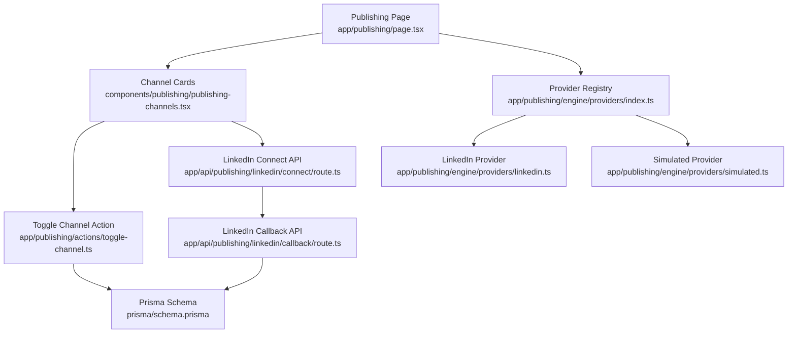
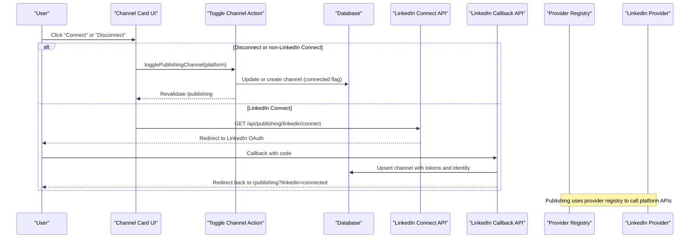
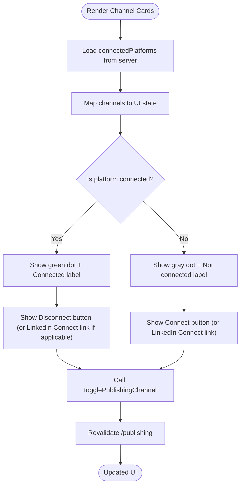
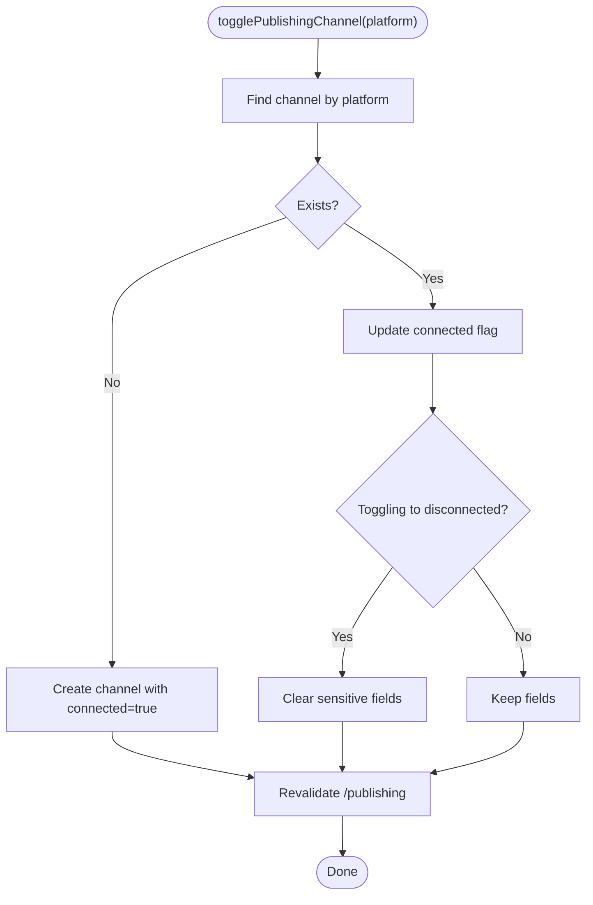
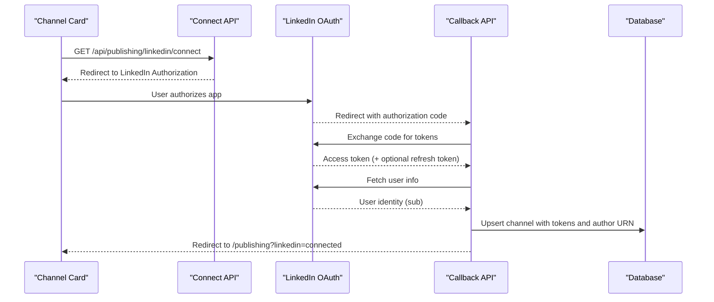
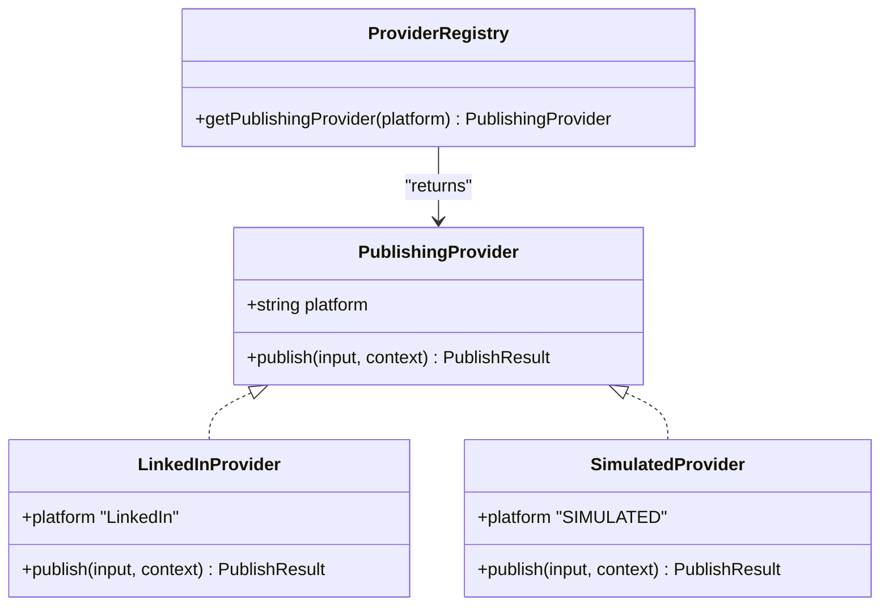
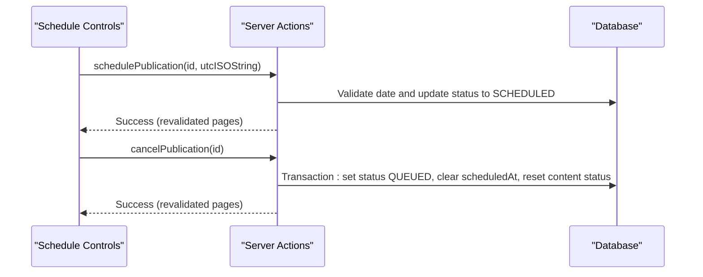
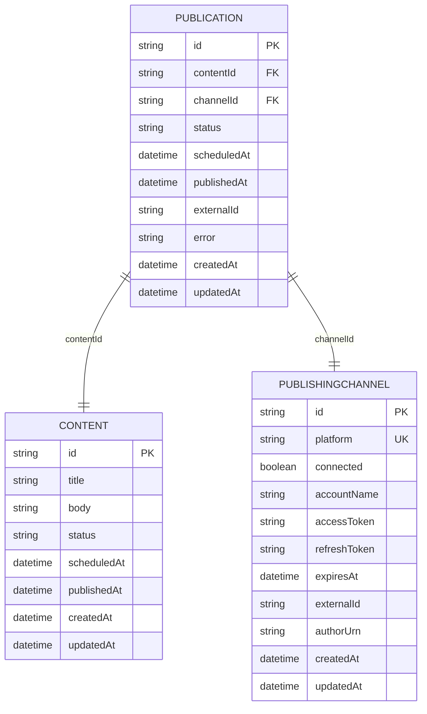
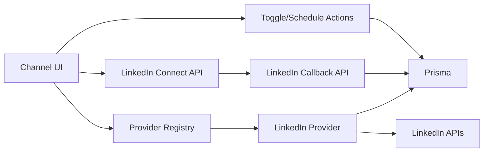

# Publishing Channels Management

<cite>
**Referenced Files in This Document**
- [page.tsx](file://app/publishing/page.tsx)
- [publishing-channels.tsx](file://components/publishing/publishing-channels.tsx)
- [toggle-channel.ts](file://app/publishing/actions/toggle-channel.ts)
- [route.ts (LinkedIn connect)](file://app/api/publishing/linkedin/connect/route.ts)
- [route.ts (LinkedIn callback)](file://app/api/publishing/linkedin/callback/route.ts)
- [types.ts](file://app/publishing/engine/types.ts)
- [index.ts (providers registry)](file://app/publishing/engine/providers/index.ts)
- [linkedin.ts (provider)](file://app/publishing/engine/providers/linkedin.ts)
- [simulated.ts (provider)](file://app/publishing/engine/providers/simulated.ts)
- [publication-schedule-controls.tsx](file://components/publishing/publication-schedule-controls.tsx)
- [schedule-publication.ts](file://app/publishing/actions/schedule-publication.ts)
- [cancel-publication.ts](file://app/publishing/actions/cancel-publication.ts)
- [schema.prisma](file://prisma/schema.prisma)
- [migration.sql](file://prisma/migrations/20260812122000_add_publishing_channels/migration.sql)
</cite>

## Table of Contents
1. [Introduction](#introduction)
2. [Project Structure](#project-structure)
3. [Core Components](#core-components)
4. [Architecture Overview](#architecture-overview)
5. [Detailed Component Analysis](#detailed-component-analysis)
6. [Dependency Analysis](#dependency-analysis)
7. [Performance Considerations](#performance-considerations)
8. [Troubleshooting Guide](#troubleshooting-guide)
9. [Conclusion](#conclusion)

## Introduction
This document explains how the publishing channels feature works end-to-end: connecting and managing multiple social media platforms, toggling channel states, storing and validating credentials, and controlling publication scheduling. It focuses on the user interface for channel management, backend actions that update channel configurations, and the provider-based architecture used to publish content to platforms like LinkedIn. Security considerations for credential storage and access control are also covered.

## Project Structure
The publishing channels feature spans server components, client components, server actions, API routes, and an engine with pluggable providers. The key areas are:
- Publishing page and UI for channel cards and distribution queue
- Server action to toggle channel connection state
- LinkedIn OAuth flow endpoints for connect and callback
- Provider registry and platform-specific implementations
- Scheduling controls and related server actions
- Data model definitions for channels and publications

**Diagram sources**
- [page.tsx:18-76](file://app/publishing/page.tsx#L18-L76)
- [publishing-channels.tsx:33-147](file://components/publishing/publishing-channels.tsx#L33-L147)
- [toggle-channel.ts:6-39](file://app/publishing/actions/toggle-channel.ts#L6-L39)
- [route.ts (LinkedIn connect):3-33](file://app/api/publishing/linkedin/connect/route.ts#L3-L33)
- [route.ts (LinkedIn callback):4-168](file://app/api/publishing/linkedin/callback/route.ts#L4-L168)
- [index.ts (providers registry):5-20](file://app/publishing/engine/providers/index.ts#L5-L20)
- [linkedin.ts (provider):141-283](file://app/publishing/engine/providers/linkedin.ts#L141-L283)
- [simulated.ts (provider):8-32](file://app/publishing/engine/providers/simulated.ts#L8-L32)
- [schema.prisma:57-93](file://prisma/schema.prisma#L57-L93)

**Section sources**
- [page.tsx:18-76](file://app/publishing/page.tsx#L18-L76)
- [schema.prisma:57-93](file://prisma/schema.prisma#L57-L93)

## Core Components
- Publishing page loads connected channels and displays a distribution queue with status badges and schedule controls.
- Channel cards show each platform’s name, description, connection indicator dot, and a Connect/Disconnect button. LinkedIn uses a dedicated Connect link to start OAuth; other platforms use a toggle action.
- Server action toggles a channel’s connected state and clears sensitive fields when disconnecting.
- LinkedIn OAuth endpoints handle authorization redirect and token exchange, then persist credentials and identity into the database.
- Provider registry maps platform names to concrete implementations; currently supports LinkedIn and a simulated provider.
- Scheduling controls allow users to set or reschedule publication times and cancel scheduled items.

**Section sources**
- [page.tsx:18-186](file://app/publishing/page.tsx#L18-L186)
- [publishing-channels.tsx:33-147](file://components/publishing/publishing-channels.tsx#L33-L147)
- [toggle-channel.ts:6-39](file://app/publishing/actions/toggle-channel.ts#L6-L39)
- [route.ts (LinkedIn connect):3-33](file://app/api/publishing/linkedin/connect/route.ts#L3-L33)
- [route.ts (LinkedIn callback):4-168](file://app/api/publishing/linkedin/callback/route.ts#L4-L168)
- [index.ts (providers registry):5-20](file://app/publishing/engine/providers/index.ts#L5-L20)
- [linkedin.ts (provider):141-283](file://app/publishing/engine/providers/linkedin.ts#L141-L283)
- [simulated.ts (provider):8-32](file://app/publishing/engine/providers/simulated.ts#L8-L32)
- [publication-schedule-controls.tsx:13-181](file://components/publishing/publication-schedule-controls.tsx#L13-L181)
- [schedule-publication.ts:6-51](file://app/publishing/actions/schedule-publication.ts#L6-L51)
- [cancel-publication.ts:6-52](file://app/publishing/actions/cancel-publication.ts#L6-L52)

## Architecture Overview
The system uses a provider-based architecture to abstract platform differences. The UI triggers actions that either update channel state or initiate OAuth flows. When publishing, the engine selects the appropriate provider by platform name and executes platform-specific logic. Credentials are stored per channel and validated before API calls.

**Diagram sources**
- [publishing-channels.tsx:38-141](file://components/publishing/publishing-channels.tsx#L38-L141)
- [toggle-channel.ts:6-39](file://app/publishing/actions/toggle-channel.ts#L6-L39)
- [route.ts (LinkedIn connect):3-33](file://app/api/publishing/linkedin/connect/route.ts#L3-L33)
- [route.ts (LinkedIn callback):4-168](file://app/api/publishing/linkedin/callback/route.ts#L4-L168)
- [index.ts (providers registry):5-20](file://app/publishing/engine/providers/index.ts#L5-L20)
- [linkedin.ts (provider):141-283](file://app/publishing/engine/providers/linkedin.ts#L141-L283)

## Detailed Component Analysis

### Channel UI and State Management
- Displays a grid of channel cards with visual indicators:
  - Green dot indicates connected; gray dot indicates not connected.
  - Text label shows “Connected” or “Not connected”.
  - LinkedIn card shows a dedicated “Connect” link to start OAuth; others show a “Connect”/“Disconnect” button.
- Uses React transitions to prevent UI flicker during toggles.
- Loads connected platforms from the server and passes them as props to compute initial state.

**Diagram sources**
- [publishing-channels.tsx:33-147](file://components/publishing/publishing-channels.tsx#L33-L147)
- [toggle-channel.ts:6-39](file://app/publishing/actions/toggle-channel.ts#L6-L39)

**Section sources**
- [publishing-channels.tsx:33-147](file://components/publishing/publishing-channels.tsx#L33-L147)
- [page.tsx:18-76](file://app/publishing/page.tsx#L18-L76)

### Backend Toggle Action
- Finds existing channel by platform or creates one if missing.
- Toggles the connected boolean.
- On disconnect, clears sensitive fields (accountName, accessToken, refreshToken, expiresAt, externalId).
- Revalidates the publishing page to reflect changes immediately.

**Diagram sources**
- [toggle-channel.ts:6-39](file://app/publishing/actions/toggle-channel.ts#L6-L39)

**Section sources**
- [toggle-channel.ts:6-39](file://app/publishing/actions/toggle-channel.ts#L6-L39)

### LinkedIn OAuth Flow
- Connect endpoint builds an authorization URL using environment variables and redirects the user to LinkedIn.
- Callback endpoint validates the incoming code, exchanges it for tokens, retrieves user info, computes author URN, and upserts the channel record with credentials and identity.
- Redirects back to the publishing page with a success query parameter.

**Diagram sources**
- [route.ts (LinkedIn connect):3-33](file://app/api/publishing/linkedin/connect/route.ts#L3-L33)
- [route.ts (LinkedIn callback):4-168](file://app/api/publishing/linkedin/callback/route.ts#L4-L168)

**Section sources**
- [route.ts (LinkedIn connect):3-33](file://app/api/publishing/linkedin/connect/route.ts#L3-L33)
- [route.ts (LinkedIn callback):4-168](file://app/api/publishing/linkedin/callback/route.ts#L4-L168)

### Provider Engine and Platform-Specific Logic
- Provider registry maps platform names to implementations. If a platform is not registered, an error is thrown.
- LinkedIn provider:
  - Validates channel credentials and expiration before publishing.
  - Uploads images via LinkedIn’s image upload flow, then creates a post with optional media.
  - Returns success with external ID or detailed error messages.
- Simulated provider logs inputs and returns a synthetic external ID for testing.

**Diagram sources**
- [types.ts:1-37](file://app/publishing/engine/types.ts#L1-L37)
- [index.ts (providers registry):5-20](file://app/publishing/engine/providers/index.ts#L5-L20)
- [linkedin.ts (provider):141-283](file://app/publishing/engine/providers/linkedin.ts#L141-L283)
- [simulated.ts (provider):8-32](file://app/publishing/engine/providers/simulated.ts#L8-L32)

**Section sources**
- [types.ts:1-37](file://app/publishing/engine/types.ts#L1-L37)
- [index.ts (providers registry):5-20](file://app/publishing/engine/providers/index.ts#L5-L20)
- [linkedin.ts (provider):141-283](file://app/publishing/engine/providers/linkedin.ts#L141-L283)
- [simulated.ts (provider):8-32](file://app/publishing/engine/providers/simulated.ts#L8-L32)

### Scheduling Controls and Actions
- Client component allows scheduling, rescheduling, and canceling publications with validation for future dates and proper formatting.
- Server actions update publication status and timestamps, and revert content state when canceling.
- Revalidation ensures consistent views across pages.

**Diagram sources**
- [publication-schedule-controls.tsx:13-181](file://components/publishing/publication-schedule-controls.tsx#L13-L181)
- [schedule-publication.ts:6-51](file://app/publishing/actions/schedule-publication.ts#L6-L51)
- [cancel-publication.ts:6-52](file://app/publishing/actions/cancel-publication.ts#L6-L52)

**Section sources**
- [publication-schedule-controls.tsx:13-181](file://components/publishing/publication-schedule-controls.tsx#L13-L181)
- [schedule-publication.ts:6-51](file://app/publishing/actions/schedule-publication.ts#L6-L51)
- [cancel-publication.ts:6-52](file://app/publishing/actions/cancel-publication.ts#L6-L52)

### Data Model and Relationships
- PublishingChannel stores platform identity, connection state, and credentials.
- Publication links Content to a specific channel and tracks status, scheduling, and errors.
- Unique constraints ensure one publication per content-channel pair.

**Diagram sources**
- [schema.prisma:21-37](file://prisma/schema.prisma#L21-L37)
- [schema.prisma:57-93](file://prisma/schema.prisma#L57-L93)

**Section sources**
- [schema.prisma:21-37](file://prisma/schema.prisma#L21-L37)
- [schema.prisma:57-93](file://prisma/schema.prisma#L57-L93)
- [migration.sql:5-9](file://prisma/migrations/20260812122000_add_publishing_channels/migration.sql#L5-L9)

## Dependency Analysis
- UI depends on server actions for toggling channels and scheduling publications.
- Server actions depend on Prisma to read/write channel and publication records.
- LinkedIn OAuth endpoints depend on environment variables for client credentials and app URL.
- Provider registry centralizes platform mapping; adding a new platform requires registering a provider implementation.
- LinkedIn provider depends on Prisma to fetch channel credentials and on external APIs for OAuth and posting.

**Diagram sources**
- [publishing-channels.tsx:33-147](file://components/publishing/publishing-channels.tsx#L33-L147)
- [toggle-channel.ts:6-39](file://app/publishing/actions/toggle-channel.ts#L6-L39)
- [schedule-publication.ts:6-51](file://app/publishing/actions/schedule-publication.ts#L6-L51)
- [cancel-publication.ts:6-52](file://app/publishing/actions/cancel-publication.ts#L6-L52)
- [route.ts (LinkedIn connect):3-33](file://app/api/publishing/linkedin/connect/route.ts#L3-L33)
- [route.ts (LinkedIn callback):4-168](file://app/api/publishing/linkedin/callback/route.ts#L4-L168)
- [index.ts (providers registry):5-20](file://app/publishing/engine/providers/index.ts#L5-L20)
- [linkedin.ts (provider):141-283](file://app/publishing/engine/providers/linkedin.ts#L141-L283)

**Section sources**
- [index.ts (providers registry):5-20](file://app/publishing/engine/providers/index.ts#L5-L20)
- [linkedin.ts (provider):141-283](file://app/publishing/engine/providers/linkedin.ts#L141-L283)

## Performance Considerations
- Use server actions to minimize client-side state synchronization and leverage Next.js revalidation for efficient UI updates.
- Avoid unnecessary network calls by loading connected platforms once on the server and passing them as props.
- For large media uploads, consider streaming or background processing to avoid blocking requests.
- Cache provider lookups where appropriate; the current registry is small and fast but can be memoized if expanded.

[No sources needed since this section provides general guidance]

## Troubleshooting Guide
- Missing environment variables:
  - LinkedIn connect and callback require LINKEDIN_CLIENT_ID, LINKEDIN_CLIENT_SECRET, and APP_URL. If any are missing, endpoints return configuration errors.
- OAuth failures:
  - Invalid or expired codes result in explicit error responses. Check the callback response for error details.
- Token issues:
  - If the access token is missing or expired, the LinkedIn provider returns a clear error instructing reconnect.
- Missing identity:
  - If user info does not include a member identifier, the callback fails; ensure required profile permissions are granted.
- Image upload problems:
  - Ensure APP_URL is correctly configured so the provider can download images from storage before uploading to LinkedIn.
- Scheduling errors:
  - Invalid or past dates will throw errors; ensure the selected time is in the future and properly formatted.

**Section sources**
- [route.ts (LinkedIn connect):3-33](file://app/api/publishing/linkedin/connect/route.ts#L3-L33)
- [route.ts (LinkedIn callback):4-168](file://app/api/publishing/linkedin/callback/route.ts#L4-L168)
- [linkedin.ts (provider):141-283](file://app/publishing/engine/providers/linkedin.ts#L141-L283)
- [schedule-publication.ts:6-51](file://app/publishing/actions/schedule-publication.ts#L6-L51)

## Conclusion
The publishing channels feature provides a clean interface to connect and manage multiple platforms, with robust backend actions and a flexible provider architecture. LinkedIn integration demonstrates a complete OAuth flow and secure credential handling. Scheduling controls enable precise control over publication timing. Extending support to additional platforms involves implementing a provider and registering it in the registry. Security best practices include storing credentials securely, validating tokens before use, and clearing sensitive data on disconnect.

[No sources needed since this section summarizes without analyzing specific files]