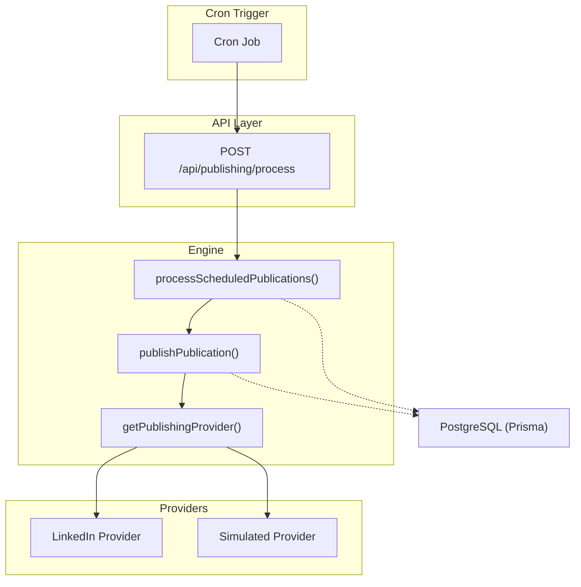
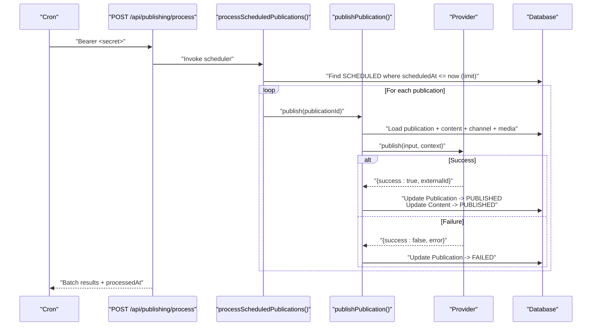
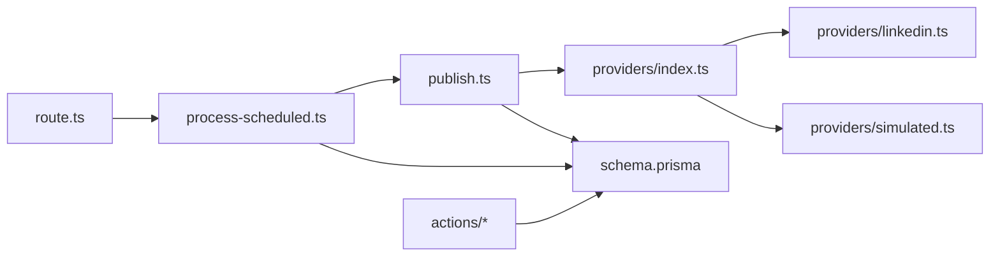
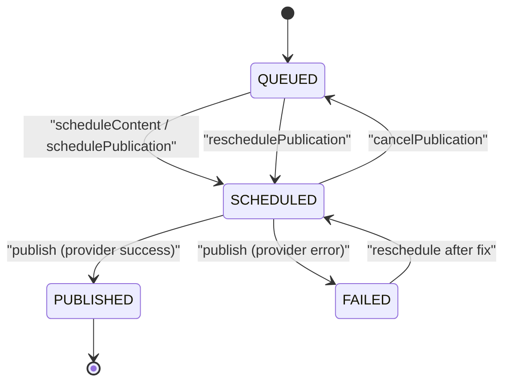

# Scheduled Content Processing

<cite>
**Referenced Files in This Document**
- [process-scheduled.ts](file://app/publishing/engine/process-scheduled.ts)
- [publish.ts](file://app/publishing/engine/publish.ts)
- [types.ts](file://app/publishing/engine/types.ts)
- [route.ts](file://app/api/publishing/process/route.ts)
- [schedule-content.ts](file://app/content/actions/schedule-content.ts)
- [reschedule-content.ts](file://app/content/actions/reschedule-content.ts)
- [cancel-schedule.ts](file://app/content/actions/cancel-schedule.ts)
- [schedule-publication.ts](file://app/publishing/actions/schedule-publication.ts)
- [reschedule-publication.ts](file://app/publishing/actions/reschedule-publication.ts)
- [cancel-publication.ts](file://app/publishing/actions/cancel-publication.ts)
- [index.ts](file://app/publishing/engine/providers/index.ts)
- [linkedin.ts](file://app/publishing/engine/providers/linkedin.ts)
- [simulated.ts](file://app/publishing/engine/providers/simulated.ts)
- [schema.prisma](file://prisma/schema.prisma)
</cite>

## Table of Contents
1. [Introduction](#introduction)
2. [Project Structure](#project-structure)
3. [Core Components](#core-components)
4. [Architecture Overview](#architecture-overview)
5. [Detailed Component Analysis](#detailed-component-analysis)
6. [Dependency Analysis](#dependency-analysis)
7. [Performance Considerations](#performance-considerations)
8. [Troubleshooting Guide](#troubleshooting-guide)
9. [Conclusion](#conclusion)
10. [Appendices](#appendices)

## Introduction
This document explains the scheduled content processing system that queues and publishes content to multiple platforms on a cron-driven cycle. It covers the queue-based architecture, cron job setup and execution, publication lifecycle with status transitions, batch processing behavior, conflict resolution for simultaneous scheduling, action handlers for scheduling/rescheduling/canceling, monitoring/logging strategies, and scalability best practices for high-volume publishing.

## Project Structure
The system is organized into:
- API entrypoint for cron-triggered processing
- Engine that queries and processes scheduled publications
- Provider abstraction for platform-specific publishing (LinkedIn, simulated)
- Server actions for user-initiated scheduling, rescheduling, and canceling
- Database schema defining Content, Publication, Media, and PublishingChannel entities

**Diagram sources**
- [route.ts:7-55](file://app/api/publishing/process/route.ts#L7-L55)
- [process-scheduled.ts:4-71](file://app/publishing/engine/process-scheduled.ts#L4-L71)
- [publish.ts:4-115](file://app/publishing/engine/publish.ts#L4-L115)
- [index.ts:5-20](file://app/publishing/engine/providers/index.ts#L5-L20)
- [linkedin.ts:141-283](file://app/publishing/engine/providers/linkedin.ts#L141-L283)
- [simulated.ts:8-32](file://app/publishing/engine/providers/simulated.ts#L8-L32)

**Section sources**
- [route.ts:1-56](file://app/api/publishing/process/route.ts#L1-L56)
- [process-scheduled.ts:1-72](file://app/publishing/engine/process-scheduled.ts#L1-L72)
- [publish.ts:1-116](file://app/publishing/engine/publish.ts#L1-L116)
- [index.ts:1-21](file://app/publishing/engine/providers/index.ts#L1-L21)
- [linkedin.ts:1-284](file://app/publishing/engine/providers/linkedin.ts#L1-L284)
- [simulated.ts:1-33](file://app/publishing/engine/providers/simulated.ts#L1-L33)
- [schema.prisma:21-93](file://prisma/schema.prisma#L21-L93)

## Core Components
- Cron route: Secures and invokes the scheduler via a Bearer token check using an environment secret.
- Scheduler: Queries due SCHEDULED publications ordered by scheduledAt, batches up to a fixed limit, and calls publish per item.
- Publisher: Validates state, loads content/channel/media, delegates to provider, and updates statuses atomically.
- Providers: Implement platform-specific publishing; LinkedIn handles media upload and post creation; Simulated logs and returns success.
- Actions: User-facing server actions to schedule, reschedule, or cancel content/publications with validation and cache revalidation.

Key responsibilities:
- Queue selection and batching: process-scheduled.ts
- State transitions and atomic updates: publish.ts
- Platform integration: providers/*
- Cron security and orchestration: route.ts
- User operations: content/actions/* and publishing/actions/*

**Section sources**
- [route.ts:7-55](file://app/api/publishing/process/route.ts#L7-L55)
- [process-scheduled.ts:4-71](file://app/publishing/engine/process-scheduled.ts#L4-L71)
- [publish.ts:4-115](file://app/publishing/engine/publish.ts#L4-L115)
- [index.ts:5-20](file://app/publishing/engine/providers/index.ts#L5-L20)
- [schedule-content.ts:6-65](file://app/content/actions/schedule-content.ts#L6-L65)
- [reschedule-content.ts:6-59](file://app/content/actions/reschedule-content.ts#L6-L59)
- [cancel-schedule.ts:6-34](file://app/content/actions/cancel-schedule.ts#L6-L34)
- [schedule-publication.ts:6-51](file://app/publishing/actions/schedule-publication.ts#L6-L51)
- [reschedule-publication.ts:6-58](file://app/publishing/actions/reschedule-publication.ts#L6-L58)
- [cancel-publication.ts:6-52](file://app/publishing/actions/cancel-publication.ts#L6-L52)

## Architecture Overview
The system uses a simple queue implemented in the database:
- Publications are created with status QUEUED or SCHEDULED.
- The cron job triggers a POST to /api/publishing/process.
- The scheduler selects due SCHEDULED items (ordered by scheduledAt, limited to a batch size).
- Each item is published via the appropriate provider.
- On success, both Publication and Content are updated to PUBLISHED with timestamps and external IDs.
- On failure, Publication is marked FAILED with error details.

**Diagram sources**
- [route.ts:7-55](file://app/api/publishing/process/route.ts#L7-L55)
- [process-scheduled.ts:4-71](file://app/publishing/engine/process-scheduled.ts#L4-L71)
- [publish.ts:4-115](file://app/publishing/engine/publish.ts#L4-L115)
- [index.ts:5-20](file://app/publishing/engine/providers/index.ts#L5-L20)
- [linkedin.ts:141-283](file://app/publishing/engine/providers/linkedin.ts#L141-L283)
- [simulated.ts:8-32](file://app/publishing/engine/providers/simulated.ts#L8-L32)

## Detailed Component Analysis

### Cron Route and Execution Cycle
- Security: Requires Authorization header matching CRON_SECRET from environment; otherwise returns 401 or 500 if secret missing.
- Execution: Logs start time, calls scheduler, logs completion, returns JSON with results and processedAt timestamp.
- Runtime: Forces Node.js runtime and dynamic rendering to ensure server-side execution.

Operational notes:
- Configure CRON_SECRET in your deployment environment.
- Ensure the endpoint is reachable by your cron service (e.g., Vercel Cron, external cron).
- Monitor response payload for processed count and per-item results.

**Section sources**
- [route.ts:1-56](file://app/api/publishing/process/route.ts#L1-L56)

### Scheduler: Batch Processing and Ordering
- Selects publications with status SCHEDULED and scheduledAt not null and less than or equal to current time.
- Orders by scheduledAt ascending to honor earliest-first semantics.
- Limits batch size to a fixed number to control throughput and avoid long-running requests.
- Iterates over each publication, calling publish and collecting results with success/failure and externalId/error.

Concurrency and conflicts:
- No explicit row-level locking is used; rely on idempotent updates and status checks in publisher.
- If multiple cron runs overlap, duplicate attempts may occur; publisher validates allowed source states before proceeding.

**Section sources**
- [process-scheduled.ts:4-71](file://app/publishing/engine/process-scheduled.ts#L4-L71)

### Publisher: Validation, Provider Delegation, and Atomic Updates
- Loads full context: publication, content (with media), and channel.
- Validates:
  - Publication exists.
  - Status is QUEUED or SCHEDULED.
  - Content body is present.
  - Channel is connected.
- Delegates to provider based on channel.platform.
- On provider success:
  - Uses a transaction to update Publication to PUBLISHED (clearing scheduledAt, setting publishedAt and externalId) and Content to PUBLISHED.
- On provider failure:
  - Updates Publication to FAILED with error message.

Error handling:
- Throws early for invalid states or missing data.
- Captures provider errors and records them in Publication.error.

**Section sources**
- [publish.ts:4-115](file://app/publishing/engine/publish.ts#L4-L115)

### Providers: Platform Abstraction and Implementation
- Provider registry maps platform names to implementations.
- LinkedIn provider:
  - Validates access token and expiry.
  - Uploads image (if any) via LinkedIn’s two-step process and creates a post.
  - Returns externalId from response headers.
- Simulated provider:
  - Logs inputs and returns success with a synthetic externalId.

Extensibility:
- Add new platforms by implementing the PublishingProvider interface and registering in the provider index.

**Section sources**
- [index.ts:1-21](file://app/publishing/engine/providers/index.ts#L1-L21)
- [linkedin.ts:141-283](file://app/publishing/engine/providers/linkedin.ts#L141-L283)
- [simulated.ts:8-32](file://app/publishing/engine/providers/simulated.ts#L8-L32)
- [types.ts:1-37](file://app/publishing/engine/types.ts#L1-L37)

### Action Handlers: Scheduling, Rescheduling, Canceling
- Schedule content:
  - Validates date is future and content not already published.
  - Sets content.status to SCHEDULED and scheduledAt.
  - Updates all related publications to SCHEDULED with same scheduledAt and clears error.
  - Revalidates relevant paths.
- Reschedule content:
  - Similar to schedule but only allows non-PUBLISHED content.
  - Updates content and associated publications to SCHEDULED with new time.
- Cancel schedule (content):
  - Only for SCHEDULED content.
  - Resets content.status to READY and clears scheduledAt.
- Schedule publication:
  - Validates date and status, sets publication to SCHEDULED with scheduledAt.
- Reschedule publication:
  - Allows QUEUED or SCHEDULED publications to be moved to SCHEDULED with new time.
- Cancel publication:
  - Only for SCHEDULED publications.
  - Moves publication back to QUEUED and clears scheduledAt; also resets content to READY.

Conflict resolution:
- Multiple actions can target the same content/publication; transactions and status checks prevent inconsistent states.
- Unique constraint on (contentId, channelId) ensures one publication per content-channel pair.

**Section sources**
- [schedule-content.ts:6-65](file://app/content/actions/schedule-content.ts#L6-L65)
- [reschedule-content.ts:6-59](file://app/content/actions/reschedule-content.ts#L6-L59)
- [cancel-schedule.ts:6-34](file://app/content/actions/cancel-schedule.ts#L6-L34)
- [schedule-publication.ts:6-51](file://app/publishing/actions/schedule-publication.ts#L6-L51)
- [reschedule-publication.ts:6-58](file://app/publishing/actions/reschedule-publication.ts#L6-L58)
- [cancel-publication.ts:6-52](file://app/publishing/actions/cancel-publication.ts#L6-L52)
- [schema.prisma:75-93](file://prisma/schema.prisma#L75-L93)

### Data Model and Relationships
- Content: Holds title, body, status, scheduledAt, publishedAt.
- Publication: Links Content to PublishingChannel; tracks status, scheduledAt, publishedAt, externalId, error.
- Media: Attached to Content; includes url, filename, mimeType, size, type.
- PublishingChannel: Stores platform connection info including tokens and URN.

Constraints:
- Unique constraint on (contentId, channelId) prevents duplicate publications for the same content-channel pair.

**Section sources**
- [schema.prisma:21-93](file://prisma/schema.prisma#L21-L93)

## Dependency Analysis

**Diagram sources**
- [route.ts:1-56](file://app/api/publishing/process/route.ts#L1-L56)
- [process-scheduled.ts:1-72](file://app/publishing/engine/process-scheduled.ts#L1-L72)
- [publish.ts:1-116](file://app/publishing/engine/publish.ts#L1-L116)
- [index.ts:1-21](file://app/publishing/engine/providers/index.ts#L1-L21)
- [linkedin.ts:1-284](file://app/publishing/engine/providers/linkedin.ts#L1-L284)
- [simulated.ts:1-33](file://app/publishing/engine/providers/simulated.ts#L1-L33)
- [schema.prisma:21-93](file://prisma/schema.prisma#L21-L93)

**Section sources**
- [route.ts:1-56](file://app/api/publishing/process/route.ts#L1-L56)
- [process-scheduled.ts:1-72](file://app/publishing/engine/process-scheduled.ts#L1-L72)
- [publish.ts:1-116](file://app/publishing/engine/publish.ts#L1-L116)
- [index.ts:1-21](file://app/publishing/engine/providers/index.ts#L1-L21)
- [schema.prisma:21-93](file://prisma/schema.prisma#L21-L93)

## Performance Considerations
- Batch size: The scheduler limits to a fixed number per run to avoid long request durations and resource contention. Tune this limit based on expected volume and provider rate limits.
- Ordering: Ascending order by scheduledAt ensures fairness and timeliness.
- Transactions: Successful publish uses a single transaction to update both Publication and Content, reducing inconsistency risk and improving performance.
- Provider overhead: External API calls (e.g., LinkedIn uploads) dominate latency; consider retries and exponential backoff at the provider layer for resilience.
- Concurrency: Avoid overlapping cron executions to prevent duplicate work. Use idempotency keys or distributed locks if necessary.
- Indexes: Ensure efficient queries on Publication(status, scheduledAt) and Content(id) to support fast selection and updates.

[No sources needed since this section provides general guidance]

## Troubleshooting Guide
Common issues and resolutions:
- Unauthorized cron calls:
  - Ensure CRON_SECRET is configured and the Authorization header matches Bearer <secret>.
- Invalid dates:
  - Scheduling/rescheduling requires future dates; validate client inputs.
- Missing content body:
  - Publisher rejects empty bodies; ensure content has text.
- Disconnected channels:
  - Ensure PublishingChannel.connected is true and tokens are valid and not expired.
- Provider failures:
  - Check Publication.error for details; retry logic should be implemented at the provider level with backoff.
- Duplicate processing:
  - If cron jobs overlap, publisher validates status; ensure idempotent updates and consider adding locking.

Monitoring and logging:
- Cron route logs start/end times and results.
- Scheduler logs found items and per-item outcomes.
- Provider logs detailed steps (e.g., LinkedIn upload and post creation).
- Persist errors in Publication.error for auditability.

**Section sources**
- [route.ts:7-55](file://app/api/publishing/process/route.ts#L7-L55)
- [process-scheduled.ts:4-71](file://app/publishing/engine/process-scheduled.ts#L4-L71)
- [publish.ts:4-115](file://app/publishing/engine/publish.ts#L4-L115)
- [linkedin.ts:141-283](file://app/publishing/engine/providers/linkedin.ts#L141-L283)

## Conclusion
The scheduled content processing system implements a robust, queue-based workflow driven by a cron job. It safely batches due publications, delegates to platform-specific providers, and atomically updates state on success or failure. Action handlers provide flexible scheduling controls while maintaining consistency through transactions and validations. With proper configuration, monitoring, and scaling considerations, the system supports high-volume publishing scenarios across multiple platforms.

[No sources needed since this section summarizes without analyzing specific files]

## Appendices

### Publication Lifecycle and Status Transitions

**Diagram sources**
- [schedule-content.ts:35-57](file://app/content/actions/schedule-content.ts#L35-L57)
- [schedule-publication.ts:34-43](file://app/publishing/actions/schedule-publication.ts#L34-L43)
- [reschedule-publication.ts:41-48](file://app/publishing/actions/reschedule-publication.ts#L41-L48)
- [cancel-publication.ts:21-44](file://app/publishing/actions/cancel-publication.ts#L21-L44)
- [publish.ts:72-112](file://app/publishing/engine/publish.ts#L72-L112)

### Cron Setup Checklist
- Set CRON_SECRET environment variable.
- Expose POST /api/publishing/process to your cron service.
- Send Authorization: Bearer <CRON_SECRET>.
- Schedule frequency based on batch size and volume.
- Monitor logs and responses for processedAt and result counts.

**Section sources**
- [route.ts:7-55](file://app/api/publishing/process/route.ts#L7-L55)